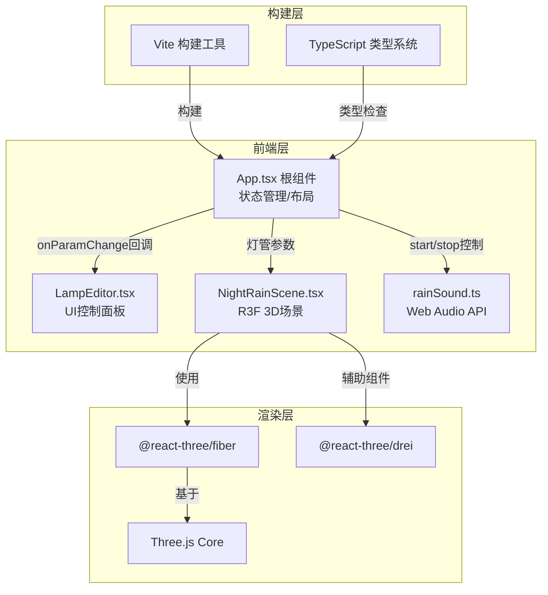

## 1. 架构设计



## 2. 技术栈说明
- **前端框架**：React@18 + TypeScript@5 (严格模式, ES2020)
- **构建工具**：Vite@5 + @vitejs/plugin-react（自动打开浏览器）
- **3D渲染**：three@0.160 + @react-three/fiber@8 + @react-three/drei@9
- **类型定义**：@types/three@0.160
- **音频处理**：Web Audio API (原生)

## 3. 路由定义
| 路由 | 用途 |
|-----|------|
| / | 主应用页面（单页应用，无额外路由） |

## 4. 数据模型

### 4.1 灯管参数接口
```typescript
interface LampParams {
  bendAngle: number;          // 弯曲度 0-90度
  color: string;              // 灯管颜色 HEX格式
  glowIntensity: number;      // 发光强度 2-10 (光晕半径cm)
  flickerMode: 'steady' | 'slow' | 'fast';  // 闪烁模式
  material: 'matte' | 'glossy' | 'cracked'; // 表面材质
}
```

### 4.2 默认值
```typescript
const DEFAULT_LAMP_PARAMS: LampParams = {
  bendAngle: 30,
  color: '#FF3366',
  glowIntensity: 6,
  flickerMode: 'steady',
  material: 'glossy',
};
```

### 4.3 材质参数映射
```typescript
interface MaterialConfig {
  roughness: number;
  metalness: number;
  saturationAdjust: number;  // 饱和度调整 -0.15 ~ +0.10
  normalMapIntensity?: number;
}

const MATERIAL_CONFIGS: Record<LampParams['material'], MaterialConfig> = {
  matte:   { roughness: 0.8, metalness: 0.2, saturationAdjust: -0.15 },
  glossy:  { roughness: 0.2, metalness: 0.9, saturationAdjust: 0 },
  cracked: { roughness: 0.5, metalness: 0.5, saturationAdjust: 0.10, normalMapIntensity: 1.0 },
};
```

## 5. 文件结构与数据流向

```
项目根目录/
├── package.json                    # 依赖与脚本配置
├── vite.config.js                  # Vite构建配置(自动开浏览器)
├── tsconfig.json                   # TS严格模式配置
├── index.html                      # 入口HTML(全屏)
└── src/
    ├── App.tsx                     # [状态中枢]
    │                               # ↑ 接收: 用户输入事件
    │                               # ↓ 分发: lampParams → 子组件
    │                               # ↓ 调用: rainSound.start/stop
    │
    ├── components/
    │   ├── NightRainScene.tsx      # [3D渲染器]
    │   │                           # ↑ Props: lampParams 对象
    │   │                           # 职责: 1500雨滴粒子 + 贝塞尔灯管 + 地面倒影
    │   │
    │   └── LampEditor.tsx          # [UI交互器]
    │                               # ↑ Props: currentParams + onParamChange
    │                               # ↓ 触发: onChange回调 → 更新App状态
    │
    └── utils/
        └── rainSound.ts            # [音频工具]
                                    # ↑ 被App.tsx调用start/stop/setGain
                                    # 职责: 白噪声+低通滤波(1500Hz)模拟雨声
```

## 6. 核心数据流

### 6.1 参数更新流
```
用户拖动滑块/选择颜色
    ↓
LampEditor.onParamChange(key, value)
    ↓
App.setState({ ...lampParams, [key]: value })
    ↓
React重新渲染 → NightRainScene.lampProps 更新
    ↓
NightRainScene内useEffect检测参数变化
    ↓
更新TubeGeometry控制点 / MeshStandardMaterial颜色 / 点光源强度
```

### 6.2 闪烁-音频联动流
```
flickerMode === 'fast'
    ↓
NightRainScene: useFrame内计算脉冲值(2Hz)
    ↓
通过回调或共享状态传递pulseValue
    ↓
rainSound.setGain(0.1 + 0.3 * pulseValue)  // 增益0.1~0.4循环
```

## 7. 性能优化点
1. **雨滴粒子**：使用BufferGeometry + PointsMaterial，CPU端在useFrame中更新positionBuffer
2. **灯管几何体**：TubeGeometry使用10 radialSegments + 64 tubularSegments平衡性能
3. **外发光效果**：使用3-5层渐变透明球体叠加，而非后处理bloom(降低开销)
4. **反射地面**：MeshStandardMaterial + envMapIntensity=0.3模拟模糊反射，不使用真实RTT
