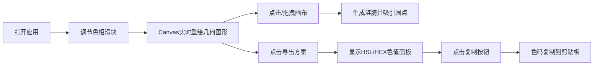

## 1. 产品概述

「几何色谱」是一款面向 UI 设计师的交互式配色探索工具，通过动态几何图形渲染帮助用户快速试验不同 HSL 色彩组合的视觉表现，并一键导出可复用的配色方案。

- 目标用户：UI 设计师、视觉设计师、前端开发者
- 核心价值：降低配色探索成本，所见即所得地评估色彩在几何元素上的表现

## 2. 核心功能

### 2.1 功能模块

1. **主界面**：左侧配色控制面板 + 右侧几何画布，支持响应式布局切换
2. **三层几何叠加渲染**：底层半透明大圆环、中间层旋转六边形、顶层散布小圆点
3. **实时配色调节**：三个独立滑块分别控制三层图形的色相(H)值
4. **鼠标涟漪交互**：点击/拖拽画布生成彩色涟漪并吸引小圆点
5. **配色方案导出**：显示当前 HSL/HEX 色值并支持一键复制到剪贴板

### 2.2 页面详情

| 页面名称 | 模块名称 | 功能描述 |
|---------|---------|---------|
| 主页面 | 配色控制面板 | 三个色相滑块(背景色/主图形/辅图形) + 导出按钮 + 色值展示面板 |
| 主页面 | 几何画布 | Canvas 2D 渲染三层叠加几何图形 + 鼠标涟漪交互 |

## 3. 核心流程

用户打开应用 → 调节三个色相滑块观察几何图形色彩变化 → 点击画布任意位置生成彩色涟漪 → 点击「导出当前方案」查看 HSL 和 HEX 色值 → 点击「复制」将色码存入剪贴板

## 4. 用户界面设计

### 4.1 设计风格

- **主色调**：深色主题，背景主色 `#0f0f23`，画布背景渐变 `#1a1a2e → #16213e`
- **配色面板**：毛玻璃效果 `rgba(255,255,255,0.08)`，模糊 12px，边框 `1px solid rgba(255,255,255,0.1)`
- **滑块**：玻璃态设计，渐变色轨道（从当前层色相渐变到无色），圆形手柄 16px 带白色投影
- **文字颜色**：白灰色 `#e0e0e0`，无衬线字体
- **导出色码面板**：卡片式圆角 12px，每个色码块带对应颜色边框和 10% 透明度背景

### 4.2 页面设计概述

| 页面名称 | 模块名称 | UI 元素 |
|---------|---------|---------|
| 主页面 | 配色控制面板 | 毛玻璃容器、3组标签+滑块、导出按钮、折叠式色值卡片 |
| 主页面 | 几何画布 | Canvas 全屏自适应、十字准星光标、暗色渐变背景 |

### 4.3 响应式

- **桌面端（≥768px）**：左侧固定 300px 面板 + 右侧自适应画布
- **移动端（<768px）**：面板在上部 100% 宽度 + 画布在下部 70vh 高度
- **布局切换过渡**：0.3s ease-in-out 动画
