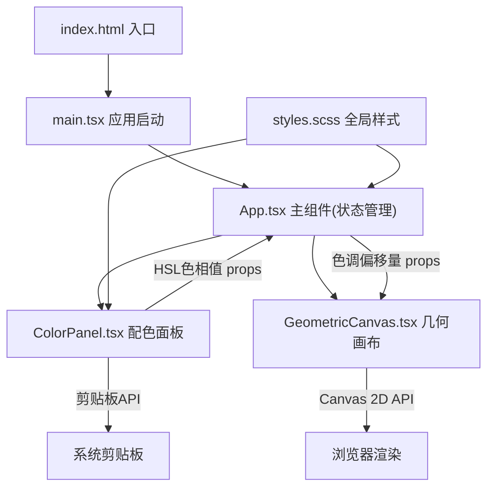

## 1. 架构设计



## 2. 技术说明

- **前端框架**：React 18 + TypeScript（严格模式）
- **构建工具**：Vite 5 + @vitejs/plugin-react
- **样式方案**：SCSS（node-sass），全局变量 + 毛玻璃 + 动画
- **图形渲染**：Canvas 2D API，requestAnimationFrame 驱动 60 FPS
- **状态管理**：React useState/useCallback（轻量场景，无需 zustand）

## 3. 路由定义

| 路由 | 用途 |
|-----|------|
| / | 单页应用主界面（无路由跳转，使用 BrowserRouter 空壳或无需路由） |

本应用为单页面交互工具，不涉及路由跳转。

## 4. 核心数据结构与类型

```typescript
// 配色方案 - 在 App.tsx 中维护，向下传递给子组件
interface ColorScheme {
  bgHue: number;      // 背景色调 H: 0-360
  mainHue: number;    // 主图形色调 H: 0-360
  accentHue: number;  // 辅图形色调 H: 0-360
}

// 涟漪对象 - 在 GeometricCanvas 内部状态
interface Ripple {
  x: number;
  y: number;
  hue: number;
  startTime: number;  // performance.now() 时间戳
  duration: number;   // 1500ms
}

// 小圆点对象 - 在 GeometricCanvas 内部状态
interface Dot {
  baseAngle: number;  // 基础角度（沿六边形顶点分布）
  radius: number;     // 半径 5-12px 随机
  driftPhase: number; // 漂移相位
  offsetX: number;    // 涟漪吸引偏移 X
  offsetY: number;    // 涟漪吸引偏移 Y
}

// 涟漪吸引记录
interface Attraction {
  rippleX: number;
  rippleY: number;
  startTime: number;
  duration: number;   // 500ms
}
```

## 5. 性能优化策略

- **Canvas 脏矩形**：每帧完整重绘（画面较小，全屏清屏重绘性能可接受）
- **requestAnimationFrame**：严格 60 FPS 驱动，避免 setInterval
- **涟漪对象池**：涟漪数组动态管理，超出 duration 的对象自动回收
- **鼠标事件节流**：拖拽过程中每 ~16ms 最多生成一个涟漪
- **避免重排**：Canvas 内部纯 GPU 绘制，不触发 DOM 回流
