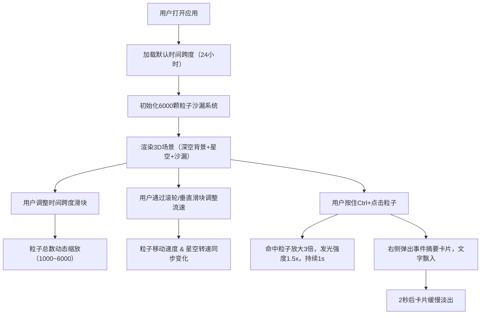

## 1. 产品概述

「数据沙漏·时空流转」是一款面向数据艺术家与数据爱好者的3D交互可视化艺术品，通过粒子沙漏的形式将任意时间跨度内的事件数据转化为沉浸式的动态视觉体验。用户可自由调整时间跨度与流速，观察代表不同事件类型的彩色粒子在沙漏中的流动与堆积，实现"时间即物质、数据即形态"的艺术表达。

- 核心价值：将抽象的时间维度具象化为可感知的3D粒子系统，为数据叙事提供全新的艺术化表达方式
- 目标用户：数据艺术家、数据可视化爱好者、展览展示设计师、教育工作者

## 2. 核心特性

### 2.1 用户角色

| 角色 | 注册方式 | 核心权限 |
|------|---------|---------|
| 数据艺术家 | 无需注册，直接使用 | 配置时间参数、控制粒子流动、点击回溯数据详情 |

### 2.2 功能模块

1. **主3D场景页**：沙漏粒子系统渲染、视角控制、缩放操作
2. **参数控制面板（左上）**：时间跨度滑块、时间流速控制、当前时间标签
3. **事件详情面板（右下）**：粒子点击回溯的事件摘要卡片、颜色图例说明
4. **背景氛围系统**：深空渐变背景、半透明星空粒子、动态发光边框效果

### 2.3 页面详情

| 页面名称 | 模块名称 | 功能描述 |
|---------|---------|---------|
| 主3D场景页 | 沙漏粒子系统 | 6000颗彩色粒子按沙漏形状分布，从上端流向下端，支持动态缩放粒子数量 |
| 主3D场景页 | 视角交互 | 鼠标拖拽旋转视角（Y轴±180°），滚轮缩放（5-50单位） |
| 主3D场景页 | 星空背景 | 随机分布的半透明闪烁星点，随时间流速旋转 |
| 参数控制面板 | 时间跨度滑块 | 范围1秒~365天，实时调整沙漏尺寸与粒子总数（1000~6000颗） |
| 参数控制面板 | 时间流速控制 | 垂直滑块/滚轮调整0.1x~10x流速，同步影响粒子速度与星空旋转 |
| 参数控制面板 | 当前时间标签 | 显示当前可视化的时间跨度单位及粒子状态信息 |
| 事件详情面板 | 事件摘要卡片 | Ctrl+点击粒子后显示，文字从底部飘入，高亮粒子放大发光1秒 |
| 事件详情面板 | 颜色图例 | 6种事件类别对应的颜色映射说明 |

## 3. 核心流程

**主操作流程：**
用户打开应用 → 默认时间跨度加载沙漏 → 调整时间跨度（滑块/输入）→ 沙漏尺寸与粒子数动态更新 → 调整时间流速 → 粒子流速与星空旋转同步变化 → 按住Ctrl点击感兴趣的粒子/簇团 → 粒子高亮放大发光 + 右侧弹出事件摘要卡片 → 卡片2秒后淡出

## 4. 用户界面设计

### 4.1 设计风格

- **主色调**：深空蓝黑渐变（#0A0F1E → #1A1A2E），营造宇宙时空氛围
- **强调色循环**：交互元素悬停边框在青蓝#00C9FF与橙红#FF6B35之间平滑色相循环（周期8秒）
- **事件色彩映射**：
  - 橙色 #FF6B35 - 商业/金融事件
  - 蓝色 #00C9FF - 科技/网络事件
  - 金色 #FFD700 - 文化/娱乐事件
  - 红色 #FF4D4D - 紧急/警报事件
  - 紫色 #7B68EE - 科学/学术事件
  - 绿色 #32CD32 - 环境/自然事件
- **玻璃拟态面板**：背景 rgba(255,255,255,0.08)，backdrop-filter: blur(12px)，边框 1px solid rgba(255,255,255,0.12)
- **字体**：主展示字体 "Space Grotesk"（数据艺术科技感），正文字体 "Noto Sans SC"
- **动效**：粒子拖尾（5层副本透明度线性衰减0.8→0）、卡片飘入、悬停辉光、星空闪烁

### 4.2 页面设计概述

| 页面名称 | 模块名称 | UI元素 |
|---------|---------|--------|
| 主3D场景页 | 沙漏粒子系统 | 上下圆锥+窄通道圆柱轮廓粒子，色彩按6类事件随机分配，同类粒子微弱聚类（系数0.05），1-2秒后散开 |
| 主3D场景页 | 视角控制 | 拖拽旋转Y轴±180°，滚轮缩放5-50单位，缩放时沙漏自适应缩放 |
| 参数控制面板 | 容器 | 玻璃毛玻璃面板，固定左上角，圆角12px，内边距20px，宽度280px |
| 参数控制面板 | 标题 | "时空控制台" 白色字体，16px，字重600，下边距16px |
| 参数控制面板 | 时间跨度滑块 | 水平滑块，左侧"1秒"，右侧"365天"，悬停时边框辉光循环 |
| 参数控制面板 | 流速控制 | 垂直滑块（右置），范围0.1x~10x，带刻度标记 |
| 事件详情面板 | 容器 | 固定右下角，玻璃毛玻璃面板，圆角12px，宽度320px，最大高度400px，溢出滚动 |
| 事件详情面板 | 事件卡片 | 标题14px加粗，摘要文字12px，时间戳11px灰色，卡片间隔12px |
| 事件详情面板 | 颜色图例 | 6色圆点+文字标签，网格2列3行，底部展示 |

### 4.3 响应式设计

- **桌面端（≥1024px）**：完整UI布局，所有面板可见
- **平板端（768px~1023px）**：控制面板简化为半宽，事件面板宽度自适应
- **移动端（<768px）**：所有UI面板自动隐藏，仅保留全屏沙漏，底部显示手势提示（"双指旋转 · 捏合缩放 · 长按+点按回溯"），支持触摸手势

### 4.4 3D场景指引

- **环境与氛围**：深空蓝黑径向渐变背景，无HDRI，使用自发光粒子营造发光感
- **光照设置**：环境光强度0.3（白），点光源2盏分别位于沙漏上方（#00C9FF，强度0.8）和下方（#FF6B35，强度0.6）
- **相机设置**：PerspectiveCamera（fov=60，near=0.1，far=1000），初始位置(0, 0, 20)，OrbitControls限制：minDistance=5，maxDistance=50，minPolarAngle=π/6，maxPolarAngle=5π/6
- **构图焦点**：沙漏居中占据画布70%区域，星空粒子分布在半径30-60的球壳上
- **交互动画**：粒子流动拖尾、同类粒子微聚类（着色器实现）、Ctrl+点击命中粒子在GPU侧实现放大与发光（uniform变量控制）
- **后期效果**：轻微Bloom（强度0.3，阈值0.8）增强粒子发光感，FXAA抗锯齿
- **性能预算**：粒子数≤6000，全部使用BufferGeometry + PointsMaterial + 自定义着色器，位置更新完全在Vertex Shader中完成

## 5. 性能与约束

- 目标帧率：≥55 FPS（Chrome + Intel i5 + 集成显卡）
- 粒子计算：所有位置/颜色/大小更新在GPU着色器中完成，禁止CPU逐粒子循环
- 事件卡片动画延迟：≤50ms（CSS transform + opacity实现，无需JS动画库）
- 内存占用：单个粒子数据（position:vec3 + color:vec3 + velocity:float + category:float + timeTag:float + size:float）= 36字节，6000粒子 = 216KB，可接受
