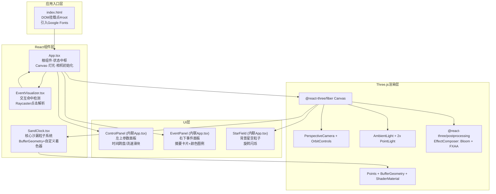

## 1. 架构设计



**数据流向图：**
```
用户输入事件
  │
  ├─→ [滑块变化] 时间跨度(spanSeconds) → App.state
  │                                       │
  │                                       ▼
  │                                   SandClock props更新
  │                                       │ 重新计算粒子数N=lerp(6000→1000)
  │                                       ▼
  │                                   BufferGeometry.setAttribute 更新
  │
  ├─→ [滚轮/垂直滑块] 流速(speedMultiplier) → App.state
  │                                                   │
  │                                                   ▼
  │                                               uniform.uSpeed更新
  │                                               ├→ SandClock粒子速度变化
  │                                               └→ StarField旋转速度变化
  │
  └─→ [Ctrl+点击] Raycaster命中 → EventVisualizer
                                        │
                                        ├→ 写入 App.state.highlightedIndex
                                        │     │
                                        │     ▼
                                        │   uniform.uHighlightedIndex更新
                                        │   目标粒子size×3, color×1.5，1秒后复位
                                        │
                                        └→ 写入 App.state.activeEvent
                                              │
                                              ▼
                                          EventPanel渲染
                                          CSS动画：translateY(30px→0) + opacity(0→1)
```

## 2. 技术描述

- **前端框架**：React@18.2 + TypeScript@5（严格模式）
- **构建工具**：Vite@5 + @vitejs/plugin-react@4
- **3D渲染引擎**：three@0.160 + @react-three/fiber@8 + @react-three/drei@9 + @react-three/postprocessing@2
- **类型支持**：@types/three@0.160
- **样式方案**：原生CSS + CSS Modules（内联于TSX文件，使用styled-components风格的CSS-in-JS避免引入额外依赖，使用<style>标签+className）
- **无后端、无数据库**：所有事件数据使用前端Mock数据随机生成，基于确定性算法（粒子index→category→event text映射）

## 3. 目录结构与文件职责

```
项目根/
├── package.json              # 依赖与脚本: dev/build/preview
├── vite.config.js            # Vite配置: React插件、路径别名
├── tsconfig.json             # TS严格模式配置、JSX:react-jsx、target:ES2020
├── index.html                # 入口HTML、#root容器、字体引入、全局CSS
└── src/
    ├── App.tsx               # 主组件（核心文件A）
    │                         #   · 初始化Canvas、相机、灯光、后期处理
    │                         #   · 维护全局state: spanSeconds, speedMultiplier,
    │                         #         highlightedIndex, activeEvent, particleCount
    │                         #   · 渲染内联UI: ControlPanel(左上)、EventPanel(右下)、StarField(星空)
    │                         #   · 调用关系: App → <SandClock/> → <EventVisualizer/>
    │                         #   · 数据流: 用户交互→setState→props传递给子组件
    │
    ├── SandClock.tsx         # 沙漏粒子系统（核心文件B）
    │                         #   · 使用BufferGeometry创建N颗粒子(N=1000~6000)
    │                         #   · 6种attribute: position(vec3)、color(vec3)、
    │                         #       category(float)、initialY(float)、phase(float)、seed(float)
    │                         #   · ShaderMaterial自定义顶点+片元着色器
    │                         #   · vertex: 根据uniform.uTime/uSpeed/uSpan计算流动
    │                         #       上腔(y>1)→窄通道(-1<y<1)→下腔(y<-1) 三段逻辑
    │                         #       同类粒子微聚类(基于category哈希+正弦波叠加)
    │                         #   · fragment: glow效果、拖尾透明度衰减、高亮放大
    │                         #   · uniform: uTime, uSpeed, uSpan, uHighlightedIndex, uHighlightProgress
    │                         #   · 调用关系: 被App渲染，接收props: span/speed/onParticleClick
    │                         #   · 数据流: props变化→uniform更新→GPU着色器计算
    │
    └── EventVisualizer.tsx   # 交互命中解析（核心文件C）
                              #   · 使用useThree获取raycaster
                              #   · 监听pointerdown事件，检测ctrlKey==true
                              #   · raycaster.intersectObject命中Points
                              #   · 通过faceIndex/attribute映射获取粒子index
                              #   · 调用onHit回调返回{ index, category, timeTag, eventText }
                              #   · 调用关系: 嵌套在SandClock内部，共享Points ref
                              #   · 数据流: 鼠标事件→raycast→解析→回传App→更新面板
```

**各文件间调用关系：**
```
index.html → ReactDOM.createRoot → <App/>
  ↓
App.tsx 持有以下ref/state并传递：
  ├─ spanSeconds (state)      ──prop──→ SandClock.span
  ├─ speedMultiplier (state)  ──prop──→ SandClock.speed
  ├─ highlightedIndex (state) ──prop──→ SandClock.highlight
  ├─ onParticleHit (callback) ──prop──→ SandClock → EventVisualizer.onHit
  │
  ├─ 渲染 <ControlPanel>（内联），其onChange更新spanSeconds/speedMultiplier
  ├─ 渲染 <EventPanel>（内联），从activeEvent(state)读取卡片数据
  └─ 渲染 <StarField>（内联），接收speedMultiplier控制旋转速度
```

## 4. 核心数据结构

### 4.1 TypeScript类型定义

```typescript
// 事件类别枚举
const EVENT_CATEGORIES = [
  { id: 0, color: '#FF6B35', name: '商业/金融', hex: 0xFF6B35 },
  { id: 1, color: '#00C9FF', name: '科技/网络', hex: 0x00C9FF },
  { id: 2, color: '#FFD700', name: '文化/娱乐', hex: 0xFFD700 },
  { id: 3, color: '#FF4D4D', name: '紧急/警报', hex: 0xFF4D4D },
  { id: 4, color: '#7B68EE', name: '科学/学术', hex: 0x7B68EE },
  { id: 5, color: '#32CD32', name: '环境/自然', hex: 0x32CD32 },
] as const;

// 点击命中结果
interface ParticleHit {
  index: number;           // 粒子索引
  categoryId: number;      // 事件类别 0-5
  timeTag: string;         // 人类可读时间标签 "HH:MM:SS" / "MM-DD"
  eventTitle: string;      // 事件标题（Mock生成）
  eventSummary: string;    // 事件摘要（Mock生成）
}

// App全局状态
interface AppState {
  spanSeconds: number;          // 时间跨度 1秒 ~ 31536000秒(365天)
  speedMultiplier: number;      // 时间流速 0.1 ~ 10
  highlightedIndex: number;     // 高亮粒子 -1=无
  highlightStartTime: number;   // 高亮开始时间戳
  activeEvent: ParticleHit | null; // 当前展示的事件卡片
  particleCount: number;        // 当前粒子总数(1000~6000)
}

// 每类事件Mock标题/摘要库
const EVENT_MOCK_DATA: Record<number, { titles: string[]; summaries: string[] }> = {
  0: { titles: ['全球股市震荡', '科技股创下新高', '央行调整利率', ...], summaries: [...] },
  1: { titles: [...], summaries: [...] },
  // ...共6类
};
```

### 4.2 BufferGeometry Attribute布局

| Attribute名称 | 类型 | 每个粒子占用 | 说明 |
|---|---|---|---|
| position | vec3 (Float32Array) | 12字节 | 初始上腔内随机位置，在着色器中动态修改 |
| color | vec3 (Float32Array) | 12字节 | RGB颜色（已归一化0-1），来自EVENT_CATEGORIES |
| category | float (Float32Array) | 4字节 | 类别ID 0-5，用于同类微聚类计算 |
| aInitialY | float (Float32Array) | 4字节 | 初始Y值，用于流动循环重置 |
| aPhase | float (Float32Array) | 4字节 | 0-1随机相位，控制个体流动时间差 |
| aSeed | float (Float32Array) | 4字节 | 0-1随机种子，用于大小抖动与微聚类方向 |

### 4.3 Shader Uniform列表

| Uniform名 | 类型 | 说明 |
|---|---|---|
| uTime | float | 当前累计时间（秒），每帧更新 |
| uSpeed | float | 流速倍率 0.1-10，控制流动整体速度 |
| uSpanRatio | float | 当前跨度/最大跨度，影响沙漏Y方向缩放 |
| uHighlightedIndex | int | 高亮粒子索引（-1为无） |
| uHighlightProgress | float | 高亮进度 0-1，1秒内衰减 |
| uClockTopY | float | 上腔顶部Y = +3.0（随spanRatio缩放） |
| uNeckTopY | float | 窄通道顶部Y = +0.8 |
| uNeckBottomY | float | 窄通道底部Y = -0.8 |
| uClockBottomY | float | 下腔底部Y = -3.0 |
| uResolution | vec2 | 屏幕分辨率，用于正确的点大小像素换算 |

## 5. 着色器核心算法（顶点着色器）

```glsl
// 流动三段式（伪代码）：
float totalSpan = (uClockTopY - uClockBottomY);
float travelY = mod(uTime * uSpeed * 0.5 + aPhase * totalSpan, totalSpan);
float currentY = uClockTopY - travelY;
vec3 pos = position;

// 1. 上腔阶段 (y > uNeckTopY)
if (currentY > uNeckTopY) {
    float t = 1.0 - (currentY - uNeckTopY) / (uClockTopY - uNeckTopY);
    float r_top = 2.5;
    float r_neck = 0.3;
    float radius = mix(r_top, r_neck, smoothstep(0.0, 1.0, t));
    float angle = aSeed * 6.2831 + sin(uTime*0.2 + category*1.7 + aPhase*10.0)*0.05;
    pos.x = cos(angle) * radius * (0.2 + 0.8*aSeed);
    pos.z = sin(angle) * radius * (0.2 + 0.8*aSeed);
}
// 2. 窄通道阶段 (uNeckBottomY <= y <= uNeckTopY)
else if (currentY >= uNeckBottomY) {
    float t = (currentY - uNeckBottomY) / (uNeckTopY - uNeckBottomY);
    float radius = 0.3 + sin(t * 3.14159) * 0.05;
    float angle = aSeed * 6.2831 + category * 1.047;
    pos.x = cos(angle) * radius * 0.5;
    pos.z = sin(angle) * radius * 0.5;
}
// 3. 下腔阶段 (y < uNeckBottomY) 堆积效果
else {
    float t = 1.0 - (uNeckBottomY - currentY) / (uNeckBottomY - uClockBottomY);
    float r_bottom = 2.5;
    float r_neck = 0.3;
    float radius = mix(r_neck, r_bottom, smoothstep(0.0, 1.0, t));
    // 堆积密度：越靠下粒子越密
    float jitterY = sin(aSeed*50.0 + floor(uTime*2.0)) * 0.02;
    pos.x = cos(aSeed*12.566 + category) * radius * (0.3 + 0.7*sqrt(aSeed));
    pos.z = sin(aSeed*12.566 + category) * radius * (0.3 + 0.7*sqrt(aSeed));
    pos.y = currentY + jitterY;
}

// 同类微聚类（微弱正弦吸引，周期1-2秒）
float clusterWave = sin(uTime * 3.0 + category * 0.7 + aPhase * 6.2831);
float clusterStrength = 0.05 * smoothstep(0.7, 1.0, clusterWave);
pos.x += sin(aSeed*25.13 + category*1.3) * clusterStrength;
pos.z += cos(aSeed*25.13 + category*1.3) * clusterStrength;

// 高亮放大
if (gl_VertexID == uHighlightedIndex) {
    gl_PointSize = (1.0 + 4.0*aSeed) * 3.0 * (1.0 + uHighlightProgress*0.5);
} else {
    gl_PointSize = (1.0 + 4.0*aSeed);
}
gl_Position = projectionMatrix * modelViewMatrix * vec4(pos, 1.0);
```

## 6. 性能优化策略

1. **GPU驱动粒子**：所有位置计算在Vertex Shader中完成，CPU仅更新uniform（16字节/帧），零逐粒子CPU开销
2. **BufferGeometry复用**：粒子数量变化时复用同一Geometry实例，仅resize attribute数组（drawRange控制可见数），避免频繁GC
3. **拖尾效果**：使用5次multi-draw（instanced variation via shader built-in gl_VertexID/6），或更简单的方案：在片元着色器通过directional blur模拟拖尾感，避免实际5倍粒子数
4. **PointSize自适应**：使用gl_PointSize + gl_Position.w做距离衰减，避免远处过大/近处过小
5. **事件卡片纯CSS动画**：transition: transform 500ms cubic-bezier, opacity 500ms，完全GPU合成，不触发重排
6. **Raycaster优化**：Ctrl+点击才开启射线检测，常态跳过；命中检测使用Points boundingSphere预剔除

## 7. 关键时间常数

| 参数 | 值 | 说明 |
|---|---|---|
| 粒子流动完整周期 | 12秒 (speed=1x时) | 从上顶→下底的时间 |
| 高亮时长 | 1000ms | 放大3倍 + 发光1.5x |
| 事件卡片飘入 | 500ms | translateY 30→0, opacity 0→1 |
| 事件卡片停留 | 1500ms | 可见期 |
| 事件卡片淡出 | 500ms | opacity 1→0 |
| 强调色循环 | 8000ms | #00C9FF ↔ #FF6B35 |
| 星空闪烁 | 2000~4000ms/星 | 透明度0.3↔0.6随机周期 |
| 同类微聚类周期 | ~1500ms | 吸引→散开 |

## 8. 构建与开发命令

| 命令 | 说明 |
|---|---|
| `npm run dev` | 启动Vite开发服务器 (默认端口5173) |
| `npm run build` | 生产构建，输出到dist/ |
| `npm run preview` | 本地预览生产构建 |
