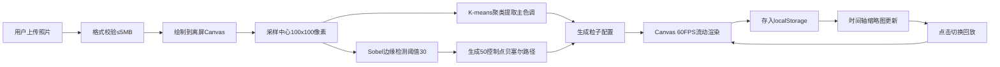

## 1. 产品概述

「光影沙盘·每日光画」是一款面向独立创作者的浏览器端数字艺术工具，用户通过上传每日照片，系统自动提取色彩与轮廓，将其转化为流动的抽象光画，并在时间轴上构建可追溯的光影记忆河流。

- **核心价值**：将日常摄影转化为可流动、可回放的艺术光影，赋予照片超越静态的生命力
- **目标用户**：独立创作者、摄影爱好者、视觉艺术家、日常记录者

## 2. 核心功能

### 2.1 用户角色

| 角色 | 注册方式 | 核心权限 |
|------|----------|----------|
| 独立创作者 | 无需注册，浏览器直接使用 | 上传照片、生成光画、浏览历史、回放动画、本地存储 |

### 2.2 功能模块

1. **主画布区域**：照片上传入口、光画实时渲染、播放/暂停控制、速度调节滑块
2. **图像处理引擎**：中心区域色彩提取（K-means 5簇聚类）、Sobel简化版边缘检测、贝塞尔曲线控制点生成
3. **粒子动画系统**：60FPS Canvas 2D渲染、色相循环流动、线宽动态变化、周期循环控制
4. **时间轴浏览区**：水平可滚动缩略图、虚拟滚动优化、日期标签、点击高亮切换
5. **本地持久化层**：localStorage存储、30天自动过期清理、页面刷新恢复

### 2.3 页面详情

| 页面名称 | 模块名称 | 功能描述 |
|----------|----------|----------|
| 主应用页 | 上传模块 | 点击渐变按钮上传JPG/PNG（≤5MB），拖拽支持，格式校验 |
| 主应用页 | 主画布 | 800×600 Canvas渲染，渐变背景（主色调0.3-0.6透明），内发光边框 |
| 主应用页 | 动画控制 | 播放/暂停切换（2秒完整周期），速度滑块（0.5x-2x），实时响应 |
| 主应用页 | 时间轴 | 水平滚动缩略图（80×60），日期标签，悬停放大1.15x，金色高亮边框 |
| 主应用页 | 数据管理 | 自动保存到localStorage，30天过期清理，启动时恢复历史 |

## 3. 核心流程

用户上传照片 → 系统采样中心100×100区域 → K-means聚类提取5个主色调（取占比最大） → Sobel边缘检测（阈值30） → 轮廓转换为50控制点贝塞尔路径 → 生成粒子数组和主色调 → Canvas以60FPS渲染流动动画 → 光画数据存入localStorage → 时间轴渲染缩略图 → 点击缩略图切换回放

## 4. 用户界面设计

### 4.1 设计风格

- **主色调**：深空蓝背景 `#0D0D1A`，品牌紫 `#6B4CFF`，科技蓝 `#38B2FF`，警告红 `#FF6B6B`，高亮金 `#FFD700`
- **按钮样式**：渐变圆角矩形（`#6B4CFF` → `#38B2FF`），悬停上浮3px + 阴影扩散，0.3s ease-in-out过渡
- **字体方案**：显示字体采用极具艺术感的 "Space Grotesk" 或 "Syne"，正文采用 "Inter" 保证可读性
- **布局风格**：居中卡片式布局，最大宽度1200px，深邃呼吸感动画背景
- **视觉质感**：内发光边框、半透明白色tooltip、微妙噪点纹理叠加、玻璃态拟物效果

### 4.2 页面设计概览

| 页面名称 | 模块名称 | UI元素 |
|----------|----------|--------|
| 主应用页 | 页面容器 | 深空蓝背景+噪点纹理，居中最大宽度1200px，内边距48px |
| 主应用页 | 标题区 | 艺术字大标题「光影沙盘·每日光画」，副标题描述，微妙渐变色 |
| 主应用页 | 上传区 | 渐变圆角按钮，拖拽悬停态，文件大小提示，上传状态反馈 |
| 主应用页 | 主画布 | 800×600 Canvas，`#6B4CFF`内发光边框（透明度0.2→0.5悬停），居中 |
| 主应用页 | 控制栏 | 播放/暂停按钮（品牌色），速度滑块（自定义样式），速度数值显示 |
| 主应用页 | 时间轴 | 水平滚动容器，缩略图80×60间距12px，日期标签，1.15x悬停放大 |
| 主应用页 | 数据统计 | 可选：当前光画数量，最早/最近记录日期，优雅小字展示 |

### 4.3 响应式设计

- **桌面端（≥1024px）**：标准布局，画布800×600，缩略图80×60，双排控制按钮
- **平板端（768px-1023px）**：画布缩小至100%宽度自适应，缩略图60×45，间距缩至8px，单列控制
- **交互优化**：触摸事件支持，100ms内响应所有交互反馈，移动端禁用不必要动画

### 4.4 动画与动效指导

- **光画流动**：贝塞尔曲线粒子沿路径流动，线宽2→6px脉动，色相±30°循环偏移
- **页面加载**：标题渐入+位移（150ms延迟），画布淡入（300ms延迟），时间轴错落滑入
- **微交互**：按钮悬停上浮3px+阴影扩散（0.3s），缩略图悬停缩放1.15x+光晕，点击脉冲反馈
- **转场过渡**：切换光画时画布淡出→新画淡入（200ms），平滑不突兀
