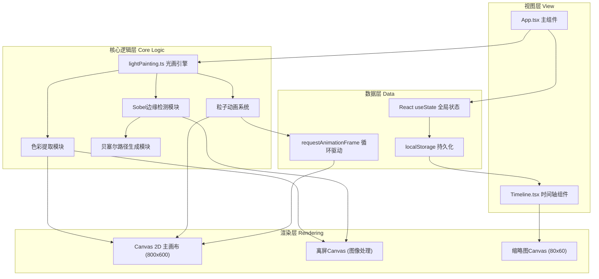

## 1. 架构设计



## 2. 技术选型说明

- **前端框架**：React 18 + TypeScript (严格模式)
- **构建工具**：Vite 5.x + @vitejs/plugin-react
- **渲染引擎**：Canvas 2D API（原生，无额外库依赖）
- **状态管理**：React useState + useRef（轻量场景，无需引入zustand）
- **数据持久化**：浏览器 localStorage（同步API，≤20ms读写）
- **性能优化**：requestAnimationFrame拆解计算、虚拟滚动、离屏Canvas

## 3. 文件结构与职责

```
.
├── package.json                 # 项目依赖与脚本配置
├── vite.config.js               # Vite构建配置（React+TS支持）
├── tsconfig.json                # TypeScript配置（strict+ES2020）
├── index.html                   # 入口HTML（挂载#root，加载字体）
└── src/
    ├── App.tsx                  # 主组件（全局状态中枢）
    ├── Timeline.tsx             # 时间轴组件（虚拟滚动+缩略图）
    ├── lightPainting.ts         # 核心图像处理引擎
    ├── main.tsx                 # React入口（createRoot挂载）
    └── index.css                # 全局样式（设计Token+响应式）
```

### 调用关系与数据流

| 源文件 | 调用方向 | 目标 | 数据内容 |
|--------|----------|------|----------|
| `App.tsx` | → | `lightPainting.ts` | `ImageData` → 调用 `processImage()` |
| `lightPainting.ts` | → | `App.tsx` | 返回 `LightPaintingData { particles, primaryColor, controlPoints }` |
| `App.tsx` | → | `Timeline.tsx` | Props: `paintings[]`, `activeIndex`, `onSelect(index)` |
| `Timeline.tsx` | → | `App.tsx` | 回调: `onSelect(index)` 触发切换回放 |
| `App.tsx` | → | `localStorage` | 存入 `light_paintings_v1` JSON序列化数组 |
| `localStorage` | → | `App.tsx` | 启动时读取 → 清理30天前数据 → 初始化状态 |

## 4. 核心数据模型

### 4.1 类型定义

```typescript
// 单个光画数据结构
interface LightPainting {
  id: string;                    // UUID v4
  createdAt: number;             // 时间戳 ms
  dateLabel: string;             // "YYYY-MM-DD" 显示标签
  primaryColor: RGB;             // 主色调 RGB
  controlPoints: Point[];        // 50个贝塞尔控制点
  particles: Particle[];         // 粒子数组
}

// 粒子定义
interface Particle {
  pathProgress: number;          // 路径进度 0-1
  speed: number;                 // 速度系数
  size: number;                  // 基础尺寸
  hueOffset: number;             // 色相偏移量 ±30°
  alpha: number;                 // 透明度
}

// 通用坐标点
interface Point { x: number; y: number; }

// RGB颜色
interface RGB { r: number; g: number; b: number; }

// 图像处理返回值
interface ProcessImageResult {
  primaryColor: RGB;
  controlPoints: Point[];
  particles: Particle[];
}
```

### 4.2 状态管理（App.tsx）

```
useState<LightPainting[]> paintings        // 全部光画列表
useState<number> activeIndex               // 当前选中索引
useState<boolean> isPlaying                // 播放状态
useState<number> speed                     // 速度倍率 0.5-2.0
useRef<HTMLCanvasElement> canvasRef        // 主画布引用
useRef<number> rafId                       // requestAnimationFrame ID
useRef<number> startTime                   // 动画起始时间戳
```

## 5. 核心算法规范

### 5.1 色彩提取（K-means简化版）
1. 采样中心100×100 = 10,000像素
2. 随机选取5个初始聚类中心
3. 迭代3次K-means（保证<500ms）：计算每个像素到5中心的欧氏距离→归类→更新中心
4. 统计各簇像素数，取占比最大的簇的中心作为主色调

### 5.2 Sobel边缘检测（简化版）
1. 灰度化：Gray = 0.299R + 0.587G + 0.114B
2. 对中心100×100区域应用3×3 Sobel核：
   - Gx = [[-1,0,1],[-2,0,2],[-1,0,1]]
   - Gy = [[-1,-2,-1],[0,0,0],[1,2,1]]
3. 梯度幅值 G = √(Gx²+Gy²)
4. 阈值=30：G≥30判定为边缘点，置1，否则0
5. 遍历边缘二值图，按从上到下、从左到右收集前N个边缘点

### 5.3 贝塞尔曲线控制点生成
1. 将收集到的边缘点按x坐标排序（或按连通性分组）
2. 取均匀分布的50个采样点（若边缘点不足50则插值补充）
3. 坐标映射至800×600画布范围（按比例缩放+偏移）
4. 添加微小随机扰动避免机械感（±2px高斯噪声）
5. 输出50个Point构成平滑路径

### 5.4 粒子动画系统（60FPS）
每一帧在 `requestAnimationFrame` 回调中：
1. 计算 `elapsed = (now - startTime) * speed`，取 `progress = (elapsed % 2000) / 2000`
2. 清除画布，绘制渐变背景（主色调，透明度0.3+0.3*sin(π*progress)）
3. 对每个粒子：
   - 累计 `pathProgress += particle.speed * 0.02 * speed`，若>1则重置为0
   - 在50控制点构成的Catmull-Rom样条上插值取点
   - 线宽 = 2 + 4 * sin(π * particle.pathProgress)
   - hue = RGBtoHSL(primaryColor).h + particle.hueOffset * sin(2π*progress)
   - 沿路径方向绘制圆形粒子，叠加发光效果(shadowBlur=10)

## 6. 性能保障策略

| 性能指标 | 目标值 | 实现手段 |
|----------|--------|----------|
| Canvas帧率 | ≥55FPS | 精简绘制调用，批量路径stroke，避免每帧创建对象 |
| 图像处理耗时 | ≤500ms | K-means仅迭代3次，requestIdleCallback拆解，Sobel用TypedArray |
| localStorage读写 | ≤20ms | 仅序列化必要字段，不存原始ImageData，每次写入前裁剪>30天 |
| 时间轴滚动流畅 | 无卡顿 | 虚拟滚动：仅渲染可见范围内±50px溢出的缩略图 |
| 交互响应延迟 | ≤100ms | 所有点击事件立即设置视觉状态，计算延后到下一帧 |

## 7. 持久化与数据清理

localStorage Key: `light_paintings_v1`

写入流程：
1. 新光画 unshift 到数组头部
2. 过滤 `Date.now() - createdAt > 30*24*3600*1000` 的过期项
3. 截取最多30条记录（安全阈值）
4. `JSON.stringify` 后 `localStorage.setItem`

启动读取流程：
1. `localStorage.getItem` → 解析 JSON
2. 再次执行30天过期过滤
3. 过滤后重新写回（清理历史垃圾）
4. 赋值给 paintings 状态
