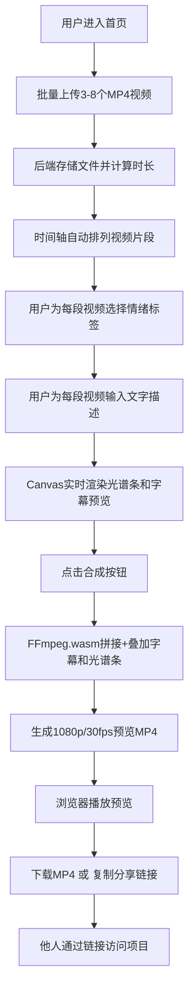

# 帧情速记 - 产品需求文档

## 1. 产品概述
帧情速记是一款面向业余纪录片爱好者的Web端视频情绪编目与粗剪工具，帮助用户快速对多段短视频进行情绪标注、文字描述，并生成带有动态字幕和色彩映射的情绪粗剪预览。

- **核心价值**：将繁琐的视频编辑简化为「上传→打标→预览」三步流程，让非专业用户也能快速产出带有情绪表达的短视频
- **目标用户**：独立纪录片创作者、Vlog博主、短视频爱好者、婚礼/活动记录者
- **市场定位**：轻量级浏览器端视频情绪剪辑工具，无需下载安装，即开即用

## 2. 核心功能

### 2.1 用户角色
| 角色 | 注册方式 | 核心权限 |
|------|----------|----------|
| 普通用户 | 无需注册，项目ID自动分配 | 上传视频、打情绪标签、输入文字描述、合成预览、分享项目链接 |

### 2.2 功能模块
1. **主工作台页面**：视频上传区、情绪光谱时间轴、浮动字幕预览区、情绪标签面板、操作控制栏
2. **项目分享页面**：通过项目ID加载已有项目数据，展示时间轴和预览，支持重新编辑

### 2.3 页面详情
| 页面名称 | 模块名称 | 功能描述 |
|----------|----------|----------|
| 主工作台 | 视频上传区 | 支持批量上传3-8个mp4文件，单文件≤20MB，显示上传进度和文件信息 |
| 主工作台 | 时间轴组件 | 水平排列视频片段，支持拖拽调整顺序，显示情绪光谱条，绘制浮动字幕位置 |
| 主工作台 | 情绪标签面板 | 5种预定义情绪胶囊按钮（宁静/兴奋/忧伤/愤怒/喜悦），选中高亮+弹性动画 |
| 主工作台 | 文字描述输入 | 每段视频对应最多30字描述输入框，实时预览字幕效果 |
| 主工作台 | 预览Canvas容器 | 实时渲染带字幕和光谱条的合成预览帧 |
| 主工作台 | 操作控制栏 | 合成按钮、下载按钮、复制分享链接按钮、进度显示 |
| 分享页面 | 项目加载 | 根据URL中的项目ID从后端加载元数据和视频列表 |
| 分享页面 | 只读预览 | 展示时间轴和合成预览，可切换至编辑模式重新编辑 |

## 3. 核心流程

### 3.1 用户主流程描述
用户进入首页 → 批量上传3-8个短视频 → 系统自动计算时长并排列时间轴 → 用户为每段视频选择情绪标签 → 用户为每段视频输入文字描述 → 实时预览带情绪光谱和浮动字幕的效果 → 点击合成按钮 → FFmpeg.wasm拼接视频并叠加字幕/光谱条 → 生成1080p/30fps预览mp4 → 浏览器播放预览 → 用户下载或复制分享链接 → 他人通过链接访问相同项目

### 3.2 核心流程图

## 4. 用户界面设计

### 4.1 设计风格
- **主色调**：深色玻璃态（背景#121212，面板磨砂半透明rgba(255,255,255,0.08)）
- **情绪色卡**：
  - 宁静：#4A90D9（沉稳蓝）
  - 兴奋：#FF6B35（活力橙）
  - 忧伤：#7B68EE（梦幻紫）
  - 愤怒：#E74C3C（烈焰红）
  - 喜悦：#F1C40F（明黄金）
- **按钮风格**：圆角胶囊按钮，hover时柔光内阴影+轻微上浮1px，0.3s过渡
- **字体**：标题使用思源黑体（Source Han Sans）/ Noto Sans SC 粗体，正文使用中等粗细，渲染清晰
- **布局风格**：分层玻璃卡片布局，时间轴占上方60%高度，操作面板在下方，模糊背景叠加
- **图标风格**：简约线性SVG图标，情绪标签使用表情符号（🌊🔥💔😡✨）

### 4.2 页面设计概述
| 页面名称 | 模块名称 | UI元素与风格 |
|----------|----------|-------------|
| 主工作台 | 顶部标题栏 | 玻璃态磨砂条，左logo「帧情速记」+副标，右当前项目ID/新建按钮 |
| 主工作台 | 上传区 | 虚线圆角边框，拖拽上传高亮，文件卡片显示缩略图+时长+大小 |
| 主工作台 | 时间轴区域 | 深色渐变背景，视频块圆角矩形，上方彩色渐变光谱条，下方浮动字幕指示线 |
| 主工作台 | 情绪标签面板 | 彩色胶囊按钮，选中时弹性缩放1.08倍，未选中半透明，排列整齐 |
| 主工作台 | 描述输入区 | 玻璃态输入框，聚焦时边框发光，30字计数器实时变色 |
| 主工作台 | 预览区 | 16:9 Canvas，黑色边框，中央浮动字幕带随机飘动，底部光谱条滚动 |
| 主工作台 | 底部控制栏 | 磨砂玻璃条，主要操作按钮渐变色彩，合成按钮脉冲光晕动画 |
| 分享页面 | 加载动画 | 渐入加载指示器，项目数据加载完成后平滑展开界面 |

### 4.3 响应式设计
- **断点策略**：Desktop-first，断点768px
- **桌面端（≥1200px）**：时间轴占屏幕高度60%，最小宽度1200px，按钮间距24px
- **平板横屏（768px-1199px）**：时间轴高度调整为50%，按钮间距缩小至16px，字体缩小1-2号
- **不支持竖屏**：显示提示语「请横屏使用以获得最佳体验」

### 4.4 动画与交互
- **情绪标签选中**：0.3s cubic-bezier(0.34, 1.56, 0.64, 1) 弹性缩放至1.08倍，边框发光扩散
- **浮动字幕动画**：从右侧滑入中央（3s持续），期间随机±5px上下飘动，最后淡出，文字颜色取自情绪色
- **色彩光谱过渡**：相邻片段边界处1秒时长的平滑颜色渐变过渡，光谱条整体从半透明渐变至全彩
- **合成进度**：环形进度指示器，百分比数字跳动动画，完成时彩虹光晕扩散
- **按钮hover**：柔光内阴影（box-shadow inset）+ 向上偏移1px + 轻微放大
- **拖拽排序**：被拖拽视频块上浮+阴影，目标位置虚线指示，释放时弹性归位
