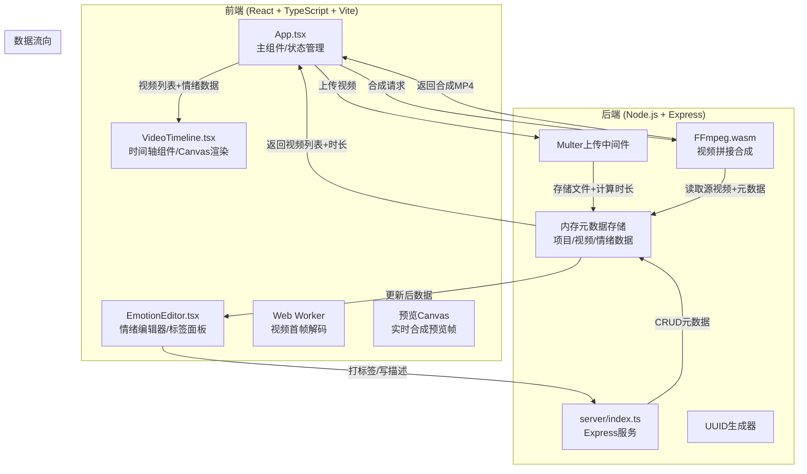
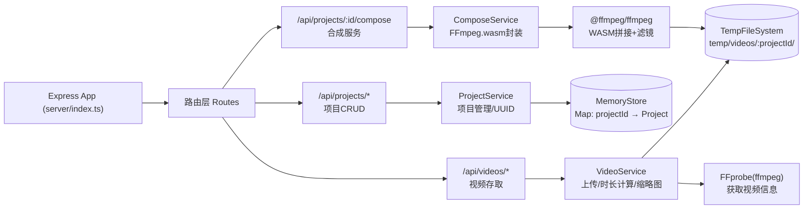
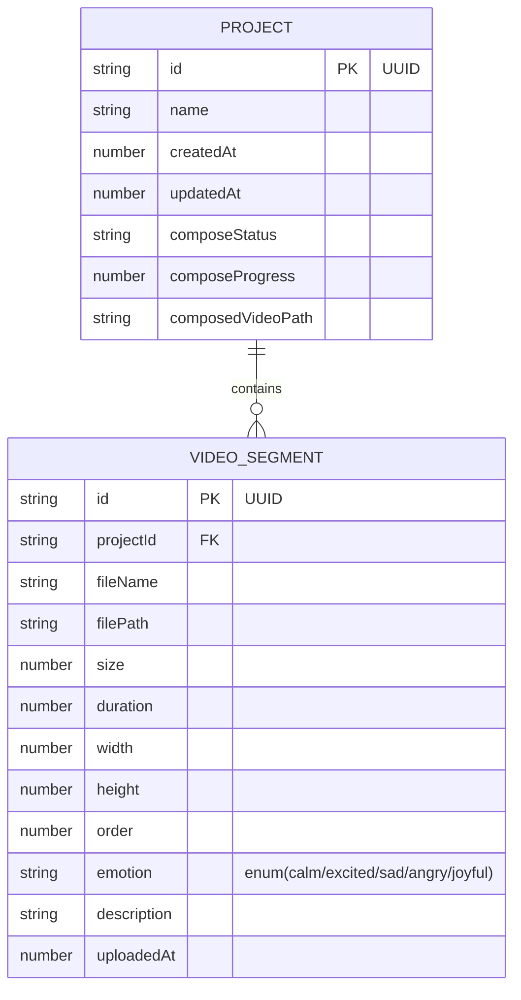
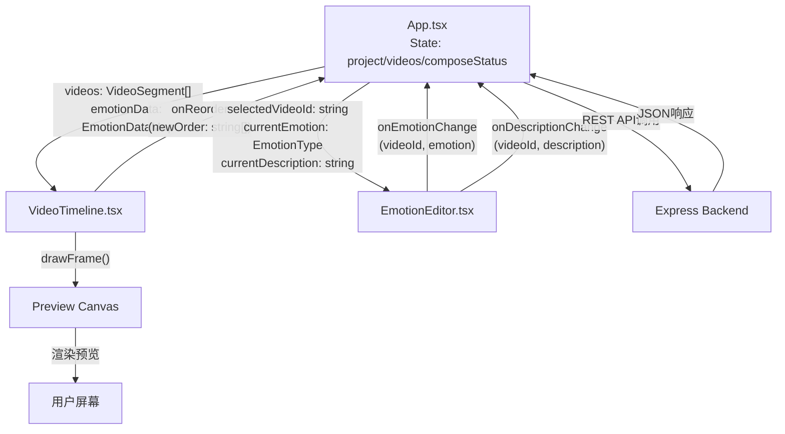

# 帧情速记 - 技术架构文档

## 1. 架构设计



## 2. 技术说明

- **前端框架**：React@18 + TypeScript@5 + Vite@5
- **构建工具**：Vite，配置支持WASM加载和大文件静态资源
- **前端路由**：Hash Router（简单分享链接），支持 `#/project/:id`
- **视频解码**：Web Worker + VideoElement解码首帧，5秒内完成
- **实时预览**：Canvas 2D API绘制光谱条+浮动字幕
- **后端框架**：Express@4
- **文件上传**：Multer@1.4，内存存储+磁盘临时目录双重方案
- **视频处理**：@ffmpeg/ffmpeg@0.12 + @ffmpeg/util，WASM端拼接+滤镜叠加
- **元数据存储**：Node.js内存Map（按项目ID索引），UUID@9生成唯一ID
- **开发命令**：`npm run dev` — 同时启动Vite(3000)和Express后端(3001)，使用concurrently

## 3. 路由定义

### 3.1 前端路由 (Hash Router)
| 路由 | 用途 |
|------|------|
| `#/` | 主工作台，新建项目 |
| `#/project/:projectId` | 加载并展示/编辑指定项目 |

### 3.2 后端API路由 (Express)
| 方法 | 路径 | 用途 |
|------|------|------|
| POST | `/api/projects` | 创建新项目，返回项目ID |
| GET | `/api/projects/:projectId` | 获取项目元数据（视频列表、情绪标签、描述等） |
| PUT | `/api/projects/:projectId` | 更新项目元数据（排序、标签、描述） |
| POST | `/api/projects/:projectId/videos` | 上传视频文件到项目（支持多文件） |
| DELETE | `/api/projects/:projectId/videos/:videoId` | 删除指定视频 |
| GET | `/api/videos/:videoId` | 流式获取视频文件 |
| GET | `/api/videos/:videoId/thumbnail` | 获取视频首帧缩略图 |
| POST | `/api/projects/:projectId/compose` | 触发合成预览，返回合成进度流或最终MP4 |
| GET | `/api/projects/:projectId/compose` | 获取合成结果MP4文件 |

## 4. API类型定义

```typescript
// ========== 核心数据模型 ==========

type EmotionType = 'calm' | 'excited' | 'sad' | 'angry' | 'joyful';

interface EmotionConfig {
  type: EmotionType;
  name: string;        // 中文显示名
  color: string;       // 十六进制颜色
  emoji: string;       // 表情图标
}

interface VideoSegment {
  id: string;                    // UUID
  fileName: string;
  filePath: string;              // 后端磁盘路径
  size: number;                  // 字节
  duration: number;              // 秒
  width: number;
  height: number;
  thumbnailDataUrl?: string;     // 首帧base64（可选）
  order: number;                 // 时间轴顺序
  emotion: EmotionType | null;   // 情绪标签
  description: string;           // 文字描述（≤30字）
  uploadedAt: number;            // 时间戳
}

interface Project {
  id: string;                    // UUID
  name: string;                  // 自动命名
  createdAt: number;
  updatedAt: number;
  videos: VideoSegment[];        // 按order排序
  composedVideoPath?: string;    // 合成后文件路径
  composeStatus: 'idle' | 'processing' | 'done' | 'error';
  composeProgress: number;       // 0-100
}

// ========== 请求/响应类型 ==========

interface CreateProjectResponse {
  projectId: string;
  project: Project;
}

interface UpdateProjectRequest {
  videos?: {
    id: string;
    order?: number;
    emotion?: EmotionType | null;
    description?: string;
  }[];
  name?: string;
}

interface UploadVideoResponse {
  videos: VideoSegment[];
  project: Project;
}

interface ComposeRequest {
  force?: boolean;               // 是否强制重新合成
}

interface ComposeProgressEvent {
  type: 'progress' | 'done' | 'error';
  progress: number;              // 0-100
  stage?: string;                // 当前阶段描述
  message?: string;
  downloadUrl?: string;
}
```

## 5. 后端服务架构



**模块职责与调用关系：**
- `server/index.ts`：Express入口，挂载路由、CORS、Multer中间件
- `server/services/ProjectService.ts`：项目创建、查询、更新、删除，调用MemoryStore
- `server/services/VideoService.ts`：视频上传存储、使用ffprobe读取元数据、生成缩略图
- `server/services/ComposeService.ts`：使用@ffmpeg/ffmpeg按时间轴拼接视频，应用drawtext滤镜和color光谱条滤镜
- `server/store/MemoryStore.ts`：内存Map存储，含TTL清理机制
- `server/middleware/upload.ts`：Multer配置，单文件≤20MB，总文件≤8个
- 数据流：路由 → Service → Store/FS → 路由返回JSON

## 6. 数据模型

### 6.1 实体关系图



### 6.2 内存存储结构

```typescript
// MemoryStore - 简单内存Map实现
class MemoryStore {
  private projects: Map<string, Project> = new Map();
  private createdAt: Map<string, number> = new Map();
  private TTL_MS = 24 * 60 * 60 * 1000; // 24小时过期

  get(projectId: string): Project | undefined;
  set(projectId: string, project: Project): void;
  delete(projectId: string): void;
  cleanup(): void; // 定期清理过期项目
}
```

## 7. 前端组件数据流向



**关键调用链路：**

1. **上传流程**：`App.onFileUpload()` → `POST /api/projects/:id/videos` (FormData) → 后端返回更新的VideoSegment数组 → App更新state → VideoTimeline重绘

2. **情绪打标流程**：`EmotionEditor.onEmotionClick(type)` → `App.updateEmotion(videoId, type)` → `PUT /api/projects/:id` → 后端更新 → App同步更新 → VideoTimeline绘制新颜色光谱

3. **描述更新流程**：`EmotionEditor.input onChange` → debounce 300ms → `App.updateDescription()` → PUT API → 后端持久化

4. **时间轴排序**：`VideoTimeline HTML5 DragDrop` → `App.reorderVideos(orderedIds)` → PUT API → 后端更新order字段

5. **预览渲染循环**：`requestAnimationFrame → VideoTimeline.drawFrame(t)` → Canvas 2D API：draw视频帧 + draw光谱条渐变 + draw浮动字幕（按t计算位置/透明度）

6. **合成流程**：`App.onCompose()` → `POST /api/projects/:id/compose` → ComposeService.runFFmpeg() → 读取各视频元数据生成concat demuxer → drawtext滤镜添加字幕 → color+overlay滤镜加光谱条 → 输出1080p/30fps MP4 → 前端轮询进度 → 完成后`<video>`播放 + `<a download>`下载

## 8. 性能约束保障方案

| 约束 | 解决方案 |
|------|----------|
| 预览帧解析≤5秒 | Web Worker中创建离屏`<video>`加载视频，监听`loadeddata`事件后`drawImage`到OffscreenCanvas，转base64返回主线程 |
| 合成时间≤视频总时长一半 | 1. 使用@ffmpeg/ffmpeg Wasm SIMD版本；2. 滤镜链尽量简单（单次drawtext而非多步）；3. concat demuxer直接拼接避免重复编码 |
| UI线程≥30fps | 所有视频解码、缩略图生成、合成计算均放在Web Worker或后端，主线程只做Canvas绘制和DOM更新；Canvas绘制用分层离屏缓存光谱条 |
