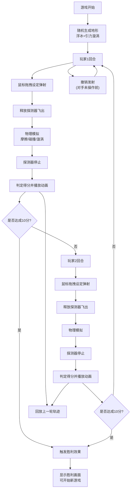

# PRD - 星轨弹射·太空冰壶

## 1. 产品概述
「星轨弹射·太空冰壶」是一款在浏览器中运行的2D策略竞技游戏，玩家操控发光冰晶构成的宇宙探测器，在布满随机浮冰和引力漩涡的冰蓝色星盘上进行弹射对决。游戏解决了传统弹射游戏缺乏物理惯性滑行和动态地形影响的问题，融合了冰壶运动的策略性与太空物理模拟的趣味性。

- **核心玩法**：鼠标拖拽设定弹射角度和力度，将探测器像冰壶一样弹射出去，利用浮冰碰撞反弹和引力漩涡偏转，最终停在目标得分区
- **目标用户**：休闲竞技游戏爱好者，喜欢策略类物理模拟游戏的玩家
- **产品价值**：提供双人回合制的本地对战体验，兼具策略思考与物理直觉的游戏乐趣

## 2. 核心特性

### 2.1 用户角色
| 角色 | 说明 | 核心权限 |
|------|------|----------|
| 玩家1（蓝方） | 本地对战的第一位玩家 | 进行弹射操作、撤销自己的发射、回放观看 |
| 玩家2（紫方） | 本地对战的第二位玩家 | 进行弹射操作、撤销自己的发射、回放观看 |

### 2.2 功能模块
1. **游戏主界面**：Canvas星盘渲染、UI比分板、操作按钮
2. **弹射物理系统**：拖拽力度/角度控制、摩擦滑行、弹性碰撞、引力牵引
3. **动态地形生成**：随机浮冰生成、引力漩涡生成
4. **回合计分系统**：同心圆得分区、分数累计、胜利判定
5. **回放与撤销**：轨迹回放、发射撤销
6. **视觉与音频反馈**：粒子特效、光晕效果、音效系统

### 2.3 页面详情
| 页面名称 | 模块名称 | 功能描述 |
|-----------|-------------|---------------------|
| 游戏主界面 | Canvas星盘 | 渲染星盘背景、浮冰、漩涡、探测器、粒子特效、得分区 |
| 游戏主界面 | 比分板 | 显示当前回合玩家、双方比分（霓虹蓝发光字体） |
| 游戏主界面 | 操作区 | 撤销按钮、回放按钮、新游戏按钮 |
| 游戏主界面 | 弹射指示 | 拖拽时显示弹性虚线（长度=力度、角度随鼠标），50%以上渐变黄色 |
| 游戏主界面 | 得分动画 | 闪烁光环、加分滚动动画 |
| 游戏主界面 | 胜利画面 | 彩色脉冲光、半透明蒙版、逐字弹出胜利文字 |

## 3. 核心流程

**主流程描述**：
1. 游戏开始 → 随机生成地形（15-20块浮冰 + 5-8个引力漩涡）
2. 玩家1回合 → 鼠标在探测器上按下并拖拽 → 显示弹射虚线 → 松开弹射 → 探测器滑行（摩擦减速+碰撞反弹+漩涡偏转）→ 生成冰晶拖尾
3. 探测器停止 → 判定得分（按同心圆位置）→ 播放得分音效和动画 → 切换到玩家2
4. 玩家2重复步骤2-3的操作
5. 每轮结束后可使用回放功能观看上一轮轨迹，或在对手操作前撤销自己的发射
6. 循环进行直到某方率先累计10分 → 触发胜利效果 → 可开始新游戏

## 4. 用户界面设计

### 4.1 设计风格
- **主色调**：深蓝到紫黑径向渐变背景（#0B0C2A → #1A1A2E），冰蓝色浮冰（#8EE4F0 → #A8D8EA），淡紫色漩涡光晕，霓虹蓝比分（#00F0FF）
- **得分区颜色**：外圈#4A90D9(0.3)，中圈#357ABD(0.4)，内圈#2A6F97(0.5)
- **视觉风格**：太空科幻风，发光边缘，半透明材质，粒子特效
- **字体风格**：比分数字采用霓虹发光效果（带阴影），UI文字简洁现代
- **按钮风格**：圆形半透明撤销按钮，悬停放大+文字提示
- **动效风格**：平滑过渡、微光辉光、粒子爆散、逐字弹出

### 4.2 页面设计概览
| 页面名称 | 模块名称 | UI元素 |
|-----------|-------------|-------------|
| 游戏主界面 | 星盘Canvas | 居中显示，圆形星盘，深蓝紫黑径向渐变背景 |
| 游戏主界面 | 得分区 | 三个半透明同心圆环，位于星盘中心区域 |
| 游戏主界面 | 浮冰 | 随机六边形，冰蓝半透明，发光边缘 |
| 游戏主界面 | 引力漩涡 | 旋转淡紫色光晕，40px半径 |
| 游戏主界面 | 探测器 | 发光冰晶造型，带粒子拖尾 |
| 游戏主界面 | 比分板 | 左上角，霓虹蓝发光数字，显示当前回合玩家 |
| 游戏主界面 | 撤销按钮 | 右上角，圆形半透明，悬停放大 |
| 游戏主界面 | 回放按钮 | 撤销按钮下方，样式统一 |
| 游戏主界面 | 弹射虚线 | 拖拽时从探测器延伸出的弹性线，>50%长度渐变黄色 |
| 游戏主界面 | 得分效果 | 闪烁光环（1.5秒，闪烁2次），加分滚动数字 |
| 游戏主界面 | 胜利画面 | 半透明黑蒙版(0.6透明度)，逐字放大弹出的胜利文字 |

### 4.3 响应式设计
- **桌面优先设计**：基准分辨率1280x720
- **适配区间**：800x600 到 1920x1080 自动缩放
- **布局策略**：Canvas按比例缩放保持圆形，UI元素相对定位，字体大小基于视口单位
- **触摸优化**：支持触屏拖拽操作（等效鼠标事件）

## 5. 性能与技术指标
- **帧率**：全程60fps
- **粒子峰值**：正常游戏≤200颗，回放≤150颗
- **内存占用**：稳定在150MB以下
- **交互响应**：延迟≤16ms
- **音频同步**：Web Audio API实时音效
