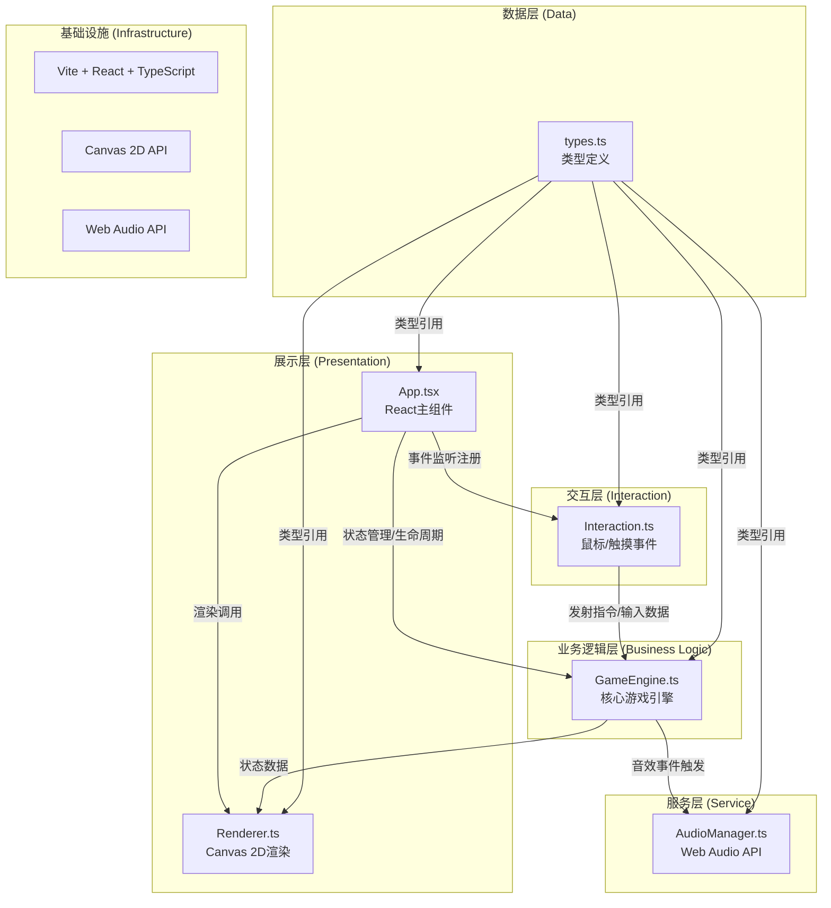

# 技术架构文档 - 星轨弹射·太空冰壶

## 1. 架构设计



## 2. 技术说明

- **前端框架**：React@18 + TypeScript（严格模式）
- **构建工具**：Vite@5 + @vitejs/plugin-react（支持React严格模式）
- **渲染引擎**：Canvas 2D API（所有游戏实体、粒子特效、UI元素渲染）
- **音频引擎**：Web Audio API（程序化生成碰撞音效、漩涡音效、得分音阶）
- **状态管理**：React useState/useRef + GameEngine内部状态机（不引入额外状态库）
- **目标语言版本**：ES2020

## 3. 模块职责划分

### 3.1 核心模块清单

| 模块 | 文件路径 | 职责 | 关键接口/方法 |
|------|----------|------|--------------|
| 类型定义 | `src/types.ts` | 声明所有公共接口、数据结构、枚举常量 | `Vector2`, `Probe`, `IceFloe`, `Vortex`, `Particle`, `GameState`, `Player`, 等 |
| 游戏引擎 | `src/GameEngine.ts` | 物理模拟、碰撞检测、回合计分、回放记录、状态机 | `init()`, `update(delta)`, `render(ctx)`, `launchProbe()`, `undoLastLaunch()`, `getReplayFrames()`, `startReplay()` |
| 渲染模块 | `src/Renderer.ts` | Canvas 2D绘制所有视觉元素 | `renderBackground()`, `renderIceFloes()`, `renderVortices()`, `renderProbe()`, `renderParticles()`, `renderScoreZones()`, `renderAimLine()`, `renderUI()`, `renderVictory()` |
| 交互模块 | `src/Interaction.ts` | 鼠标/触摸事件监听，弹射参数计算 | `bind(canvas)`, `onAimStart()`, `onAimMove()`, `onAimEnd()`, `getAimParams()` |
| 音频管理 | `src/AudioManager.ts` | Web Audio API封装，各类音效生成 | `init()`, `playCollision()`, `playVortexStart()`, `playVortexStop()`, `playScore()`, `playVictory()` |
| 主组件 | `src/App.tsx` | React生命周期管理、模块协调、UI组件 | `useGameLoop()`, 状态变量管理、组件渲染 |

## 4. 核心数据结构定义

### 4.1 基础类型
```typescript
// 二维向量
interface Vector2 { x: number; y: number; }

// 玩家枚举
enum Player { PLAYER1 = 1, PLAYER2 = 2 }

// 游戏状态枚举
enum GamePhase {
  WAITING,      // 等待玩家操作（可拖拽）
  LAUNCHING,    // 探测器飞行中
  SCORING,      // 计分动画中
  REPLAY,       // 回放中
  GAME_OVER     // 游戏结束
}
```

### 4.2 游戏实体
```typescript
// 探测器（冰晶宇宙飞船）
interface Probe {
  id: string;
  player: Player;
  position: Vector2;
  velocity: Vector2;
  radius: number;        // 碰撞半径 12px
  isMoving: boolean;
  inVortex: boolean;     // 是否在引力漩涡内
  trailParticles: Particle[];
}

// 浮冰（六边形）
interface IceFloe {
  id: string;
  position: Vector2;
  size: number;          // 边长 20-40px
  rotation: number;      // 旋转角度
  vertices: Vector2[];   // 六边形顶点（相对中心）
  colorStart: string;    // #8EE4F0
  colorEnd: string;      // #A8D8EA
}

// 引力漩涡
interface Vortex {
  id: string;
  position: Vector2;
  radius: number;        // 40px
  rotationSpeed: number; // 0.01-0.03 rad/frame
  rotationAngle: number; // 当前旋转角度
  pullStrength: number;  // 牵引加速度强度
}

// 粒子（通用：拖尾/碰撞碎片/得分特效）
interface Particle {
  position: Vector2;
  velocity: Vector2;
  life: number;          // 剩余生命周期（秒）
  maxLife: number;       // 初始生命周期
  size: number;          // 当前大小
  maxSize: number;       // 初始大小
  color: string;
  opacity: number;
}
```

### 4.3 游戏状态
```typescript
interface GameState {
  phase: GamePhase;
  currentPlayer: Player;
  scores: { [Player.PLAYER1]: number; [Player.PLAYER2]: number };
  probes: Probe[];
  currentProbe: Probe | null;
  iceFloes: IceFloe[];
  vortices: Vortex[];
  particles: Particle[];
  scoreAnimation: ScoreAnimationState | null;
  victoryAnimation: VictoryAnimationState | null;
  
  // 回放相关
  replayFrames: ReplayFrame[];
  isReplaying: boolean;
  replayFrameIndex: number;
  
  // 撤销相关
  lastLaunchSnapshot: LaunchSnapshot | null;
  canUndo: boolean;
}
```

## 5. 物理系统核心算法

### 5.1 弹射初速度计算
```
拖拽向量 = 鼠标按下位置 - 鼠标当前位置
力度百分比 = clamp(拖拽向量长度 / 最大拖拽长度, 0, 1)  最大拖拽长度=150px
初速度大小 = 力度百分比 * 最大初速度(8 px/frame)
初速度方向 = normalize(拖拽向量)
```

### 5.2 摩擦滑行
每帧更新：
```
速度大小 = 速度大小 * (1 - 摩擦系数0.02)
若 速度大小 < 0.05 → 停止移动
```

### 5.3 六边形碰撞检测
- 探测器与浮冰：使用分离轴定理(SAT)进行圆与多边形碰撞检测
- 碰撞响应：弹性碰撞公式，恢复系数e=0.6
```
法向分量反弹：v_n' = -e * v_n
切向分量保留：v_t' = v_t
```

### 5.4 引力漩涡牵引
每帧检测距离<40px：
```
到中心方向向量 = normalize(漩涡位置 - 探测器位置)
牵引加速度 = 牵引强度(0.3) * (1 - 距离/半径)
速度 += 到中心方向向量 * 牵引加速度
```

## 6. 性能优化策略

1. **粒子池化**：使用对象池复用Particle对象，避免频繁GC，限制峰值≤200/150
2. **空间分区**：浮冰使用网格空间分区，碰撞检测复杂度从O(n)降至O(1)
3. **脏渲染**：非动画期减少重绘，UI变化局部更新
4. **requestAnimationFrame**：使用原生RAF驱动游戏循环，delta时间标准化
5. **Canvas分层**：（可选）静态地形和动态对象分层Canvas减少重绘量
6. **向量运算内联**：热点路径避免函数调用开销

## 7. 构建与运行

| 命令 | 说明 |
|------|------|
| `npm install` | 安装项目依赖 |
| `npm run dev` | 启动Vite开发服务器 |
| `npm run build` | 生产构建 |
| `npm run typecheck` | TypeScript类型检查 |
