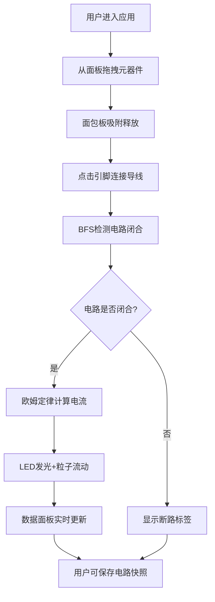

## 1. 产品概述

电子电路拼装沙盘是一款基于浏览器的交互式电路模拟应用，解决抽象电路原理难以直观观察和动手探索的问题。用户可通过拖拽元器件到虚拟面包板上，实时观察电路闭合状态、电流电压计算结果以及LED发光效果。

- 目标用户：电子爱好者、学生、教育工作者
- 产品价值：提供零成本、零风险的电路实验环境，降低电子学习门槛

## 2. 核心功能

### 2.1 功能模块

1. **主界面**：顶部工具栏、左侧元器件面板、中央面包板区域、右上角数据面板
2. **元器件拖拽系统**：5种基础元器件（电池、电阻、LED、开关、导线）的拖拽与吸附
3. **导线连接系统**：引脚连接、贝塞尔曲线绘制、障碍物避让
4. **电路物理引擎**：BFS闭合检测、欧姆定律计算、LED阈值判断
5. **粒子动画系统**：能量流动粒子、呼吸发光效果、断路标签动画
6. **电路存储系统**：localStorage保存/加载最多3个电路快照

### 2.3 页面详情

| 页面名称 | 模块名称 | 功能描述 |
|-----------|-------------|---------------------|
| 主界面 | 顶部工具栏 | 保存按钮、加载按钮、模态对话框 |
| 主界面 | 元器件面板 | 5类元器件列表、参数选择器、拖拽源 |
| 主界面 | 面包板区域 | 10x15网格Canvas、元件渲染、导线渲染、粒子动画渲染、交互事件处理 |
| 主界面 | 数据面板 | 实时电压/电流/功率显示、电路状态标签、断路闪烁动画 |

## 3. 核心流程

用户从左侧面板拖拽元器件 → 面包板自动吸附网格 → 点击引脚建立导线连接 → 系统实时检测电路状态 → 闭合时计算物理参数并驱动动画 → 可保存当前电路到本地

## 4. 用户界面设计

### 4.1 设计风格
- **主题风格**：深色科技风（赛博朋克/工程仪表风格）
- **主色调**：背景#1E1E2E、面板#2D2D44、面包板#2A2A3D
- **强调色**：数据绿#00FF88、导线蓝#4A90D9、粒子橙#FFAA00、断路红#FF4444
- **交互反馈**：弹性缩放、发光高亮、呼吸动画、抖动反馈

### 4.2 页面设计概述

| 页面名称 | 模块名称 | UI元素 |
|-----------|-------------|-------------|
| 主界面 | 顶部工具栏 | Flex布局、圆角按钮、磨砂背景 |
| 主界面 | 元器件面板 | 240px宽、卡片式元件、hover放大1.05倍 |
| 主界面 | 面包板区域 | Canvas 2D渲染、10x15虚线网格、35px间距 |
| 主界面 | 数据面板 | 280px宽、backdrop-filter磨砂、等宽字体、绿字灰标签 |

### 4.3 响应式
- 桌面端优先设计，最小宽度1000px
- 面包板区域自适应填充剩余高度
- 固定左侧面板240px与右上角数据面板280px

### 4.4 性能指标
- 60FPS动画（requestAnimationFrame）
- 拖拽/连接响应 ≤ 50ms
- localStorage读写 ≤ 10ms
