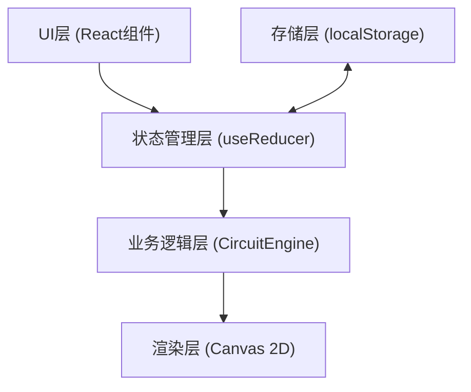

## 1. 架构设计

纯前端单页应用，无后端依赖。采用分层架构：



## 2. 技术描述

- **前端框架**：React@18 + TypeScript@5（严格模式）
- **构建工具**：Vite@5 + @vitejs/plugin-react@4
- **渲染技术**：Canvas 2D API（面包板、元件、导线、粒子）
- **状态管理**：React useReducer（中心化状态，action驱动）
- **数据持久化**：浏览器 localStorage
- **HTML5 API**：Drag and Drop API（元件拖拽）

## 3. 核心模块与文件结构

```
项目根目录
├── package.json
├── vite.config.js
├── tsconfig.json
├── index.html
└── src/
    ├── types.ts              # 类型定义：Component/Connection/CircuitState/SimParams
    ├── CircuitEngine.ts      # 纯函数：电路检测(BFS)、物理计算(欧姆定律)
    ├── ComponentPalette.tsx  # 左侧元器件面板：拖拽源、参数选择
    ├── Breadboard.tsx        # 面包板Canvas：渲染、事件、动画循环
    ├── DataPanel.tsx         # 右上角数据面板：参数显示、状态标签
    └── App.tsx               # 根组件：useReducer状态、布局组合
```

## 4. 数据模型

### 4.1 核心类型定义

```typescript
// 元器件类型
type ComponentType = 'battery' | 'resistor' | 'led' | 'switch' | 'wire';

interface Component {
  id: string;                    // 唯一ID
  type: ComponentType;           // 元件类型
  position: { x: number; y: number };  // 网格对齐坐标
  params: Record<string, any>;   // 参数：电压/阻值/颜色/开关状态
  pinPositions: Array<{ x: number; y: number }>;  // 引脚坐标（相对）
}

// 连接关系
interface Connection {
  id: string;
  fromId: string;        // 起始元件ID
  fromPinIndex: number;  // 起始引脚索引
  toId: string;          // 目标元件ID
  toPinIndex: number;    // 目标引脚索引
}

// 电路状态枚举
enum CircuitState {
  Closed = 'closed',    // 闭合
  Open = 'open'         // 断路
}

// 模拟参数
interface SimParams {
  voltage: number;      // 电压 V
  current: number;      // 电流 mA
  power: number;        // 功率 mW
  status: CircuitState; // 状态
}

// 电路快照
interface CircuitSnapshot {
  id: string;
  name: string;
  timestamp: number;
  components: Component[];
  connections: Connection[];
}

// 全局State
interface AppState {
  components: Component[];
  connections: Connection[];
  simParams: SimParams;
  snapshots: CircuitSnapshot[];
}
```

### 4.2 全局State与Action

```typescript
type Action =
  | { type: 'ADD_COMPONENT'; payload: Component }
  | { type: 'REMOVE_COMPONENT'; payload: string }
  | { type: 'UPDATE_COMPONENT_PARAM'; payload: { id: string; params: any } }
  | { type: 'ADD_CONNECTION'; payload: Connection }
  | { type: 'REMOVE_CONNECTION'; payload: string }
  | { type: 'UPDATE_SIM_PARAMS'; payload: SimParams }
  | { type: 'SAVE_SNAPSHOT'; payload: { name: string } }
  | { type: 'LOAD_SNAPSHOT'; payload: string }
  | { type: 'DELETE_SNAPSHOT'; payload: string };
```

## 5. 关键算法

### 5.1 电路闭合检测（BFS）
1. 构建邻接表：引脚ID → 相邻引脚ID列表
2. 找到电池正负极引脚
3. BFS从正极出发，若能到达负极且所有开关均闭合 → 电路闭合
4. 返回是否闭合、参与串联的总电阻、电池电压

### 5.2 贝塞尔曲线避障
1. 取起点与终点的中点
2. 检测中点附近是否存在障碍物元件
3. 若存在，将控制点沿垂直方向偏移（障碍物半径+20px）
4. 生成二次贝塞尔曲线路径

### 5.3 粒子沿路径移动
1. 使用贝塞尔曲线参数方程：B(t) = (1-t)²P0 + 2(1-t)tP1 + t²P2
2. 粒子t值随时间递增（速度30px/s）
3. 每帧更新所有粒子的位置并渲染

## 6. 性能优化策略

- 粒子对象池复用，避免频繁GC
- Canvas脏区渲染：仅重绘变化区域（如粒子位置）
- useMemo缓存BFS邻接表计算结果
- requestAnimationFrame驱动所有动画，与浏览器刷新率同步
