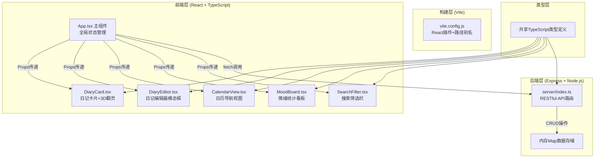
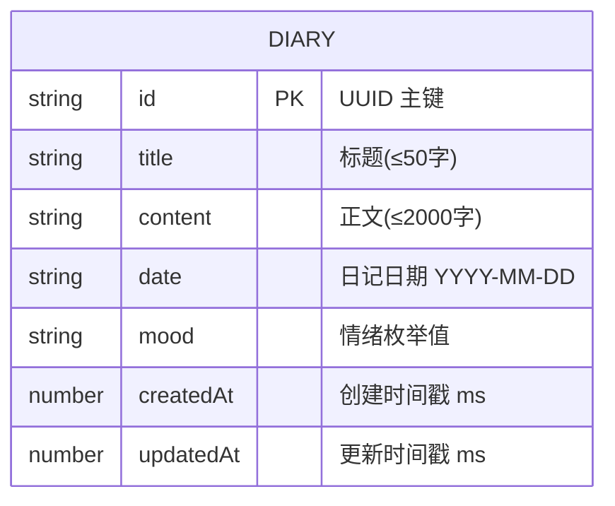

## 1. 架构设计



## 2. 技术描述

- **前端框架**: React 18 + TypeScript (严格模式 strict: true, ES2020 模块)
- **构建工具**: Vite 5.x + @vitejs/plugin-react 4.x (支持路径别名 @/ 映射到 src/)
- **UI样式**: 纯 CSS + CSS Modules (不用UI库，手工实现纸张质感、翻页动画、情绪标签)
- **后端框架**: Express 4.x + ts-node (直接运行TypeScript服务端代码)
- **数据存储**: 内存存储 (使用 `Map<string, Diary>`，uuid 生成唯一ID)
- **音频**: Web Audio API (播放白噪声模拟纸页摩擦音效)
- **动画**: CSS 3D transform + transition (翻页rotateY、光晕box-shadow、缩放scale)
- **初始化方式**: 手工创建所有配置文件和源码，`npm run dev` 同时启动Vite前端和Express后端（使用concurrently）

## 3. 路由定义

本应用为单页应用(SPA)，前端不使用路由库，所有界面在主页面内通过组件状态切换展示：

| 逻辑视图 | 触发方式 | 用途 |
|---------|---------|------|
| 日记浏览视图 | 默认视图 | 展示翻页卡片、日历、看板、搜索栏 |
| 日记编辑器模态框 | 点击「新建日记」或「编辑」按钮 | 新建/编辑单篇日记 |

## 4. API 定义

### 4.1 类型定义

```typescript
// 情绪类型
type Mood = 'happy' | 'calm' | 'sad' | 'angry' | 'surprised';

// 日记数据模型
interface Diary {
  id: string;          // UUID
  title: string;       // 标题（最多50字）
  content: string;     // 正文（最多2000字）
  date: string;        // 日期 ISO格式 YYYY-MM-DD
  mood: Mood;          // 情绪标签
  createdAt: number;   // 创建时间戳
  updatedAt: number;   // 更新时间戳
}

// 搜索筛选条件
interface FilterOptions {
  keyword: string;
  mood?: Mood;
  startDate?: string;
  endDate?: string;
}
```

### 4.2 RESTful API 接口

| 方法 | 路径 | 请求体 | 响应 | 描述 |
|------|------|--------|------|------|
| POST | `/api/diaries` | `{title, content, date, mood}` | `201 {Diary}` | 创建新日记，ID和时间戳由后端生成 |
| GET | `/api/diaries` | - | `200 Diary[]` | 获取所有日记，按createdAt降序返回 |
| PUT | `/api/diaries/:id` | `{title?, content?, date?, mood?}` | `200 {Diary}` | 更新指定ID的日记（部分字段更新） |
| DELETE | `/api/diaries/:id` | - | `204 No Content` | 删除指定ID的日记 |

### 4.3 错误响应格式

```json
{
  "error": true,
  "message": "错误描述信息",
  "code": "VALIDATION_ERROR/NOT_FOUND/SERVER_ERROR"
}
```

## 5. 服务器架构图


**数据流向**:
1. 前端 `fetch` 发送请求 → Express 接收
2. 中间件解析 JSON Body → 路由匹配
3. 参数校验（标题≤50字、正文≤2000字、情绪枚举校验）
4. 操作内存 Map（CRUD）
5. 返回 `res.json()` 响应 → 前端更新 useState

## 6. 数据模型

### 6.1 数据模型 ER 图



### 6.2 内存存储结构

```typescript
// 内存存储使用 Map，key 为 diary.id
const diariesMap: Map<string, Diary> = new Map();

// 索引结构（辅助查询优化）
const dateIndex: Map<string, string[]> = new Map();
// key: YYYY-MM-DD, value: diaryId[]

const moodIndex: Map<Mood, string[]> = new Map();
// key: Mood枚举值, value: diaryId[]
```

### 6.3 初始模拟数据

应用启动时注入 3-5 篇示例日记，覆盖不同情绪和日期，便于测试翻页和统计功能。

## 7. 文件目录结构与调用关系

```
auto137/
├── package.json                 # 依赖定义 + dev启动脚本
├── vite.config.js               # Vite配置 + 路径别名 + 代理到后端3001
├── tsconfig.json                # TS严格模式 + ES2020 + 路径别名
├── index.html                   # 入口HTML (UTF-8, 视口meta, 中文lang)
├── server/
│   └── index.ts                 # Express服务端 (端口3001)
│       ├── 定义 API 路由
│       ├── 操作内存Map
│       └── 返回JSON响应
└── src/
    ├── main.tsx                 # React入口
    ├── App.tsx                  # 主组件 (顶层)
    │   ├── useState管理日记列表
    │   ├── useEffect初始加载GET
    │   ├── fetch调用后端API
    │   ├── 计算筛选后列表
    │   ├── 计算情绪统计数据
    │   └── 渲染子组件
    ├── types.ts                 # Diary/Mood 类型定义 (共享)
    ├── utils/
    │   ├── audio.ts             # Web Audio API 翻页音效
    │   └── helpers.ts           # 日期格式化/情绪配色工具
    ├── styles/
    │   ├── global.css           # 全局样式 + CSS变量
    │   └── paper.css            # 纸张纹理/翻页动画关键帧
    └── components/
        ├── DiaryCard.tsx        # 单页卡片 → 从App接收diary props
        ├── DiaryEditor.tsx      # 编辑器 → 从App接收onSave回调
        ├── CalendarView.tsx     # 日历 → 从App接收diaries + onDateClick
        ├── MoodBoard.tsx        # 情绪看板 → 从App接收统计数据
        └── SearchFilter.tsx     # 搜索栏 → 从App接收onFilterChange
```
