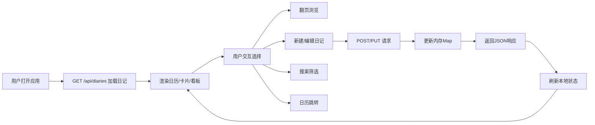

## 1. 产品概述

「时光手账·电子札记」是一款面向手账爱好者的全栈Web日记应用，让用户在浏览器中以视觉化的方式记录生活碎片与心情点滴，拥有仿实体手账的翻页动画与纸张质感体验。

- 核心价值：将传统手账的仪式感与数字记录的便捷性结合，通过3D翻页、情绪标签、日历导航等功能，打造沉浸式的电子手账体验
- 目标用户：热爱生活记录的手账爱好者、文字工作者、情绪觉察者

## 2. 核心功能

### 2.1 功能模块
1. **主应用页面**：日记卡片浏览、顶部搜索栏、左侧日历、底部情绪看板、日记编辑器
2. **日记卡片**：3D翻页动画、情绪标签图标、纸张纹理质感、翻页音效
3. **日记编辑器**：标题输入、正文输入、日期自动记录、情绪标签选择、表单验证
4. **日历视图**：当月日历网格、情绪彩色圆点、日期快速跳转、悬停提示
5. **情绪看板**：本周情绪分布柱状图、柱高=日记数量、柱色=情绪颜色、悬停详情
6. **搜索筛选**：关键词实时搜索、情绪标签筛选、日期区间筛选

### 2.2 页面详情

| 页面名称 | 模块名称 | 功能描述 |
|-----------|-------------|---------------------|
| 主应用页面 | 顶部搜索栏 | 关键词输入实时筛选（标题/正文），情绪下拉筛选，日期区间选择器 |
| 主应用页面 | 左侧日历 | 7×6网格当月日历，有日记的日期显示彩色圆点（颜色=情绪，大小=数量），点击跳转 |
| 主应用页面 | 中央卡片区 | 日记卡片堆叠展示，上一页/下一页按钮触发3D翻页动画，右上角情绪图标 |
| 主应用页面 | 底部情绪看板 | 横条式柱状图，周一至周日7根柱子，柱高代表日记数，柱色对应情绪，悬停显示详情 |
| 主应用页面 | 日记编辑器 | 浮动模态框，标题（≤50字）、正文（≤2000字）、自动日期、5种情绪选择，保存/取消 |
| 日记卡片 | 翻页交互 | 点击按钮绕Y轴旋转180°（0.6s），CSS 3D transform，背面亚麻纹理，纸页摩擦音效（0.3s白噪声） |
| 日记卡片 | 情绪标签 | 圆形24px彩色图标，悬停放大1.2倍+光晕动画（0.2s），开心/平静/忧伤/愤怒/惊喜五色 |

## 3. 核心流程

### 主用户流程
用户打开应用 → 后端加载全部日记 → 渲染日历圆点、卡片、情绪看板 → 用户可选择：
- 点击卡片翻页按钮 → 3D翻页动画+音效 → 切换到下一篇/上一篇
- 点击日历日期 → 卡片跳转到该日日记
- 点击"新建日记" → 弹出编辑器 → 填写内容 → 保存 → POST请求 → 刷新列表
- 在搜索框输入 → 实时筛选卡片列表
- 选择情绪/日期区间 → 组合筛选
- 悬停情绪看板柱子 → 显示当日统计详情

## 4. 用户界面设计

### 4.1 设计风格
- **主色调**：暖色调米白背景 `#F5E6D3`，卡片底色 `#E8D5B7`，磨损圆角，柔和阴影
- **情绪配色**：开心-暖黄 `#F9D423`，平静-薄荷绿 `#7EC8E3`，忧伤-浅紫 `#B19CD9`，愤怒-珊瑚红 `#FF6B6B`，惊喜-亮粉 `#FF9FF3`
- **卡片样式**：方形书页，四角磨损圆角，`box-shadow: 2px 2px 8px rgba(0,0,0,0.1)`，背面仿亚麻纹理灰棕色
- **字体**：标题用手写感衬线体，正文用清晰易读的宋体/楷体体系
- **动画**：翻页0.6s，情绪图标悬停0.2s光晕，日历圆点大小渐变

### 4.2 页面设计概要

| 页面名称 | 模块名称 | UI元素 |
|-----------|-------------|-------------|
| 主应用页面 | 整体布局 | 桌面三栏：左日历（25%）+ 中卡片（50%）+ 右筛选（25%）；底部横条看板；纸张纹理背景 |
| 主应用页面 | 顶部搜索栏 | 圆角输入框+放大镜图标，情绪下拉chip，日期区间两个date picker |
| 主应用页面 | 日历视图 | 7×6网格，周标题浅灰，今日高亮边框，日记日期彩色圆点，圆点大小随数量，悬停tooltip |
| 主应用页面 | 卡片区域 | 卡片居中堆叠，上一页/下一页按钮左右两侧，卡片正面显示标题/日期/正文/情绪，背面亚麻纹理+装饰 |
| 主应用页面 | 情绪看板 | 7根柱子横排，X轴=周一周日，柱色=当日主导情绪，柱高=日记数，柱子圆角渐变 |
| 日记编辑器 | 模态框 | 半透明遮罩，纸张白色，标题输入框（带字数统计），正文textarea（行数自适应），情绪chip选择，底部保存/取消按钮 |

### 4.3 响应式设计
- **桌面端（≥1024px）**：三栏布局，日历25% + 卡片50% + 筛选25%，看板固定底部
- **平板（600-1023px）**：两栏布局，日历可折叠到顶部，卡片居中占主要空间，看板在底部
- **手机（<600px）**：单列滚动布局，日历和看板为手风琴可折叠，卡片全屏，编辑器全屏模态

### 4.4 性能要求
- 翻页动画稳定 ≥ 30fps（使用CSS transform + will-change优化）
- 搜索响应 ≤ 300ms（前端本地筛选，防抖处理）
- 首屏加载 ≤ 2s（按需加载组件，Vite代码分割）
