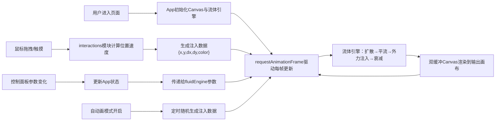

## 1. 产品概述

「幻彩流体画」是一款基于浏览器的实时流体艺术生成器，让数字艺术家和普通用户通过鼠标拖拽与参数调节，模拟油彩在水面上扩散、交融和旋转的动态过程，每一帧都是独一无二的艺术作品。

- 目标用户：数字艺术家、设计爱好者、创意工作者、休闲娱乐用户
- 市场价值：提供零门槛的沉浸式艺术创作体验，结合物理模拟与交互设计，可用于生成壁纸、背景素材、社交媒体分享内容

## 2. 核心功能

### 2.1 功能模块

1. **主画布区域**：实时流体粒子渲染、颜色混合效果、帧率显示、暗角覆盖层
2. **控制面板**：流体参数调节、颜色模式切换、背景预设、操作按钮
3. **流体模拟引擎**：双缓冲Canvas、Navier-Stokes近似求解、速度/密度/颜色场更新
4. **交互系统**：鼠标多点触控检测、速度计算、力场注入映射
5. **自动生成模式**：随机位置/方向/颜色自动注入流体

### 2.2 页面详情

| 页面名称 | 模块名称 | 功能描述 |
|-----------|-------------|---------------------|
| 主页面 | 流体画布 | 渲染实时流体模拟结果，响应鼠标/触摸输入，显示FPS |
| 主页面 | 控制面板(PC) | 悬浮右侧280px固定宽度，包含所有参数滑块和按钮 |
| 主页面 | 控制面板(移动) | 底部折叠40px标签栏，点击展开可拖动半屏面板 |
| 主页面 | 颜色选择器 | 圆形色轮按钮，弹出环形HSV色盘选取注入颜色 |
| 主页面 | 背景预设切换 | 4种深色垂直渐变背景一键切换 |

## 3. 核心流程

用户打开应用后看到深色渐变背景和悬浮控制面板，默认自动启动流体模拟。

## 4. 用户界面设计

### 4.1 设计风格

- **主色调**：深色主题，背景使用 `#0a0a1a` → `#1a1a2e` 垂直渐变
- **强调色**：流体注入色默认 `#FF3366`（霓虹粉红），滑块轨道蓝色渐变 `#4a90d9` → `#357abd`
- **控制面板**：半透明毛玻璃材质，`backdrop-filter: blur(10px)`，背景 `rgba(255,255,255,0.06)`，圆角12px
- **按钮风格**：圆角8px，悬停放大 `scale(1.05)`，过渡 `0.2s ease`
- **滑块风格**：细长金属质感，圆形滑块带蓝色外发光 `box-shadow: 0 0 10px #4a90d9`
- **字体**：使用现代无衬线字体组合，标题粗体醒目，正文纤细清晰
- **画布装饰**：边缘暗角效果，使用 `radial-gradient` 覆盖层制造画面聚焦感

### 4.2 页面设计概述

| 页面名称 | 模块名称 | UI元素 |
|-----------|-------------|-------------|
| 主页面 | 流体画布 | 全屏宽度，高度自适应(≥400px)，左上角FPS标签(白字半透明)，暗角vignette覆盖 |
| 主页面 | 控制面板 | 标题「参数调节」，分组标签：流体/颜色/背景/操作，垂直排列，移动端底部弹出 |
| 主页面 | 滑块组件 | 标签+数值显示+细长轨道+发光圆形滑块 |
| 主页面 | 色轮选择器 | 圆形预览色块，点击展开环形色盘，当前色外圈高亮 |
| 主页面 | 功能按钮 | 重置画布（红粉渐变）、自动画开关（切换式滑块按钮） |

### 4.3 响应式设计

- **桌面端（≥768px）**：控制面板固定右侧280px宽，画布占据左侧全部剩余空间
- **移动端（<768px）**：控制面板折叠为底部40px高标签栏（带向上箭头图标），点击标签展开为50vh高可拖动面板（顶部带拖动条），画布占全屏
- **触摸优化**：支持至少2点同时触控注入，手指移动即注入颜色和力场，无悬停态

### 4.4 Canvas渲染性能优化

- 双缓冲离屏Canvas避免闪烁
- 分辨率比例滑块(0.25x-1.0x)，低分辨率下降低每帧像素处理量
- 使用 `Float32Array` 存储速度场和密度场，GPU友好内存布局
- 数值模拟迭代次数与粘度关联，平衡物理精度与性能
