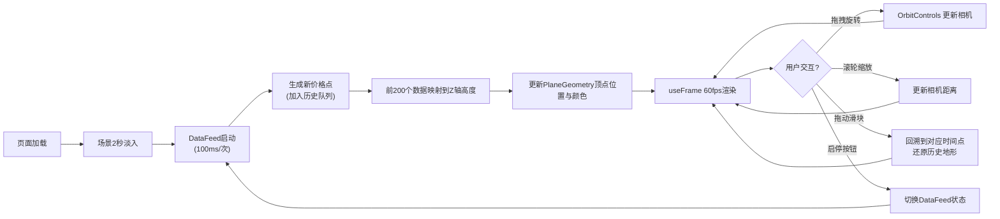

## 1. 产品概述
「价格地形·波动山脉」是一款面向数据艺术家和金融爱好者的3D交互可视化工具，将实时股票或加密货币价格流转化为动态起伏的3D地貌，通过沉浸式视觉体验让用户直观感知市场波动。
- 核心价值：将抽象的金融数据转化为可交互、可感知的视觉山脉形态，降低数据分析门槛
- 目标用户：数据艺术家、交易员、金融可视化爱好者、数据科学学习者

## 2. 核心功能

### 2.1 功能模块
1. **主场景页**：3D动态地形渲染、实时数据驱动、视觉交互控制、UI信息覆层

### 2.2 页面详情
| 页面名称 | 模块名称 | 功能描述 |
|-----------|-------------|---------------------|
| 主场景页 | 3D地形渲染 | 200x200顶点PlaneGeometry网格，高度随价格变化率映射到-2~2单位，颜色根据高度渐变映射 |
| 主场景页 | 数据推送模块 | 每100ms生成新价格点，维护最近200个价格历史，支持启停控制 |
| 主场景页 | 视角交互 | OrbitControls水平旋转±60°、垂直±30°，滚轮缩放0.5×~3×，默认45°俯视 |
| 主场景页 | 历史回放 | 0~200范围滑块回溯时间轴，松开后从回溯点继续实时更新 |
| 主场景页 | 信息面板 | 显示当前价格、24h涨跌幅（红涨绿跌）、历史最高/最低价 |
| 主场景页 | 启停控制 | 底部中央圆角按钮，切换数据推送状态并带缩放动画 |

## 3. 核心流程
用户打开页面 → 场景淡入（2秒）→ 数据自动开始推送（10点/秒）→ 3D地形随价格实时起伏 → 用户可拖拽旋转/缩放视角 → 拖动滑块回溯历史数据 → 松开滑块恢复实时更新 → 点击底部按钮暂停/继续数据推送

## 4. 用户界面设计

### 4.1 设计风格
- **主色调**：深色主题背景 #0d1117
- **下跌色系**：深蓝 #0a2342 → 浅蓝 #4a90d9 渐变
- **上涨色系**：橙黄 #ffb347 → 亮红 #e74c3c 渐变
- **中性色**：灰色 #b0b0b0（价格不变区域）
- **面板样式**：半透明 rgba(13,17,23,0.85)，圆角12px，内边距20px
- **按钮风格**：圆角设计，悬停0.2s微微上浮（translateY(-3px)），点击0.3s缩放动画
- **字体方向**：现代无衬线字体，数据展示使用等宽数字字体
- **动效**：场景首次加载2秒淡入动画，所有UI元素悬停微浮动

### 4.2 页面设计概述
| 页面名称 | 模块名称 | UI元素 |
|-----------|-------------|-------------|
| 主场景页 | 3D场景 | Canvas全屏背景、默认45°俯视、雾化效果增强纵深感 |
| 主场景页 | 左上信息面板 | 标题「价格地形·波动山脉」、当前价格（大号）、24h涨跌幅（带色标）、历史最高/最低价 |
| 主场景页 | 左下回放滑块 | 250px宽圆角滑块、标签「时间回溯」、当前回溯位置指示 |
| 主场景页 | 底部启停按钮 | 圆形+方形组合按钮、播放/暂停图标切换、状态文本 |

### 4.3 响应式设计
- **桌面端（≥768px）**：信息面板固定左上角、回放滑块固定左下角、启停按钮底部中央
- **移动端（<768px）**：信息面板改为底部固定横条、回放滑块移至右下角、按钮尺寸适配触控

### 4.4 3D场景指导
- **环境氛围**：深色背景配轻微雾化（FogExp2），营造深邃空间感
- **光照配置**：AmbientLight(0.3) 基础光 + DirectionalLight(0.8, 45°角) 主光 + PointLight 补光突出地形起伏
- **相机设置**：PerspectiveCamera fov=60，默认位置俯视45°，看向场景中心
- **构图焦点**：地形居中，Z轴高度变化突出视觉冲击
- **交互动画**：网格顶点位置平滑过渡（lerp插值）避免闪烁，颜色随高度实时插值
- **后处理效果**：抗锯齿（antialias=true），可考虑轻微Bloom提升辉光感
- **性能预算**：200x200=40,000顶点，GPU Instancing优化，position attribute每帧更新需控制在16ms内
