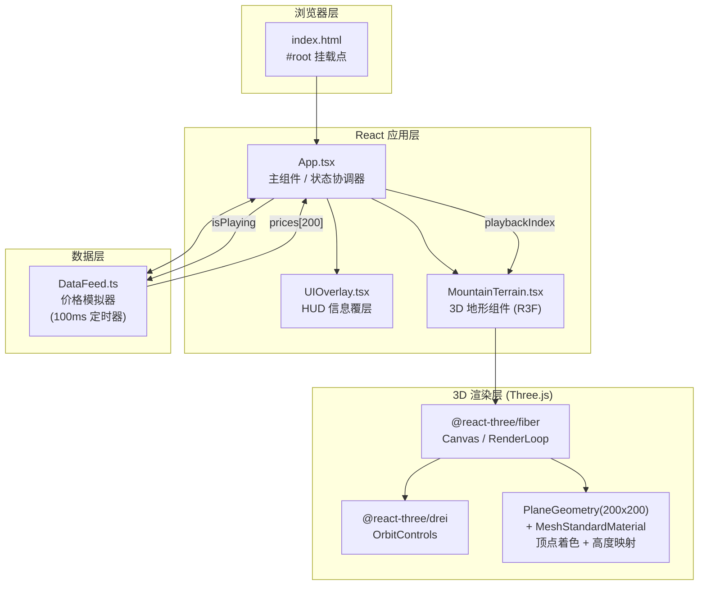

## 1. 架构设计


**调用关系与数据流向：**
1. **DataFeed → App**：每100ms通过回调 `onUpdate(prices: number[])` 推送最新200个价格数组
2. **App → MountainTerrain**：通过 props 传入 `prices` 数组 + `playbackIndex`（回放位置）
3. **MountainTerrain 内部**：useFrame 每帧读取 prices，计算 Z 轴高度百分比 → 更新 geometry.attributes.position → 更新 geometry.attributes.color
4. **UIOverlay ↔ App**：双向绑定，展示价格数据，用户交互（启停/滑块）回调到 App 状态
5. **OrbitControls（drei）**：独立在 Canvas 内，无需状态上抛

## 2. 技术描述
- **前端框架**：React@18 + TypeScript（严格模式 strict）
- **构建工具**：Vite@5 + @vitejs/plugin-react，resolve.alias: `@` → `src`
- **3D 渲染**：three@0.160 + @react-three/fiber@8 + @react-three/drei@9
- **类型定义**：@types/three
- **初始化方式**：vite-init react-ts 模板（去除无关依赖）

## 3. 路由定义
| 路由 | 用途 |
|-------|---------|
| / | 单页应用，主场景唯一入口 |

## 4. 数据模型

### 4.1 核心类型定义
```typescript
// DataFeed.ts 输出
interface PriceData {
  prices: number[];      // 长度200的价格历史数组，索引0为最旧，199为最新
  currentPrice: number;  // 当前最新价格
  change24h: number;     // 24h涨跌幅百分比（模拟：对比数组第一个）
  high24h: number;       // 24h最高价
  low24h: number;        // 24h最低价
}

// MountainTerrain 接收 Props
interface TerrainProps {
  prices: number[];           // 200个价格点
  playbackIndex: number;      // 0~200回放游标（200表示实时）
  gridSize?: number;          // 默认200
  heightScale?: number;       // 默认2.0（-2~2范围）
}

// App.state
interface AppState {
  prices: number[];
  isPlaying: boolean;
  playbackIndex: number;      // 200 = 实时模式，<200 = 历史回溯
}
```

### 4.2 高度与颜色映射算法
```
价格变化率 pct = (price[i] - price[0]) / price[0] * 100
映射高度 z = clamp(pct * k, -2, 2)  // k为缩放系数，使典型波动覆盖-2~2

颜色映射（顶点着色逐顶点计算）：
  z ∈ [-2, 0)  → lerpColor(#0a2342 → #4a90d9, (z+2)/2)
  z = 0        → #b0b0b0
  z ∈ (0, 2]   → lerpColor(#ffb347 → #e74c3c, z/2)
```

## 5. 项目文件结构
```
auto139/
├── package.json
├── vite.config.js
├── tsconfig.json
├── index.html
└── src/
    ├── main.tsx              # React入口
    ├── App.tsx               # 主组件：组装Canvas + UIOverlay，管理状态
    ├── MountainTerrain.tsx   # 3D地形：PlaneGeometry + useFrame更新顶点
    ├── DataFeed.ts           # 价格模拟器：setInterval + 回调
    ├── UIOverlay.tsx         # HUD：信息面板 + 滑块 + 启停按钮
    └── index.css             # 全局样式 + 动画 + 响应式
```
