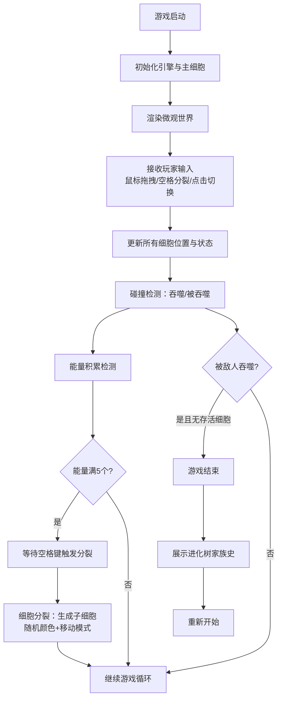

## 1. 产品概述

「细胞分裂·共生战争」是一款基于浏览器的2D微观策略游戏，玩家操控发光粒子构成的原始细胞在微观世界中生存、吞噬、分裂进化，最终组建五彩斑斓的细胞军队。

- **目标用户**：独立游戏爱好者、休闲玩家、策略游戏玩家
- **核心价值**：微观世界沉浸式体验 + 细胞分裂遗传策略 + 视觉艺术美感

## 2. 核心功能

### 2.1 功能模块
1. **游戏主画布**：Canvas 2D渲染微观世界，包含背景粒子、细胞实体、连线效果、视觉特效
2. **玩家操控系统**：鼠标拖拽移动、目标切换、分裂触发、吞噬机制
3. **细胞分裂进化系统**：能量积累触发分裂、随机颜色遗传、移动模式变异、分裂光环特效
4. **敌人AI系统**：敌人生成、游荡/追踪双模式行为、边界反弹
5. **细胞军队协作系统**：Boids集群行为、控制目标切换、高亮连线、扫描环特效
6. **音效系统**：吞噬音效（Web Audio API）、分裂音效
7. **进化树展示系统**：递归族谱树、游戏结束展示、缩放入场动画
8. **信息面板UI**：实时状态展示、圆形进度条、分裂次数指示、得分/生存时间

### 2.2 页面详情

| 页面名称 | 模块名称 | 功能描述 |
|-----------|-------------|---------------------|
| 游戏主页 | 游戏画布 | 75%宽度Canvas渲染区域，包含背景粒子、边缘渐隐、所有游戏实体 |
| 游戏主页 | 右侧信息面板 | 250px毛玻璃面板，展示控制细胞颜色、大小、能量进度条、分裂次数 |
| 游戏主页 | 顶部HUD | 右上角显示吞噬得分和生存时间，带缓动动画 |
| 游戏主页 | 进化树弹窗 | 游戏结束时显示递归树状家族史，0.5x→1x缩放入场 |

## 3. 核心流程

## 4. 用户界面设计

### 4.1 设计风格
- **主色调**：深空暗色主题 `#0a0a1a`，营造微观宇宙氛围
- **强调色**：细胞HSL动态颜色（色相±30度遗传变异）、发光辉光效果
- **字体**：使用独特的显示字体搭配精致正文字体，避免Inter/Roboto等通用字体
- **视觉效果**：毛玻璃半透明面板、柔和渐隐边缘、发光扫描环、扩散光环特效
- **动效风格**：所有数值变化0.3秒缓动，弹窗0.4秒缓出缩放，扫描环2圈/秒旋转

### 4.2 页面设计概述

| 页面名称 | 模块名称 | UI元素 |
|-----------|-------------|-------------|
| 游戏主页 | 游戏画布 | 深蓝黑背景、1000个闪烁粒子、细胞发光渲染、边缘50px渐隐、连线高亮 |
| 游戏主页 | 信息面板 | rgba(255,255,255,0.08)背景、blur(10px)毛玻璃、圆形能量进度条（细胞色）、圆点分裂指示 |
| 游戏主页 | HUD区域 | 吞噬总数+生存时间，数值变化ease-out 0.3s动画 |
| 游戏主页 | 进化树弹窗 | 递归树节点（彩色圆点+分裂时间）、0.5x→1x缩放cubic-bezier(0.16,1,0.3,1) 0.4s |

### 4.3 响应式适配
- **桌面端（≥768px）**：画布占75%宽度，右侧250px信息面板
- **移动端（<768px）**：信息面板折叠为底部60px悬浮条，关键信息横向排列，画布占满剩余空间
- **触控优化**：支持触摸拖拽控制细胞、点击切换目标

### 4.4 性能约束
- 稳定60 FPS帧率
- Canvas单帧绘制≤8ms
- 细胞实体总数上限30个（超出自动移除最老敌人）
