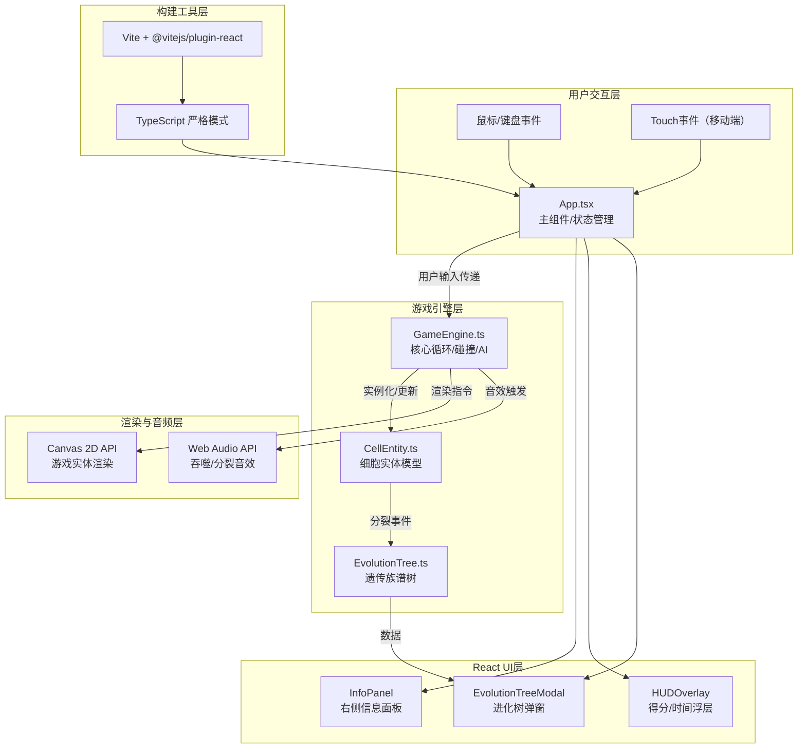

## 1. 架构设计



**文件间调用关系与数据流向：**

| 文件 | 数据输入 | 数据输出 | 调用/被调用 |
|------|---------|---------|-------------|
| `App.tsx` | 用户鼠标/键盘/touch输入、GameEngine状态回调 | 游戏控制指令、UI渲染props | 调用GameEngine；被Vite渲染 |
| `GameEngine.ts` | 玩家控制指令、dt时间步长 | 细胞状态更新、渲染数据、分裂/吞噬事件 | 调用CellEntity/EvolutionTree/WebAudio；被App.tsx调用 |
| `CellEntity.ts` | 位置/速度参数、碰撞数据 | 细胞属性（pos/vel/color/radius/divisionCount/movePattern） | 被GameEngine实例化调用 |
| `EvolutionTree.ts` | CellEntity分裂事件数据 | 递归树结构数据 | 监听CellEntity；被App.tsx读取渲染EvolutionTreeModal |

## 2. 技术描述

- **前端框架**：React 18 + TypeScript 5（严格模式）
- **构建工具**：Vite 5 + @vitejs/plugin-react
- **渲染引擎**：Canvas 2D API（原生，无额外库）
- **音频引擎**：Web Audio API（原生OscillatorNode生成音效）
- **状态管理**：React useState/useRef + GameEngine内部状态（轻量场景不引入zustand）
- **样式方案**：原生CSS + CSS变量（减少额外依赖，保持轻量）
- **初始化工具**：使用 `vite-init` 脚手架（react-ts模板）

**文件结构（按职责模块化）：**
```
src/
├── App.tsx                 # 主组件：游戏初始化/状态循环/UI布局
├── App.css                 # 全局样式：暗色主题/毛玻璃/动画
├── main.tsx                # 入口文件
├── index.css               # CSS变量与基础重置
└── game/
    ├── GameEngine.ts       # 核心引擎：游戏循环/碰撞检测/AI/渲染调度
    ├── CellEntity.ts       # 细胞实体：属性定义/移动模式/分裂逻辑
    ├── EvolutionTree.ts    # 进化树：遗传族谱记录/树形结构构建
    └── types.ts            # 共享类型定义（MovePattern/CellType等）
```

## 3. 核心数据模型

### 3.1 细胞实体数据结构

```typescript
enum MovePattern {
  LINEAR = 'linear',       // 直线游走
  SINUSOIDAL = 'sinusoidal', // 正弦波动
  JITTER = 'jitter'        // 随机抖动
}

enum CellType {
  PLAYER = 'player',
  ENEMY = 'enemy',
  NUTRIENT = 'nutrient'
}

interface CellEntityData {
  id: string;
  parentId: string | null;
  cellType: CellType;
  position: { x: number; y: number };
  velocity: { x: number; y: number };
  targetPosition?: { x: number; y: number }; // 玩家跟随目标
  hue: number;          // HSL色相（0-360），颜色遗传用
  saturation: number;   // HSL饱和度
  lightness: number;    // HSL亮度
  radius: number;       // 当前半径（10-25px玩家，8-18px敌人）
  divisionCount: number; // 分裂次数
  energy: number;       // 已吞噬目标数（满5触发分裂）
  movePattern: MovePattern;
  isSelected: boolean;  // 是否为当前控制目标
  birthTime: number;    // 创建时间戳（分裂记录用）
  aiMode?: 'wander' | 'chase'; // 敌人AI模式
  wanderAngle?: number; // 游荡方向
}
```

### 3.2 进化树数据结构

```typescript
interface EvolutionNode {
  cellId: string;
  hue: number;
  radius: number;
  divisionCount: number;
  birthTime: number;    // 相对游戏开始的秒数
  deathTime?: number;
  children: EvolutionNode[];
}
```

### 3.3 游戏全局状态

```typescript
interface GameState {
  status: 'playing' | 'gameover';
  score: number;          // 吞噬总数
  survivalTime: number;   // 生存时间（秒）
  selectedCellId: string | null;
  playerCells: string[];  // 存活玩家细胞ID列表
  enemySpawnTimer: number;
}
```

## 4. 核心算法与实现要点

### 4.1 玩家移动（平滑跟随）
```
算法：指数平滑跟随（lerp）
每帧：position += (target - position) × (1 - exp(-dt × smoothingFactor))
参数：smoothingFactor = 10（对应0.1秒延迟特征）
```

### 4.2 碰撞检测与吞噬判定
```
算法：圆形碰撞检测（AABB预过滤 + 精确距离判断）
条件：distance(A, B) < A.radius + B.radius
吞噬判定：A.radius > B.radius × 1.1 → A吞噬B
```

### 4.3 敌人AI（双模式切换）
```
游荡模式：wanderAngle += 小随机扰动；velocity方向=wanderAngle
追踪模式：当玩家距离 < 100px时，velocity方向 = normalize(playerPos - enemyPos)
边界反弹：position超出边界时反转velocity对应分量
```

### 4.4 Boids集群行为（子细胞跟随）
```
三种规则合力（简化版）：
1. 凝聚力：朝主细胞方向（目标距离50px）
2. 分离力：与邻近细胞（<30px）反向推开
3. 对齐力：邻近细胞速度平均

最终速度 = 权重混合后归一化 × 速度系数
```

### 4.5 Web Audio音效生成
```
吞噬"咕噜"声：
- OscillatorNode: 频率200Hz正弦波
- GainNode: ADSR包络（Attack:0.01s, Decay:0.19s, Sustain:0, Release:0）
- 音量0.3，总时长0.2s

分裂光环音：
- 频率从400Hz扫至800Hz，音量0.2，时长0.4s
```

### 4.6 Canvas渲染性能优化
- 背景粒子预渲染到离屏Canvas，每4帧刷新一次闪烁
- 使用 `requestAnimationFrame` 同步渲染
- 细胞实体使用对象池复用（避免GC）
- 超过30实体时FIFO淘汰最老敌人
