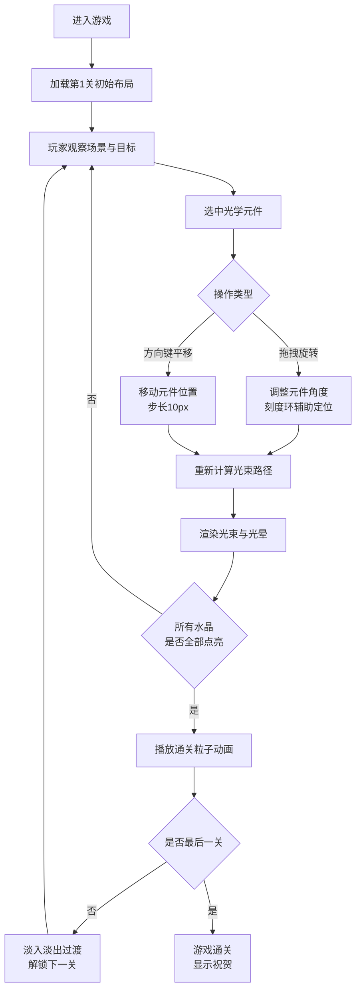

## 1. 产品概述

「光痕之域」是一款在浏览器中运行的2D光学解谜游戏。玩家操控由发光棱晶构成的光源，通过旋转和移动镜面、棱镜等光学元件，将光束折射、反射到发光水晶目标点以解锁机关。游戏解决了传统解谜游戏缺乏实时动态光影和物理反馈的痛点，提供沉浸式的光学物理体验。

- 主要用途：休闲益智类解谜游戏，适合对光学物理和空间推理感兴趣的玩家
- 目标用户：12岁以上休闲游戏玩家、教育领域光学演示场景

## 2. 核心功能

### 2.1 用户角色

| 角色 | 注册方式 | 核心权限 |
|------|----------|----------|
| 玩家 | 无需注册，直接进入 | 体验全部关卡、操作光学元件、重置关卡 |

### 2.2 功能模块

1. **游戏主界面**：Canvas画布游戏区域、关卡信息面板、重置按钮
2. **光束物理系统**：白光发射、镜面反射、棱镜色散、光晕轨迹、目标判定
3. **光学元件操作**：点击选中高亮、鼠标/触摸拖拽旋转、方向键平移、刻度环辅助
4. **关卡管理系统**：6个预置关卡、进度解锁、重置、通关粒子动画
5. **视觉反馈系统**：目标光晕脉动、屏幕震动、音效反馈、淡入淡出过渡
6. **响应式适配**：桌面鼠标操作、触屏设备触摸拖拽操作

### 2.3 页面详情

| 页面名称 | 模块名称 | 功能描述 |
|----------|----------|----------|
| 游戏主界面 | Canvas游戏区域 | 渲染场景、光束、元件、水晶、粒子特效，接收输入事件 |
| 游戏主界面 | 顶部信息栏 | 左上角显示关卡编号+点亮水晶数/总数，右上角重置按钮 |
| 游戏主界面 | 元件操作交互 | 点击选中高亮外框、拖拽旋转（带刻度环+度数显示）、方向键平移 |
| 游戏主界面 | 通关动画 | 50颗彩色粒子爆散并缓慢下落，关卡淡入淡出过渡（0.5秒） |

## 3. 核心流程

## 4. 用户界面设计

### 4.1 设计风格

- **主色调**：深空蓝黑色背景 `#0a0e27`，白色半透明文字 `rgba(255,255,255,0.8)`
- **强调色**：光束白色渐变半透明，水晶彩色脉冲光（RGB三色），元件发光描边 `rgba(255,255,255,0.5~0.8)`
- **按钮风格**：重置按钮采用半透明深色底+发光描边，圆角设计，悬停时增强发光
- **字体**：现代无衬线字体，所有文字白色半透明（透明度0.8）
- **布局风格**：全屏Canvas沉浸布局，顶部悬浮信息栏（左上角状态、右上角按钮），居中游戏区域
- **图标/视觉元素**：十字准星光标、淡黄色跟随光晕、刻度环、彩色粒子

### 4.2 页面设计概述

| 页面名称 | 模块名称 | UI元素 |
|----------|----------|--------|
| 游戏主界面 | Canvas游戏区域 | 深空蓝黑背景、发光棱晶光源、镜面/棱镜发光描边、半透明光带轨迹、水晶脉冲光、粒子特效 |
| 游戏主界面 | 顶部信息栏 | 左上角「关卡 N  💎 x/y」白色半透明文字；右上角「重置」圆角半透明按钮 |
| 游戏主界面 | 元件选中态 | 高亮外框（加粗+增亮）、周围360°刻度环（每10°一刻度+度数标签）、元件中心角度数值 |
| 游戏主界面 | 目标提示 | 未命中水晶周围半径20px微弱光晕脉动（透明度0.1-0.3，周期2秒） |
| 游戏主界面 | 光标反馈 | 可交互元件悬停→十字准星+淡黄色半径15px透明度0.3圆形光晕跟随 |
| 游戏主界面 | 过渡动画 | 关卡切换：场景淡入淡出（透明度0→1→0，持续0.5秒） |

### 4.3 响应式设计

- **设计原则**：桌面优先，最小适配分辨率800x600，Canvas自适应视口尺寸
- **缩放策略**：游戏逻辑分辨率固定（推荐逻辑坐标），Canvas按比例缩放到实际屏幕
- **触屏优化**：支持触摸事件（touchstart/touchmove/touchend）实现元件拖拽旋转，触摸目标区域扩大至元件周围20px

### 4.4 性能与体验指标

| 指标 | 目标值 |
|------|--------|
| 帧率 | 稳定45FPS以上 |
| 光束物理计算耗时 | 每帧≤5ms |
| 同时存在粒子数 | ≤200个 |
| 屏幕震动 | 位移2px，持续0.1秒 |
| 音效 | Web Audio API 440Hz正弦波，50ms |
| 光束属性 | 4px粗，光晕透明度1.0→0.2沿路径衰减 |
| 棱镜色散 | 白光→红绿蓝三束，偏移+8°/0°/-8° |
| 水晶点亮 | 三束子光全部命中→彩色脉冲永久点亮（亮度0.6-1.0循环） |
