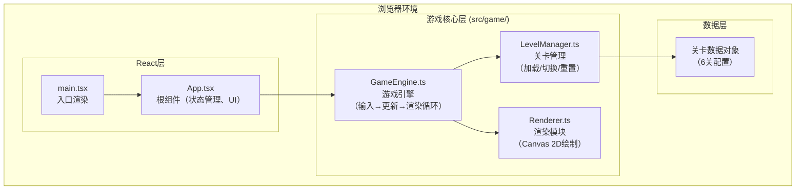
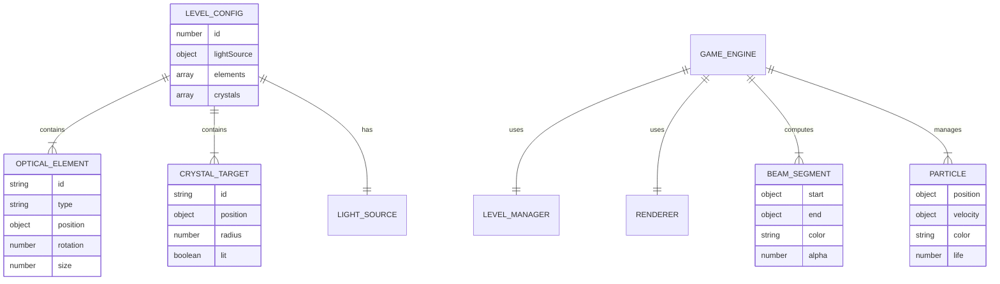

## 1. 架构设计



**分层职责说明：**
- **React层**：负责组件生命周期管理、UI元素（信息栏、按钮）的DOM渲染、Canvas挂载
- **GameEngine**：游戏主控，持有GameLoop（requestAnimationFrame），协调输入处理→物理更新→渲染绘制的流程
- **LevelManager**：纯数据与关卡状态管理，不涉及渲染
- **Renderer**：纯渲染逻辑，接收当前游戏状态快照，输出到Canvas上下文

## 2. 技术栈描述

| 层级 | 技术选型 | 版本 | 说明 |
|------|----------|------|------|
| 语言 | TypeScript | ^5.x | 严格模式，target ES2020 |
| 框架 | React | ^18.x | 函数式组件 + Hooks |
| 构建工具 | Vite | ^5.x | 开发服务器 + HMR |
| Vite插件 | @vitejs/plugin-react | ^4.x | 支持React JSX |
| 渲染 | Canvas 2D API | - | 浏览器原生，无额外依赖 |
| 音效 | Web Audio API | - | 浏览器原生，合成正弦波 |
| 输入 | DOM事件 + React事件 | - | 鼠标/键盘/触摸事件 |

**初始化方式**：手写配置文件（package.json / vite.config.js / tsconfig.json / index.html），不依赖脚手架。

## 3. 目录与文件组织

```
auto142/
├── package.json
├── vite.config.js
├── tsconfig.json
├── index.html
├── .trae/
│   └── documents/
│       ├── PRD-光痕之域.md
│       └── 技术架构-光痕之域.md
└── src/
    ├── main.tsx                      # React入口
    ├── App.tsx                       # 根组件
    └── game/
        ├── types.ts                  # 类型定义（可选，内联亦可）
        ├── GameEngine.ts             # 核心引擎
        ├── LevelManager.ts           # 关卡管理
        └── Renderer.ts               # 渲染模块
```

**文件职责**：

| 文件 | 核心职责 | 关键类/函数 |
|------|----------|-------------|
| [package.json](file:///d:/公司项目/Solo/VersionFast/tasks/auto142/package.json) | 依赖声明 + 脚本 | `npm run dev` |
| [vite.config.js](file:///d:/公司项目/Solo/VersionFast/tasks/auto142/vite.config.js) | Vite配置 | 启用React插件 |
| [tsconfig.json](file:///d:/公司项目/Solo/VersionFast/tasks/auto142/tsconfig.json) | TS配置 | 严格模式、ES2020 |
| [index.html](file:///d:/公司项目/Solo/VersionFast/tasks/auto142/index.html) | HTML入口 | 挂载点 `#root` |
| [src/main.tsx](file:///d:/公司项目/Solo/VersionFast/tasks/auto142/src/main.tsx) | React入口 | `ReactDOM.createRoot` |
| [src/App.tsx](file:///d:/公司项目/Solo/VersionFast/tasks/auto142/src/App.tsx) | 根组件 | 挂载Canvas、UI、引擎实例 |
| [src/game/GameEngine.ts](file:///d:/公司项目/Solo/VersionFast/tasks/auto142/src/game/GameEngine.ts) | 游戏引擎 | `GameEngine` 类：`start/stop/update/handleInput` |
| [src/game/LevelManager.ts](file:///d:/公司项目/Solo/VersionFast/tasks/auto142/src/game/LevelManager.ts) | 关卡管理 | `LevelManager` 类：`loadLevel/reset/nextLevel` |
| [src/game/Renderer.ts](file:///d:/公司项目/Solo/VersionFast/tasks/auto142/src/game/Renderer.ts) | 渲染模块 | `Renderer` 类：`render/renderBeam/renderElement/renderParticles` |

## 4. 核心数据模型

### 4.1 光学元件与光束类型定义

```typescript
type ElementType = 'mirror' | 'prism' | 'lightSource';
type BeamColor = 'white' | 'red' | 'green' | 'blue';

interface Vec2 { x: number; y: number; }

interface OpticalElement {
    id: string;
    type: ElementType;
    position: Vec2;
    rotation: number;        // 角度（0-360），精确到0.5度
    size: number;            // 元件渲染尺寸（px）
    selected?: boolean;
}

interface CrystalTarget {
    id: string;
    position: Vec2;
    radius: number;          // 命中判定半径
    lit: boolean;            // 是否已永久点亮
    hitColors: Set<BeamColor>; // 当次命中的颜色集合
}

interface BeamSegment {
    start: Vec2;
    end: Vec2;
    color: BeamColor;
    alpha: number;           // 当前段透明度（1.0→0.2衰减）
}

interface Particle {
    position: Vec2;
    velocity: Vec2;
    color: string;
    life: number;            // 剩余寿命（0-1）
    size: number;
}

interface LevelConfig {
    id: number;
    lightSource: { position: Vec2; rotation: number };
    elements: Omit<OpticalElement, 'selected'>[];
    crystals: Omit<CrystalTarget, 'lit' | 'hitColors'>[];
}
```

### 4.2 Mermaid ER图



## 5. 核心算法与物理模拟

### 5.1 光束追踪算法流程

```
函数 traceBeam(start, angle, color, depth):
    如果 depth > 最大反射次数(如8) → 返回
    计算方向向量 direction
    遍历所有光学元件，求最近的射线-线段交点
    遍历所有水晶，求射线-圆交点
    取最近的命中点（元件或水晶）
    
    如果无命中点：
        延伸光束到场景边界
        记录BeamSegment（start→边界）
        返回
    
    如果命中镜面：
        记录BeamSegment（start→命中点）
        计算反射角 = 2*镜面法线角 - 入射角
        递归 traceBeam(命中点, 反射角, color, depth+1)
    
    如果命中棱镜：
        记录BeamSegment（start→命中点）
        如果 color == 'white'：
            分别递归 traceBeam(命中点, angle+8, 'red', depth+1)
                   traceBeam(命中点, angle, 'green', depth+1)
                   traceBeam(命中点, angle-8, 'blue', depth+1)
        否则：
            棱镜对纯色光无色散，继续沿原方向
            递归 traceBeam(命中点+微偏移, angle, color, depth+1)
    
    如果命中水晶：
        记录BeamSegment（start→命中点）
        将color加入水晶hitColors
        触发屏幕震动+音效
        返回
```

### 5.2 反射角计算公式（精确到0.5度）

```
镜面法线角度 = 镜面rotation + 90°
入射方向角度 = beamAngle
反射角度 = 2 * 镜面法线角度 - 入射方向角度 - 180°
结果四舍五入到0.5度： round(angle * 2) / 2
```

### 5.3 每帧更新流程（性能预算≤5ms）

```
update(dt):
    1. 重置所有水晶 hitColors ← 空集
    2. 从光源发出白光，执行traceBeam ← 核心计算
    3. 遍历水晶：
        - 若hitColors.size == 3（RGB全中）→ lit = true
        - 否则 → 若lit保持true（永久点亮）
    4. 判断是否全部lit → 触发通关动画
    5. 更新粒子位置+寿命（重力下落，life衰减）
    6. 更新屏幕震动偏移量衰减
```

## 6. 输入处理与交互

| 输入事件 | 处理逻辑 |
|----------|----------|
| mousedown / touchstart | 点击位置命中元件 → 设为选中态（selected=true），记录起始旋转参考点 |
| mousemove / touchmove | 拖拽旋转：计算相对元件中心的向量角度差 → 更新元件rotation（四舍五入到0.5°）；更新十字准星与跟随光晕位置 |
| mouseup / touchend | 结束拖拽旋转 |
| keydown Arrow键 | 选中元件存在 → position.x/y ±10px，重新计算光束 |
| click 重置按钮 | 调用LevelManager.reset()，当前关卡恢复初始状态 |
| mouseover 元件 | 光标样式改为crosshair，显示跟随光晕 |

## 7. 渲染管线（Renderer.ts）

每帧绘制顺序（从后往前）：

1. **背景层**：填充 `#0a0e27`，可选淡色星点装饰
2. **目标提示层**：未点亮水晶的脉动光晕（圆半径20px，透明度0.1-0.3，sin波周期2s）
3. **光束层**：
   - 先画光晕（粗线，透明度×0.3，如12px粗）
   - 再画芯线（4px粗，透明度1.0→0.2线性衰减按段）
   - 纯色光对应RGB色，白光用白色渐变
4. **元件层**：
   - 镜面：线段（带发光描边shadowBlur）
   - 棱镜：三角形（半透明填充+发光描边）
   - 光源：菱形+发光核
   - 选中元件：加粗外框 + 刻度环（每10°短线+度数文字）+ 中心角度数值
5. **水晶层**：
   - 未点亮：暗色钻石形
   - 点亮中/永久点亮：彩色脉冲光（亮度0.6-1.0，sin循环），shadowBlur光晕
6. **特效层**：
   - 粒子（圆形，按life衰减透明度，带重力下落）
   - 通关场景淡入淡出（覆盖半透明黑矩形，alpha动态）
   - 屏幕震动偏移（ctx.translate(shakeX, shakeY)）
7. **UI层**：Canvas上不画UI，DOM层绝对定位顶部信息栏

## 8. 关卡数据（6关梯度设计）

| 关卡ID | 光源位置 | 元件数 | 水晶数 | 难度说明 |
|--------|----------|--------|--------|----------|
| 1 | 左侧 | 2（镜面） | 1 | 入门：两次反射直达 |
| 2 | 左下 | 3（镜面） | 2 | 用多反射同时点亮两颗水晶 |
| 3 | 左侧 | 1（棱镜）+ 2（镜面） | 1 | 首次引入棱镜色散，需三束汇于一晶 |
| 4 | 左侧 | 2（棱镜）+ 2（镜面） | 2 | 双棱镜，两水晶分别接收不同色散路径 |
| 5 | 中心 | 4（镜面）+ 1（棱镜） | 3 | 复杂多路径 |
| 6 | 左上角 | 3（棱镜）+ 3（镜面） | 4 | 终极挑战：多色散多目标 |

## 9. 性能与稳定性保障

| 策略 | 实现方式 |
|------|----------|
| 帧率保障 | `requestAnimationFrame` + dt时间步长，跳过渲染帧保持物理稳定 |
| 光束计算优化 | 限制最大反射深度=8，每段用线段求交（O(n)，n=元件数≤6，可接受） |
| 粒子池 | 固定数组上限200，过期粒子循环复用，避免GC |
| Canvas尺寸 | DPR适配（`canvas.width = cssWidth * devicePixelRatio`），避免模糊同时控制像素填充数 |
| 离屏操作 | 无需要离屏canvas，单次draw调用即可 |
| 音效 | 复用同一个`AudioContext`，避免重复创建 |

## 10. 构建与运行

```bash
# 安装依赖
npm install

# 启动开发服务器（默认端口5173）
npm run dev
```

访问浏览器 `http://localhost:5173` 即可开始游戏。
