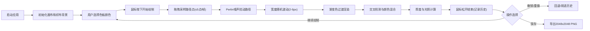

## 1. 产品概述

"浮尘织梦"是一款在浏览器中模拟交互式纱线编织效果的数字艺术创作工具，解决传统数字绘画缺乏随机纹理和触感反馈的问题。用户通过鼠标拖拽模拟纱线在虚拟织布机上穿梭，创造独一无二的数字纺织画。

- 主要用户：数字艺术家、手工爱好者、创意设计人士
- 产品价值：将传统纺织工艺数字化，提供沉浸式的手工创作体验

## 2. 核心功能

### 2.1 功能模块

1. **主画布页面**：纱线绘制画布、工具栏、撤销/重做/保存功能

### 2.2 页面详情

| 页面名称 | 模块名称 | 功能描述 |
|-----------|-------------|---------------------|
| 主画布页面 | 纱线绘制引擎 | Perlin噪声扰动路径、随机宽度波动(2-6px)、渐变色纱线、毛糙边缘效果 |
| 主画布页面 | 颜色面板 | 8种基础色色板，点击切换当前颜色，选中态金色发光边框 |
| 主画布页面 | 交叉混合引擎 | 乘法混合模式，饱和度提升15%，交叉计数映射高度偏移 |
| 主画布页面 | 厚度光照系统 | 每次交叉+0.3px高度偏移，45度左上光照，明暗倾斜立体效果 |
| 主画布页面 | 织布背景 | 米白麻布纹理(#F5E6D3)，0.5%密度噪点颗粒(1-2px) |
| 主画布页面 | 木制边框 | 20px深棕色边框(#4A2E1B)，内边缘阴影渐变(0.3→0.1透明度) |
| 主画布页面 | 撤销/重做 | 最多20步历史记录，整段纱线视为一步 |
| 主画布页面 | 保存导出 | 导出2048x2048分辨率PNG，包含边框和纹理 |

## 3. 核心流程

用户启动应用 → 画布呈现织布背景和木制边框 → 用户从色板选择颜色 → 按住鼠标左键拖拽绘制纱线 → 纱线沿路径自动应用噪声扰动和宽度波动 → 穿过已有纱线时触发颜色混合和厚度计算 → 完成绘制后可撤销/重做/保存

## 4. 用户界面设计

### 4.1 设计风格

- **主色调**：暖木色系主题，深棕色背景(#3A2E1B)，米白画布(#F5E6D3)，木边框(#4A2E1B)
- **强调色**：金色(#D4A574)用于选中态发光边框和悬停态背景
- **基础色板**：#D4A574, #8B5E3C, #C0392B, #2C3E50, #16A085, #F39C12, #8E44AD, #3498DB
- **按钮样式**：圆形色板按钮(30px直径)，圆形功能按钮(40x40px半透明背景)
- **交互效果**：悬停背景色(#D4A574)，点击弹性缩放动画(0.2s, 1→0.9→1)
- **光标样式**：画布内十字准星(16x16px，白色十字线，中心透明)

### 4.2 页面设计概述

| 页面名称 | 模块名称 | UI元素 |
|-----------|-------------|-------------|
| 主画布页面 | 左侧工具栏 | 宽度200px，垂直排列，色板圆形按钮+功能按钮，1px深灰分割线 |
| 主画布页面 | 主画布区域 | 最小800x600，米白麻布纹理，木制边框，十字准星光标 |
| 主画布页面 | 色板区域 | 8个30px直径圆形按钮，实心填充，选中态金色发光边框 |
| 主画布页面 | 功能按钮区 | 撤销/重做/保存三个40x40px圆形按钮，半透明背景，深灰图标 |

### 4.3 响应式

- 桌面优先设计：浏览器宽度≥1024px，工具栏左侧垂直排列(200px宽)
- 平板适配：宽度<1024px，工具栏折叠为顶部水平条(60px高)，色板24px直径，功能按钮32x32px

## 5. 性能指标

| 指标 | 目标值 |
|------|--------|
| 渲染帧率 | ≥55FPS |
| 单帧渲染时间 | ≤16ms |
| 路径点采样间隔 | ≤5个新点/帧 |
| 最大历史步数 | 20步 |
| 最大存储纱线路径 | 2000条 |
| 内存占用上限 | 100MB |
| 导出分辨率 | 2048x2048 PNG |
