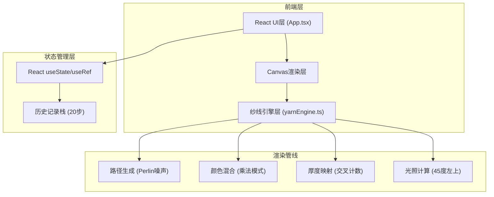

## 1. 架构设计



## 2. 技术说明

- **前端框架**：React@18 + TypeScript@5
- **构建工具**：Vite@5 + @vitejs/plugin-react@4
- **渲染技术**：Canvas 2D API
- **状态管理**：React Hooks (useState, useRef, useCallback, useEffect)
- **无后端**：纯前端应用，无服务器依赖
- **无数据库**：历史记录存储在内存中，导出通过浏览器Canvas API

## 3. 目录结构

```
auto143/
├── package.json
├── vite.config.js
├── tsconfig.json
├── index.html
└── src/
    ├── main.tsx
    ├── App.tsx
    └── utils/
        └── yarnEngine.ts
```

## 4. 模块定义

### 4.1 App.tsx 主组件

| 状态变量 | 类型 | 说明 |
|---------|------|------|
| currentColor | string | 当前选中颜色，默认#D4A574 |
| history | YarnPath[] | 历史路径数组，最多20步 |
| historyIndex | number | 当前历史索引，用于撤销/重做 |
| isDrawing | boolean | 是否正在绘制 |
| currentPath | Point[] | 当前正在绘制的路径点 |
| canvasRef | Ref<HTMLCanvasElement> | Canvas元素引用 |

| 方法 | 参数 | 返回 | 说明 |
|------|------|------|------|
| handleColorSelect | color: string | void | 切换当前颜色 |
| handleMouseDown | e: MouseEvent | void | 开始绘制，记录起点 |
| handleMouseMove | e: MouseEvent | void | 采样路径点(≤5点/帧)，触发重绘 |
| handleMouseUp | void | void | 结束绘制，压入历史栈 |
| handleUndo | void | void | historyIndex-1，重绘 |
| handleRedo | void | void | historyIndex+1，重绘 |
| handleSave | void | void | 导出2048x2048 PNG |
| resizeCanvas | void | void | 响应式调整Canvas尺寸 |

### 4.2 yarnEngine.ts 纱线渲染引擎

#### 类型定义

```typescript
interface Point {
  x: number;
  y: number;
}

interface YarnPath {
  points: Point[];
  startColor: [number, number, number];
  endColor: [number, number, number];
  id: string;
}

interface ThicknessCell {
  crossCount: number;
  colors: [number, number, number][];
}
```

| 函数 | 参数 | 返回 | 说明 |
|------|------|------|------|
| generateYarnPath | start: Point, end: Point, colors: string[], seed?: number | YarnPath | Perlin噪声扰动路径，宽度波动2-6px |
| perlinNoise1D | x: number, seed: number | number | 一维Perlin噪声，幅度±3px |
| blendColors | c1: [number,number,number], c2: [number,number,number] | [number,number,number] | 乘法混合模式，饱和度+15% |
| computeThicknessMap | paths: YarnPath[], width: number, height: number | ThicknessCell[][] | 网格交叉计数，用于高度偏移 |
| renderCanvas | ctx: CanvasRenderingContext2D, paths: YarnPath[], width: number, height: number | void | 完整渲染管线：背景→纱线→交叉混合→光照→边框 |
| renderLinenBackground | ctx: CanvasRenderingContext2D, w: number, h: number | void | 米白麻布纹理+0.5%噪点颗粒 |
| renderWoodenFrame | ctx: CanvasRenderingContext2D, w: number, h: number | void | 20px木边框+内阴影渐变 |
| renderYarnWithFringe | ctx: CanvasRenderingContext2D, path: YarnPath, t: number | void | 单条纱线+毛糙边缘+渐变着色 |
| applyLighting | ctx: CanvasRenderingContext2D, thicknessMap: ThicknessCell[][], w: number, h: number | void | 45度左上光照，明暗倾斜立体效果 |
| hexToRgb | hex: string | [number,number,number] | 十六进制颜色转RGB数组 |
| rgbToHex | r: number, g: number, b: number | string | RGB数组转十六进制颜色 |
| increaseSaturation | rgb: [number,number,number], percent: number | [number,number,number] | HSL空间提升饱和度 |

## 5. 性能优化策略

| 优化项 | 策略 |
|--------|------|
| 渲染帧率 | requestAnimationFrame驱动，限制路径采样≤5点/帧 |
| 内存管理 | 历史记录限制20步，单条路径最多2000条，超出自动裁剪 |
| 厚度计算 | 使用降低分辨率网格(1/4画布尺寸)计算交叉，避免逐像素运算 |
| 重绘策略 | 仅在状态变化时触发完整重绘，绘制中使用脏区域局部更新 |
| 离屏渲染 | 保存时使用离屏Canvas独立渲染2048x2048尺寸，不影响主画布 |

## 6. 关键算法

### 6.1 Perlin噪声扰动
- 使用种子化伪随机生成器保证同一路径可重复
- 噪声频率：0.05-0.1，幅度：±3px
- 沿路径切线方向的垂直法线方向施加扰动

### 6.2 乘法颜色混合
```
R混合 = (R1 × R2) / 255
G混合 = (G1 × G2) / 255
B混合 = (B1 × B2) / 255
饱和度+15%：转HSL→L不变，S×1.15→转回RGB
```

### 6.3 厚度与光照
- 交叉次数→高度：h = crossCount × 0.3px
- 光照方向：向量(-1, -1)归一化即45度左上
- 法向量计算：中心差分法从高度图梯度得到
- 亮度值 = 法向量 · 光照方向 → 映射为alpha混合

## 7. 构建脚本

| 命令 | 说明 |
|------|------|
| npm install | 安装依赖 |
| npm run dev | 启动Vite开发服务器 |
| npm run build | 生产构建 |
