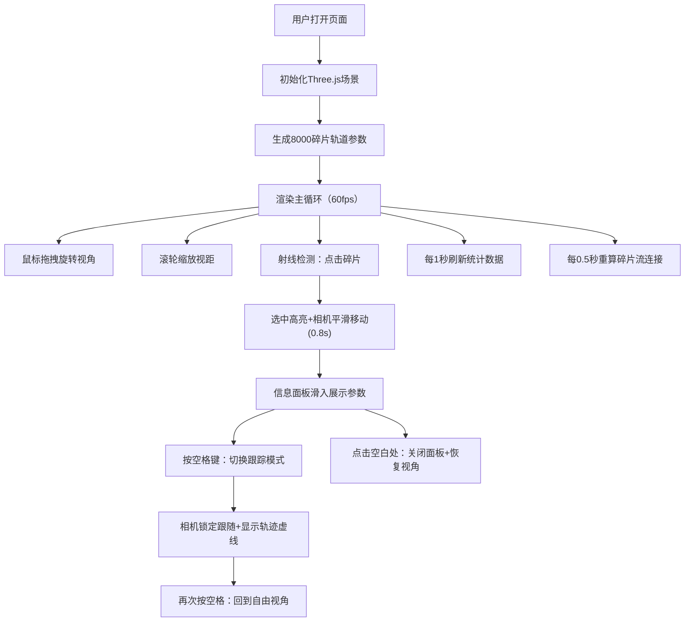

## 1. 产品概述

空间碎片三维交互可视化应用，解决太空垃圾在近地轨道上难以直观感知其分布和运动规律的问题。面向航天科普爱好者、轨道力学学习者和航天工程相关人员，提供沉浸式的3D交互体验。

- 通过三维可视化直观展示LEO（近地轨道）空间碎片的分布密度、运动轨迹和层级结构
- 以交互式探索方式帮助用户理解轨道高度、速度、倾角等参数的物理意义

## 2. 核心特性

### 2.1 用户角色
| 角色 | 使用方式 | 核心需求 |
|------|----------|----------|
| 普通用户 | 浏览器直接访问 | 自由探索轨道空间，点击查看碎片详情 |
| 学习用户 | 配合轨道力学教材 | 切换跟踪模式，观察轨迹演化 |
| 研究用户 | 数据分析辅助 | 实时统计面板，筛选碎片密度区域 |

### 2.2 功能模块
1. **主场景页面**：8000块碎片组成的5层轨道环、碎片流动态连接线、纹影环带背景
2. **信息面板模块**：选中碎片的轨道参数展示、弹出动画、点击外部关闭
3. **统计覆盖层模块**：右上角实时数据统计、每秒刷新
4. **视角控制模块**：自由Orbit控制、跟踪模式切换、平滑相机缓动

### 2.3 页面详情
| 页面名称 | 模块名称 | 功能描述 |
|----------|----------|----------|
| 主场景 | 碎片粒子系统 | GPU实例化渲染8000碎片，5层轨道环（300km-2000km），开普勒轨道运动 |
| 主场景 | 碎片流连接线 | 半透明发光线连接近邻碎片，每0.5秒重算，淡入淡出+扩散粒子特效 |
| 主场景 | 轨道纹影环带 | 5层微弱透明度圆环，营造轨道层级感 |
| 主场景 | 相机交互 | 鼠标拖拽旋转、滚轮缩放、点击碎片平滑拉近 |
| 信息面板 | 参数展示 | 编号、高度(km)、速度(km/s)、倾角(°)、密度(g/cm³) |
| 信息面板 | 动画效果 | 底部滑入+缩放弹出、缓出曲线0.3秒 |
| 统计覆盖层 | 数据展示 | 总数/可见数/连接数/平均速度/最高密度坐标 |
| 视角控制 | 跟踪模式 | 空格键切换，锁定选中碎片，前方虚线路径轨迹 |

## 3. 核心流程

## 4. 用户界面设计

### 4.1 设计风格
- **主色调**：深空黑 `#0A0E17`，橙色 `#FF6B00`（低轨）→ 蓝色 `#0066FF`（高轨）渐变
- **发光效果**：碎片外层柔和光晕（半径0.05，透明度0.3），连接线半透明发光
- **字体**：使用 monospace 等宽字体展示轨道参数，提升科技感
- **UI样式**：半透明磨砂面板（rgba背景+圆角），白色文字，弱边框

### 4.2 页面设计概览
| 页面名称 | 模块名称 | UI元素 |
|----------|----------|--------|
| 主场景 | 背景 | 深空黑纯色 + 大气透视效果（远处饱和度-30%，亮度-20%） |
| 主场景 | 碎片 | 发光球体，尺寸0.1-0.8，颜色按高度橙→蓝插值 |
| 主场景 | 碎片流 | 1px宽半透明线，颜色两端平均，>50单位距离整体变淡 |
| 主场景 | 纹影环带 | 5层圆环，透明度0.05，半径偏移15单位 |
| 主场景 | 点击反馈 | 屏幕边缘闪光0.3秒（透明度0.6→0） |
| 信息面板 | 容器 | rgba(0,0,0,0.7)背景，圆角边框，底部滑入+scale动画 |
| 信息面板 | 内容 | 编号/高度/速度/倾角/密度，白色等宽字体 |
| 统计覆盖层 | 容器 | rgba(0,0,0,0.5)背景，14px白色字体 |
| 全局 | 光标 | 悬停时十字准星样式 |

### 4.3 响应式设计
- 桌面端：碎片正常尺寸0.1-0.8单位
- 移动端：碎片最小半径0.2单位，UI面板字号适配屏幕宽度
- 触控设备：支持双指缩放、单指拖拽旋转

### 4.4 3D场景指引
- **环境光**：低强度AmbientLight + 方向光模拟太阳光，营造深空氛围
- **相机**：初始PerspectiveCamera fov=60，位置距中心约150单位
- **后处理**：大气透视（距离雾化）、Bloom发光效果、微弱晕影
- **性能**：使用 InstancedMesh / Points + ShaderMaterial 实现GPU实例化
