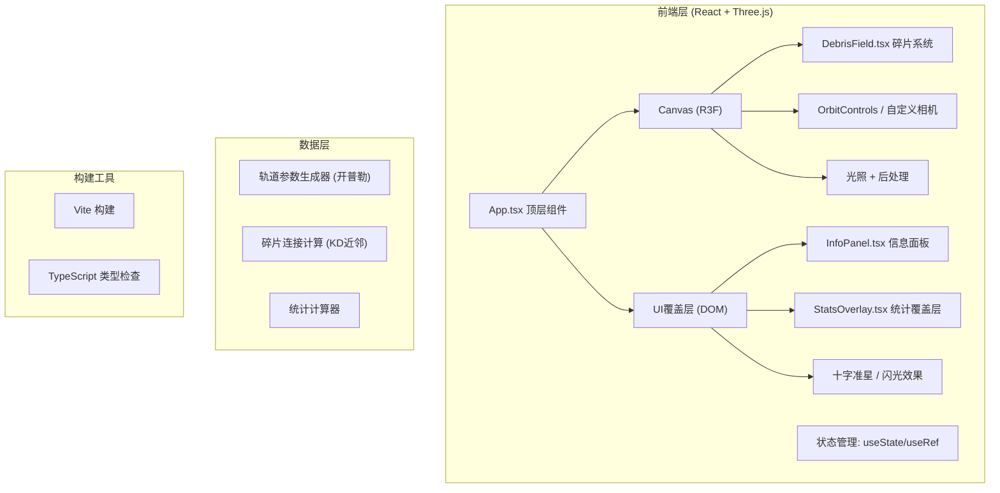

## 1. 架构设计



## 2. 技术描述

- **前端框架**：React@18 + TypeScript（严格模式）
- **3D渲染**：three@latest + @react-three/fiber@latest + @react-three/drei@latest
- **构建工具**：Vite@5 + @vitejs/plugin-react
- **状态管理**：React useState / useRef（轻量场景，无需Redux）
- **性能优化**：
  - 8000碎片使用 `THREE.Points` + 或 `InstancedMesh` + 自定义 ShaderMaterial
  - 碎片流使用 `THREE.LineSegments` + 动态更新几何体
  - 近邻搜索使用空间网格划分（Spatial Grid）加速

### 文件结构
```
auto148/
├── package.json
├── vite.config.js
├── tsconfig.json
├── index.html
└── src/
    ├── App.tsx              # 顶层：状态、UI布局
    ├── DebrisField.tsx      # 核心：碎片+轨道+连接+射线
    ├── InfoPanel.tsx        # 信息面板+动画
    └── StatsOverlay.tsx    # 统计覆盖层
```

## 3. 路由定义
| 路由 | 用途 |
|------|------|
| / | 单页应用，无路由跳转 |

## 4. 核心数据结构

### 4.1 碎片数据类型
```typescript
interface DebrisData {
  id: number;
  // 轨道参数
  semiMajorAxis: number;   // 半长轴 (单位: km，地球半径+高度)
  eccentricity: number;     // 偏心率 0-0.1
  inclination: number;      // 倾角 弧度
  raan: number;              // 升交点赤经
  argPerigee: number;    // 近地点幅角
  trueAnomaly: number;   // 真近点角
  // 物理属性
  radius: number;           // 渲染半径 0.1-0.8
  color: THREE.Color;    // 高度映射颜色
  speed: number;          // 角速度
  density: number;        // 1-10 g/cm³
  altitude: number;   // km
  // 运行时
  position: THREE.Vector3;
  velocity: THREE.Vector3;
}
```

### 4.2 连接数据类型
```typescript
interface Connection {
  a: number;      // 碎片索引A
  b: number;      // 碎片索引B
  age: number;   // 形成时长 秒
  fadingIn: boolean;
}
```

### 4.3 统计数据
```typescript
interface StatsData {
  total: 8000;
  visibleCount: number;
  connectionCount: number;
  avgSpeed: number;     // km/s
  maxDensityPos: [number, number, number];
}
```

## 5. 核心算法

### 5.1 开普勒轨道位置计算
```
在局部坐标系下近似（地球在原点）：
1. 轨道平面坐标：r = a(1-e²)/(1+e·cosν)
   x_orbit = r·cosν, y_orbit = r·sinν
2. 3D变换（Z-X-Z欧拉角旋转矩阵）：
   R = Rz(-raan) · Rx(-i) · Rz(-ω)
3. 速度近似开普勒第三定律：
   T = 2π√(a³/μ), μ=GM≈3.986e5 km³/s²
   ω_mean = 2π/T
   v_linear ≈ √(μ/a) km/s
```
坐标缩放：1单位 = 10km，300-2000km → 渲染半径30-200单位

### 5.2 空间网格近邻搜索
- 网格单元大小 = 2单位（连接阈值）
- 每个碎片只搜索所在格+相邻26格
- 每格取最近3个邻居，总复杂度O(N)

### 5.3 相机平滑过渡（三次缓动）
```
easeInOutCubic(t) = t<0.5 ? 4t³ : 1-(-2t+2)³/2
插值相机position & target从当前→目标，0.8秒
```

## 6. 性能指标
| 指标 | 目标 | 实现手段 |
|------|------|----------|
| 渲染帧率 | ≥55fps | Points/InstancedMesh + Shader |
| 点击响应 | ≤50ms | Raycaster只对Points，预计算BVH加速 |
| 视角动画 | 60fps | requestAnimationFrame + dt插值 |
| 内存占用 | <200MB | TypedArray存储位置/颜色属性 |
