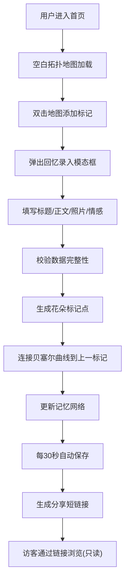

## 1. 产品概述

记忆地图是一款让用户在浏览器中创建和分享个人「记忆星系」的Web应用，通过空间化、可交互的方式记录人生成长经历。用户可以在抽象拓扑地图上标记重要地点，以花朵的形式记录回忆文字、照片和情感，并通过发光曲线将所有记忆编织成一张可视化的网络。

- **核心价值**：将个人回忆从线性的文字记录转化为可视化的空间记忆网络，让回忆变得可探索、可触摸、可分享
- **目标用户**：希望以独特方式记录人生重要时刻、整理成长轨迹、珍藏珍贵回忆的个人用户

## 2. 核心功能

### 2.1 用户角色

| 角色 | 使用方式 | 核心权限 |
|------|----------|----------|
| 地图创建者 | 通过首页进入，无需注册 | 创建/编辑/删除标记点、自动保存、生成分享链接 |
| 访客浏览者 | 通过分享链接访问 | 仅浏览地图内容、查看记忆详情、搜索回忆（不可编辑） |

### 2.2 功能模块

1. **主地图页面（创建者模式）**：拓扑地图画布、回忆录入表单、搜索框、分享按钮、自动保存
2. **主地图页面（访客模式）**：只读地图浏览、左侧信息栏、底部统计栏、搜索功能、胶囊详情查看

### 2.3 页面详情

| 页面名称 | 模块名称 | 功能描述 |
|----------|----------|----------|
| 主地图页面 | 拓扑地图画布 | Canvas 2D渲染5000x5000抽象经纬网格，支持拖拽平移、滚轮缩放(0.5x-3x) |
| 主地图页面 | 花朵标记系统 | 双击添加标记，花瓣数量=情感强度(1-10)，颜色按情感类型固定，呼吸动画(1.0↔1.05, 3s周期) |
| 主地图页面 | 记忆网络连线 | 按时间顺序连接标记点，三次贝塞尔曲线，两端颜色渐变，流动光点(80px/s)，悬停显示摘要 |
| 主地图页面 | 胶囊详情面板 | 点击标记展开胶囊(0.6s, 弹性缓动)，显示回忆内容、照片、情感信息 |
| 主地图页面 | 回忆录入模态框 | 填写标题(必填)、正文(≤500字)、上传照片(jpg/png≤3MB)、选择情感类型与强度 |
| 主地图页面 | 搜索高亮系统 | 实时过滤标题+正文，匹配标记脉冲光晕(80px, 1.5s周期)，不匹配透明度0.15 |
| 主地图页面 | 分享系统 | 每30s自动保存，生成唯一短链接/map/xxx，访客只读模式访问 |
| 主地图页面（访客） | 左侧信息栏 | 显示地图创建者（默认"匿名旅人"）、创建时间 |
| 主地图页面（访客） | 底部统计栏 | 显示总标记数量 |

## 3. 核心流程

**创建者核心流程**：
用户进入首页 → 空白地图加载完成 → 双击地图任意位置 → 弹出回忆录入模态框 → 填写标题、正文、上传照片、选择情感类型与强度 → 提交后生成花朵标记 → 标记点自动与前一个标记连接成发光曲线 → 重复创建标记构建记忆网络 → 系统每30秒自动保存到后端 → 点击分享按钮复制短链接

**访客浏览核心流程**：
访问分享短链接 → 系统加载对应地图数据 → 左侧显示创建者与创建时间 → 底部显示总标记数 → 可拖拽浏览、缩放、搜索、点击查看胶囊详情 → 无法编辑或添加标记

## 4. 用户界面设计

### 4.1 设计风格

- **主题配色**：深色太空主题
  - 背景色：`#0A0A2E`（深邃太空蓝紫）
  - 网格线：`#1A1A4A`（半透明暗网格）
  - 文字色：`#E0E0FF`（柔和淡紫白）
  - 情感色：快乐`#FFD700` / 悲伤`#4A90D9` / 怀念`#9B59B6` / 惊喜`#E74C3C`
- **核心视觉元素**：抽象花朵标记（花瓣数量+颜色）、发光贝塞尔曲线、流动光点、脉冲光晕
- **字体**：主标题使用具有梦幻感的衬线字体，正文使用清晰易读的无衬线字体
- **动画风格**：
  - 花朵呼吸缩放（3s周期，随机相位偏移）
  - 连接线光点流动（80px/s匀速）
  - 胶囊展开弹性缓动（cubic-bezier(0.34, 1.56, 0.64, 1)）
  - 模态框淡入模糊遮罩（0.4s）
  - 搜索结果脉冲光晕扩散（1.5s周期循环）

### 4.2 页面设计概述

| 页面名称 | 模块名称 | UI元素 |
|----------|----------|--------|
| 主地图页面 | 顶部搜索栏 | 毛玻璃效果背景(rgba(255,255,255,0.1), blur10px)、圆角搜索框、分享按钮 |
| 主地图页面 | Canvas画布 | 深色背景、经纬网格、花朵标记、发光连线、流动光点、脉冲高亮、胶囊面板 |
| 主地图页面 | 模态框 | 居中卡片、背景模糊遮罩(0.4s淡入)、表单字段、滑块、文件上传、提交/取消按钮 |
| 主地图页面 | 胶囊面板 | 圆角胶囊形状、从中心向两侧弹性展开、内部文字+缩略图+情感标签 |
| 访客模式 | 左侧边栏 | 毛玻璃效果、创建者头像（默认图标）、创建者名称、创建时间日期 |
| 访客模式 | 底部统计栏 | 毛玻璃效果、花朵总数图标、标记数量数字 |

### 4.3 响应式设计

- **设计优先级**：桌面端优先，适配两种主流分辨率
- **1920x1080分辨率**：完整布局，Canvas占满视口，搜索栏高度56px，侧边栏宽度280px，底部栏高度48px
- **1366x768分辨率**：保持布局比例，适当缩小UI元素间距，侧边栏宽度240px，胶囊面板宽度调整为360px
- **交互优化**：确保所有操作区域最小点击尺寸32x32px，关键元素间距合理不拥挤

## 5. 性能与约束

- **帧率要求**：交互帧率保持45fps以上
- **数据上限**：标记点数量≤80个，连接线数量≤300条
- **文件限制**：照片格式jpg/png，单张最大3MB
- **字数限制**：回忆正文最多500字
- **缩放范围**：0.5x - 3x
- **地图范围**：5000x5000px边界限制
