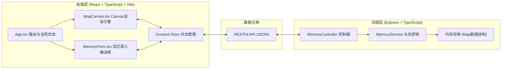
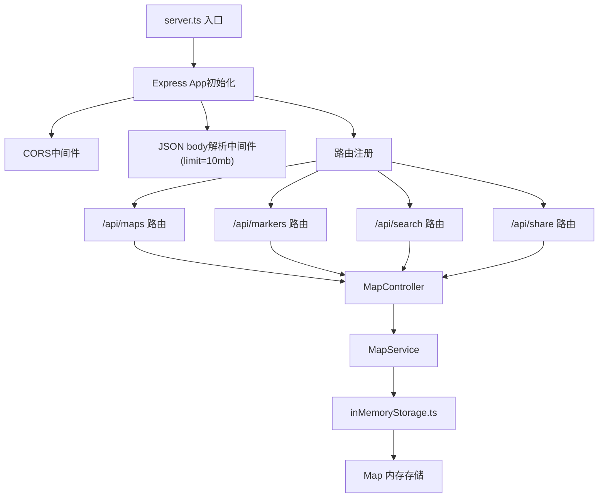
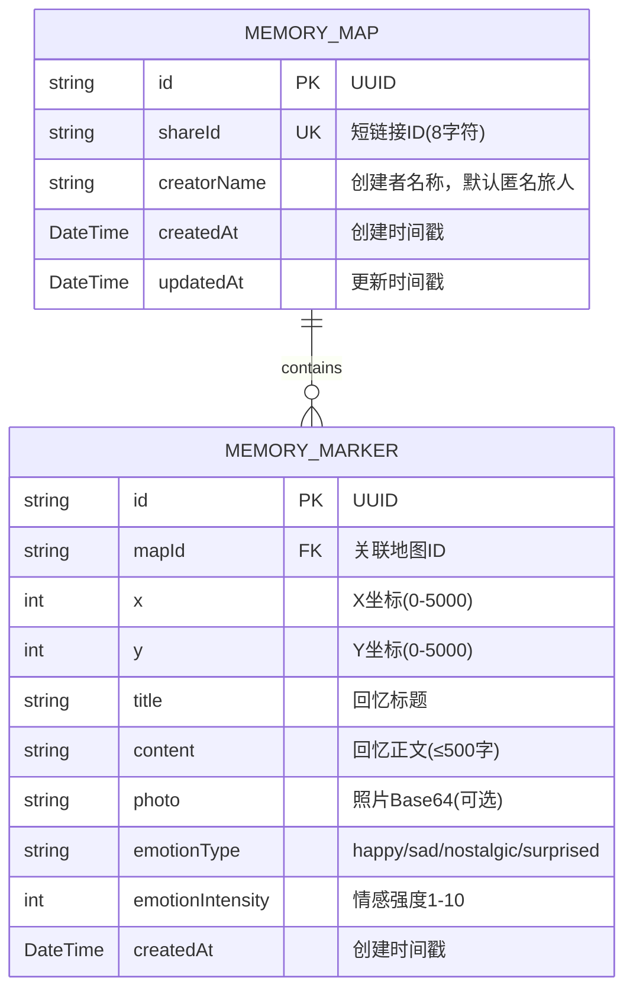

## 1. 架构设计



## 2. 技术选型说明

| 层级 | 技术栈 | 版本说明 | 选型理由 |
|------|--------|----------|----------|
| 前端框架 | React | 18.x | 用户指定，组件化开发，生态成熟 |
| 前端语言 | TypeScript | 5.x | 严格类型检查，减少运行时错误 |
| 构建工具 | Vite | 5.x | 极速开发体验，HMR，用户指定 |
| Canvas渲染 | Canvas 2D API | 原生 | 用户指定，高性能绘制大量图形与动画 |
| 状态管理 | Zustand | 4.x | 轻量级，简洁API，与React完美配合 |
| 后端框架 | Express | 4.x | 用户指定，Node.js生态最成熟的Web框架 |
| 后端语言 | TypeScript | 5.x | 前后端类型一致性 |
| 运行时 | ts-node | 10.x | 直接运行TypeScript后端代码 |
| 唯一ID | uuid | 9.x | 生成地图短链接ID |
| 跨域 | cors | 2.x | 开发环境跨域支持 |

## 3. 路由定义

| 路由 | 组件/处理 | 用途 | 模式 |
|------|-----------|------|------|
| `/` | `App.tsx` → 主地图（创建者模式） | 创建者编辑记忆地图 | 读写 |
| `/map/:shareId` | `App.tsx` → 主地图（访客模式） | 访客浏览共享地图（只读+左侧栏+底部栏） | 只读 |

**Vite开发服务器代理配置**：
- `/api/**` → 代理到 `http://localhost:3000`

## 4. API 接口定义

### 4.1 TypeScript 类型定义

```typescript
type EmotionType = 'happy' | 'sad' | 'nostalgic' | 'surprised';

interface MemoryMarker {
  id: string;
  x: number;
  y: number;
  title: string;
  content: string;
  photo?: string; // base64编码
  emotionType: EmotionType;
  emotionIntensity: number; // 1-10
  createdAt: number;
}

interface MemoryMap {
  id: string;
  shareId: string;
  markers: MemoryMarker[];
  createdAt: number;
  updatedAt: number;
  creatorName: string;
}
```

### 4.2 RESTful API 端点

| 方法 | 路径 | 请求体 | 响应 | 用途 |
|------|------|--------|------|------|
| POST | `/api/maps` | `{ creatorName: string }` | `MemoryMap` | 创建新的记忆地图，返回唯一shareId |
| GET | `/api/maps/:shareId` | - | `MemoryMap \| null` | 根据分享ID获取地图数据 |
| PUT | `/api/maps/:shareId` | `MemoryMap` (无id/shareId) | `MemoryMap` | 保存/更新整个地图数据（自动保存用） |
| POST | `/api/markers` | `{ mapId: string, marker: MemoryMarker }` | `MemoryMarker` | 添加单个标记点 |
| PUT | `/api/markers/:markerId` | `MemoryMarker` (无id) | `MemoryMarker` | 更新单个标记点 |
| DELETE | `/api/markers/:markerId` | - | `{ success: true }` | 删除单个标记点 |
| GET | `/api/search/:shareId` | Query: `q=关键词` | `MemoryMarker[]` | 搜索标记点（标题+正文模糊匹配） |
| POST | `/api/share` | `{ mapId: string }` | `{ shareId: string, shareUrl: string }` | 生成分享短链接 |

### 4.3 响应统一格式

```typescript
interface ApiResponse<T> {
  success: boolean;
  data: T;
  message?: string;
  error?: string;
}
```

## 5. 后端服务架构



**后端关键约束**：
- 所有数据存储于Node.js内存中（Map数据结构），进程重启数据丢失
- 照片以base64字符串存储，单张照片接收上限10MB（Express bodyParser limit）
- 自动保存接口（PUT /api/maps/:shareId）为幂等操作
- shareId使用uuid.v4生成并截取前8字符作为短链接

## 6. 数据模型

### 6.1 实体关系图



### 6.2 内存存储结构

```typescript
// 内存中的数据存储
const memoryStorage: {
  maps: Map<string, MemoryMap>;      // key: mapId
  shareIndex: Map<string, string>;   // key: shareId -> mapId
}
```

### 6.3 情感颜色映射常量

```typescript
const EMOTION_COLORS: Record<EmotionType, string> = {
  happy: '#FFD700',     // 金色
  sad: '#4A90D9',       // 蓝色
  nostalgic: '#9B59B6', // 紫色
  surprised: '#E74C3C', // 红色
};

const EMOTION_LABELS: Record<EmotionType, string> = {
  happy: '快乐',
  sad: '悲伤',
  nostalgic: '怀念',
  surprised: '惊喜',
};
```

## 7. 前端核心模块架构

### 7.1 文件组织（严格按用户指定）

```
项目根目录/
├── package.json
├── vite.config.js
├── tsconfig.json
├── index.html
└── src/
    ├── App.tsx              # 主应用：路由分发、全局状态、布局
    ├── server.ts            # Express后端服务
    └── components/
        ├── MapCanvas.tsx    # Canvas核心渲染引擎
        └── MemoryForm.tsx   # 回忆录入模态框表单
```

### 7.2 MapCanvas 模块内部职责

```
MapCanvas.tsx (单一Canvas组件)
├── 渲染循环 (requestAnimationFrame, ~60fps)
│   ├── 绘制背景网格 (5000x5000, 网格100px)
│   ├── 绘制贝塞尔连接线 (含颜色渐变、流动光点)
│   ├── 绘制花朵标记 (花瓣=强度、颜色=情感、呼吸动画)
│   ├── 绘制搜索脉冲光晕
│   └── 绘制胶囊详情面板 (弹性缓动动画)
│
├── 交互处理
│   ├── 鼠标拖拽平移 (地图边界限制)
│   ├── 滚轮缩放 (0.5x-3x, 以鼠标位置为中心)
│   ├── 双击添加标记 (触发模态框)
│   ├── 悬停连接线 (高亮+摘要)
│   └── 点击标记点 (胶囊展开/收起)
│
└── 状态同步
    ├── markers prop (标记点列表)
    ├── searchQuery prop (搜索关键词)
    ├── selectedMarkerId state (当前展开的胶囊)
    └── hoveredConnection state (当前悬停连线)
```

### 7.3 关键算法说明

1. **花朵绘制算法**：
   - 花瓣数 = emotionIntensity (1-10)
   - 每片花瓣为椭圆，绕中心均匀分布
   - 花瓣颜色 = EMOTION_COLORS[emotionType]
   - 缩放因子 = 1.0 + 0.05 * sin(time * 2π/3 + phaseOffset)

2. **三次贝塞尔连接线**：
   - P0 = marker[i].xy, P3 = marker[i+1].xy
   - P1 = P0 + perpendicular方向偏移(50-100px随机)
   - P2 = P3 + 反perpendicular方向偏移(50-100px随机)
   - 颜色渐变：createLinearGradient(P0, P3) 两标记颜色插值

3. **流动光点动画**：
   - 沿贝塞尔曲线参数t ∈ [0,1]匀速移动
   - 速度：80px/s，根据曲线总长度计算dt
   - 光点：径向渐变圆(中心不透明→边缘透明)

4. **胶囊展开弹性缓动**：
   - cubic-bezier(0.34, 1.56, 0.64, 1)
   - 宽度：0 → 400px (0.6s)
   - 高度：0 → 300px (0.6s)
   - 锚点：标记点屏幕坐标

5. **搜索脉冲高亮**：
   - 光晕半径：0 → 80px循环
   - 透明度：0.8 → 0.2循环
   - 周期：1.5s
   - 不匹配标记：globalAlpha = 0.15

## 8. 性能优化策略

1. **Canvas渲染优化**：
   - 离屏Canvas预渲染静态网格背景
   - 脏矩形局部重绘（标记点动画区域）
   - requestAnimationFrame帧率控制（目标60fps，最低45fps）

2. **对象池优化**：
   - 流动光点对象复用，避免频繁GC
   - 贝塞尔曲线采样点缓存

3. **前端自动保存节流**：
   - 防抖30秒（无操作后30秒触发保存）
   - 有新操作重置计时器

4. **照片上传优化**：
   - 前端文件大小校验(≤3MB)
   - 类型校验(jpg/png)
   - base64编码后发送（无额外图片压缩）
