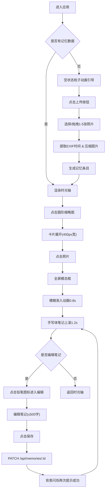

## 1. 产品概述

「足迹记忆册」是一款面向旅行爱好者的个人足迹记录与回顾工具，用户可以上传旅途中的照片、撰写心情笔记，通过时光轴的形式沉浸式地回顾每一段珍贵旅途。

- **核心目标**：让旅行记忆的记录变得简单有趣，回顾体验富有情感温度和视觉美感
- **目标用户**：热爱旅行、喜欢记录生活、重视情感记忆的用户群体
- **产品价值**：通过时光轴交互、手写体笔记、模糊渐入动画等独特视觉体验，将零散的照片转化为可触摸的情感记忆载体

## 2. 核心功能

### 2.1 用户角色

| 角色 | 注册方式 | 核心权限 |
|------|----------|----------|
| 普通用户 | 无需注册，本地使用 | 上传照片、撰写笔记、浏览时光轴、编辑笔记 |

### 2.2 功能模块

1. **时光轴首页**：垂直滚动时光轴、记忆卡片展开/收起、虚拟滚动、空状态粒子动画
2. **照片上传模块**：点击/拖拽上传、EXIF时间提取、图片自动压缩、缩略图生成
3. **笔记预览模块**：全屏模态框、模糊渐入动画、手写体笔记、照片滑动浏览
4. **笔记编辑模块**：铅笔图标进入编辑、字数限制(500字)、保存成功闪烁提示
5. **全局导航模块**：毛玻璃导航栏、上传按钮、响应式布局

### 2.3 页面详情

| 页面名称 | 模块名称 | 功能描述 |
|----------|----------|----------|
| 时光轴首页 | 空状态引导 | 粒子动画文字「开始记录你的足迹吧」，循环展示汇聚散开效果 |
| 时光轴首页 | 时光轴主干 | 垂直贯穿页面的白色渐变细线(0.5px)，透明度渐变 |
| 时光轴首页 | 记忆缩略图 | 圆形(80px)带光晕，点击展开为矩形卡片(400px宽) |
| 时光轴首页 | 记忆卡片 | 展开后显示完整缩略图、日期、文字摘要，支持收起 |
| 时光轴首页 | 虚拟滚动 | 仅渲染可视区域内卡片，确保50条时帧率≥55fps |
| 上传弹窗 | 文件选择 | 支持点击和拖拽上传1-5张照片，单张≤10MB，jpg/png格式 |
| 上传弹窗 | 图片处理 | 自动提取EXIF拍摄时间，压缩至宽度1200px，生成200x150缩略图 |
| 笔记预览 | 全屏模态框 | 半透明黑色背景(rgba(0,0,0,0.7))，覆盖整个视口 |
| 笔记预览 | 模糊渐入动画 | 照片从blur(10px)到blur(0)，耗时0.8秒 |
| 笔记预览 | 笔记文字动画 | Caveat手写体，从底部向上滚动1.2秒，透明度0→1 |
| 笔记预览 | 照片浏览 | 支持左右箭头/滑动切换同一条记忆内多张照片 |
| 笔记编辑 | 编辑模式 | 点击铅笔图标进入，textarea最多500字，实时字数统计 |
| 笔记编辑 | 保存反馈 | PATCH请求成功后，背景色淡黄→白色闪烁两次 |

## 3. 核心流程

### 主用户流程描述

用户首次进入应用 → 看到空状态粒子动画引导 → 点击顶部「上传记忆」按钮 → 选择/拖拽1-5张照片 → 系统自动提取EXIF时间并压缩图片 → 生成记忆条目并显示在时光轴顶部 → 用户点击圆形缩略图 → 卡片展开显示详情 → 点击照片进入全屏预览 → 体验模糊渐入和手写体笔记动画 → 点击铅笔图标编辑笔记 → 保存后看到闪烁成功提示 → 返回时光轴继续浏览其他记忆

## 4. 用户界面设计

### 4.1 设计风格

- **主色调**：深色渐变背景 `#1a1a2e` → `#16213e`，营造深夜星空般的沉浸感
- **辅助色**：柔和光晕 `rgba(100,200,255,0.3)`，象牙白笔记文字 `#f5f5dc`
- **按钮风格**：圆角矩形，悬停上浮2px + 亮度提升1.2倍，点击下沉scale(0.98)
- **字体搭配**：
  - 正文：无衬线字体，简洁现代
  - 笔记：`'Caveat', cursive` 钢笔手写体，字号1.2rem，行高1.6
- **布局风格**：居中垂直时光轴，卡片式记忆条目，毛玻璃导航栏
- **视觉效果**：毛玻璃(backdrop-filter: blur)、光晕box-shadow、渐变细线、模糊过渡动画

### 4.2 页面设计概述

| 页面名称 | 模块名称 | UI元素细节 |
|----------|----------|------------|
| 时光轴首页 | 导航栏 | 固定顶部，高度60px，毛玻璃效果 `rgba(255,255,255,0.05)` + `blur(12px)`，左侧Logo，右侧上传按钮 |
| 时光轴首页 | 时光轴主干 | 0.5px宽白色渐变细线，透明度0.3→0.6斜向渐变，贯穿页面中央 |
| 时光轴首页 | 记忆缩略图 | 圆形直径80px，1px细边框，光晕 `0 0 8px rgba(100,200,255,0.3)`，悬停scale(1.05) |
| 时光轴首页 | 展开卡片 | 400px宽矩形，高度自适应，圆角12px，半透明白色背景，显示日期和文字摘要 |
| 时光轴首页 | 空状态动画 | 粒子直径4px发光圆点，随机飘移→汇聚成文字→再散开，3秒循环 |
| 笔记预览 | 模态框背景 | `rgba(0,0,0,0.7)` 全屏覆盖 |
| 笔记预览 | 照片展示 | 初始60%区域局部放大，2px内阴影，无边框，支持左右切换 |
| 笔记预览 | 笔记区域 | 底部容器，`Caveat`手写体，`#f5f5dc`象牙白，1.2rem，行高1.6 |
| 笔记编辑 | 编辑模式 | textarea输入框，500字限制，实时字数统计，保存/取消按钮 |
| 笔记编辑 | 保存动画 | 背景色从淡黄→白色过渡，闪烁两次(ease-in-out) |

### 4.3 响应式设计

- **桌面优先(Desktop-first)**：默认按1024px+视口设计
- **平板适配(640px-1024px)**：时光轴卡片边距从最大120px逐步缩小到32px
- **手机适配(<640px)**：
  - 圆形缩略图直径缩小到60px
  - 展开卡片宽度调整为90vw
  - 模态框照片边距缩小到16px
  - 页面最小边距保持16px
- **触摸优化**：所有可点击元素最小44x44px触摸区域，滑动手势支持照片切换

### 4.4 动效时序规范

| 动画名称 | 触发条件 | 时长 | 曲线 | 说明 |
|----------|----------|------|------|------|
| 卡片展开/收起 | 点击圆形缩略图 | 0.3s | ease-in-out | 圆形→矩形尺寸过渡 |
| 模糊渐入 | 打开模态框 | 0.8s | ease-out | blur(10px)→blur(0) |
| 笔记上滚 | 模糊动画结束 | 1.2s | cubic-bezier(0.16,1,0.3,1) | translateY(40px)→0，opacity 0→1 |
| 悬停上浮 | 鼠标悬停可交互元素 | 0.2s | ease | translateY(-2px) + brightness(1.2) |
| 按钮按下 | 点击按钮瞬间 | 0.1s | ease-out | scale(0.98) |
| 保存成功闪烁 | PATCH响应成功 | 0.6s×2 | ease-in-out | 背景淡黄↔白色闪烁两次 |
| 粒子循环 | 空状态 | 3s | 随机 | 飘移→汇聚→散开 |
