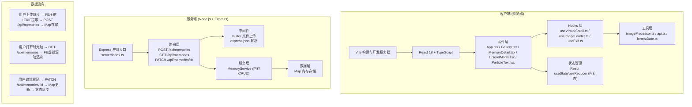
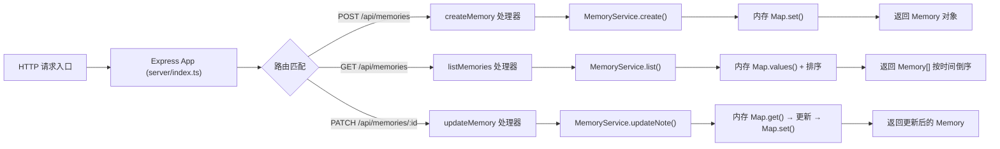
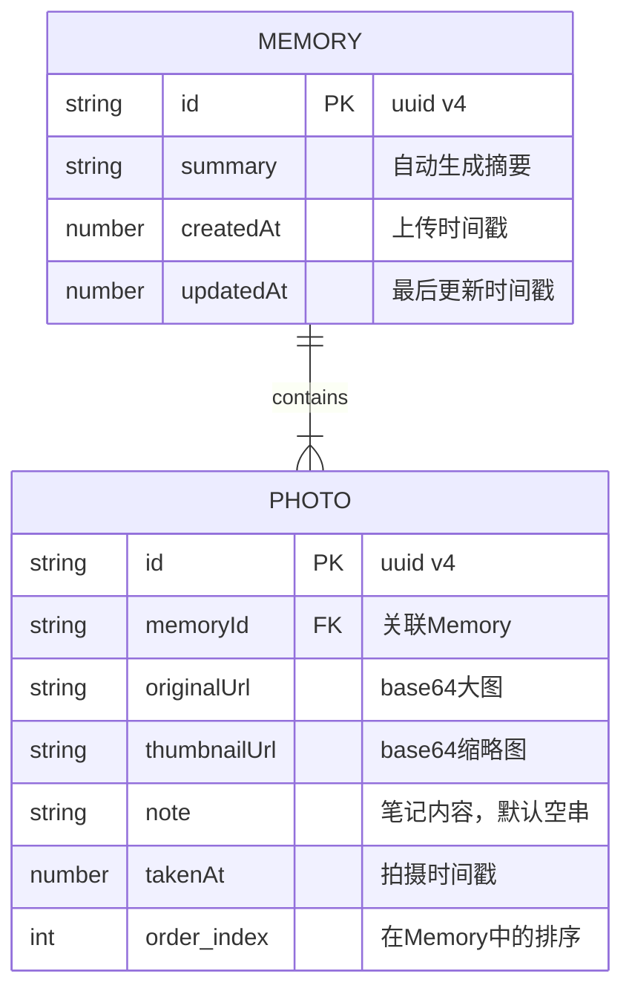

## 1. 架构设计



## 2. 技术描述

- **前端框架**：React 18 + TypeScript（严格模式 `strict: true`）
- **构建工具**：Vite 5 + @vitejs/plugin-react
- **后端框架**：Express 4 + TypeScript（ts-node 运行）
- **文件上传**：multer（内存存储模式，避免写磁盘）
- **图片处理**：Canvas API（浏览器端压缩 + 缩略图生成），exif-js / piexif-ts（EXIF提取）
- **唯一标识**：uuid 库
- **状态管理**：React Hooks（useState + useContext），无需额外状态库
- **路由**：单页应用无需路由库，使用组件状态切换视图

## 3. 路由定义

| 路由路径 | 组件/页面 | 说明 |
|----------|-----------|------|
| `/` (根路径) | App.tsx → Gallery.tsx | 时光轴首页，展示所有记忆 |

## 4. API 定义

### 4.1 类型定义（前后端共享）

```typescript
interface Photo {
  id: string;
  originalUrl: string;        // 压缩后的大图 (base64 data URL)
  thumbnailUrl: string;       // 200x150 缩略图 (base64 data URL)
  note: string;               // 手写体笔记内容，默认空字符串
  takenAt: number;            // 拍摄时间戳（ms），EXIF优先，否则上传时间
}

interface Memory {
  id: string;                 // uuid v4
  photos: Photo[];            // 1-5张照片，按拍摄时间升序
  summary: string;            // 自动生成的摘要（首张照片笔记前30字）
  createdAt: number;          // 上传时间戳
  updatedAt: number;          // 最后更新时间戳
}
```

### 4.2 请求/响应 Schema

#### POST /api/memories - 创建新记忆

**Request Body** (`multipart/form-data` 转 JSON，浏览器端先处理图片后发送 JSON)：
```typescript
interface CreateMemoryRequest {
  photos: Array<{
    dataUrl: string;          // base64 原图压缩后
    thumbnailDataUrl: string; // base64 缩略图
    takenAt: number;          // 拍摄时间戳
    note?: string;            // 可选初始笔记
  }>;
}
```

**Response 201**：
```typescript
interface CreateMemoryResponse {
  success: true;
  data: Memory;
}
```

#### GET /api/memories - 获取所有记忆列表

**Response 200**：
```typescript
interface ListMemoriesResponse {
  success: true;
  data: Memory[];             // 按拍摄时间倒序排列（取首张照片的takenAt）
}
```

#### PATCH /api/memories/:id - 更新记忆（编辑笔记）

**URL Params**: `id` - Memory 的 uuid

**Request Body**:
```typescript
interface UpdateMemoryRequest {
  photoIndex: number;         // 要更新的照片索引 (0-based)
  note: string;               // 新笔记内容（≤500字）
}
```

**Response 200**：
```typescript
interface UpdateMemoryResponse {
  success: true;
  data: Memory;               // 更新后的完整Memory对象
}
```

**Response 404**：
```typescript
{ success: false; error: "Memory not found" }
```

## 5. 服务器架构图



## 6. 数据模型

### 6.1 数据模型定义



### 6.2 内存存储结构

使用 TypeScript Map 进行内存存储（不涉及数据库，重启服务器数据丢失）：

```typescript
// server/index.ts 中定义
type MemoryStore = Map<string, Memory>;
const memoryStore: MemoryStore = new Map();
```

**排序规则**：
- GET /api/memories 返回时，按 `memory.photos[0].takenAt` 降序排列

## 7. 文件结构与调用关系

```
足迹记忆册/
├── package.json              # 统一依赖管理，npm run dev 启动前后端
├── vite.config.js            # Vite配置：React+TS，代理 /api → 后端
├── tsconfig.json             # TS严格模式，路径别名 @/*
├── index.html                # 入口HTML，引入Caveat字体
├── server/
│   └── index.ts              # Express服务器
│                           # 调用关系：接收请求 → MemoryService方法 → Map操作 → 返回JSON
├── src/
│   ├── App.tsx               # 根组件：全局状态，协调子组件
│   │                         # 数据流向：useEffect→GET /api/memories→setMemories→传递给Gallery
│   │                         # 事件流向：UploadModal→handleCreateMemory→POST→刷新列表
│   ├── main.tsx              # React入口：render <App />
│   ├── index.css             # 全局样式：Tailwind + 自定义动画keyframes
│   ├── types/
│   │   └── index.ts          # 类型定义：Memory, Photo, API类型
│   ├── api/
│   │   └── client.ts         # API请求封装：fetch包装，类型安全
│   │                         # 供App调用：createMemory, listMemories, updateMemoryNote
│   ├── utils/
│   │   ├── imageProcessor.ts # 图片处理：压缩1200px宽，生成200x150缩略图(Canvas)
│   │   │                     # 供UploadModal调用：processImage(file)→Promise<ProcessedImage>
│   │   ├── exifExtractor.ts  # EXIF提取：File→takenAt时间戳
│   │   │                     # 供UploadModal调用：extractTakenAt(file)→Promise<number>
│   │   └── dateFormatter.ts  # 日期格式化：时间戳→友好日期字符串
│   ├── hooks/
│   │   ├── useVirtualScroll.ts # 虚拟滚动Hook：计算可视区域items
│   │   │                     # 供Gallery调用：返回 visibleItems, containerRef
│   │   └── useIntersectionObserver.ts # 图片懒加载
│   └── components/
│       ├── Navbar.tsx        # 导航栏：毛玻璃效果，上传按钮
│       │                     # App→Navbar：onUploadClick 触发UploadModal
│       ├── Gallery.tsx       # 时光轴画廊：虚拟滚动+卡片展开/收起
│       │                     # App→Gallery：memories数据，onCardClick打开详情
│       ├── TimelineCard.tsx  # 记忆卡片：圆形↔矩形切换动画
│       │                     # Gallery→TimelineCard：memory数据，isExpanded状态
│       ├── MemoryDetail.tsx  # 笔记详情：全屏模态框+模糊渐入+手写体笔记
│       │                     # App→MemoryDetail：selectedMemory, onClose, onEditSave
│       ├── UploadModal.tsx   # 上传弹窗：拖拽+点击上传，预览+确认
│       │                     # App→UploadModal：onCreateMemory回调
│       ├── ParticleText.tsx  # 空状态粒子动画：Canvas实现
│       │                     # Gallery→ParticleText：当memories为空时渲染
│       └── LazyImage.tsx     # 懒加载图片组件：IntersectionObserver
```
