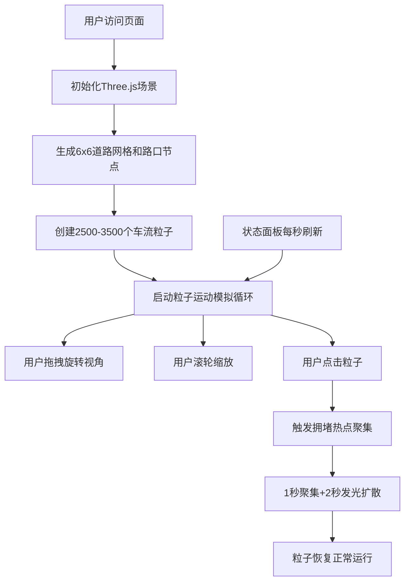

## 1. 产品概述

「霓虹都市·粒子车流」是一个基于Three.js的三维交通数据交互可视化应用，解决传统交通数据可视化缺乏空间纵深感和动态粒子表现力的问题。用户可在三维场景中观察由发光粒子流构成的微型都市交通网络，直观感受城市交通流动状态。

- 主要用途：交通数据可视化展示、城市规划辅助演示、交互艺术装置
- 目标用户：城市规划师、数据可视化从业者、技术展示场景

## 2. 核心功能

### 2.1 用户角色

无角色区分，所有用户享有全部功能权限。

### 2.2 功能模块

1. **三维城市场景**：6x6道路网格自动生成，含路口节点发光效果
2. **粒子车流模拟**：2500-3500个粒子沿道路运动，路口随机转向，拥堵状态动态切换
3. **交互热点触发**：点击粒子触发拥堵热点聚集效果
4. **视角控制系统**：鼠标拖拽旋转、滚轮缩放、平滑惯性阻尼
5. **实时状态面板**：显示总粒子数、平均车速、拥堵路段数

### 2.3 功能详情

| 模块名称 | 子模块 | 功能描述 |
|-----------|-------------|---------------------|
| 城市道路网格 | 道路生成 | 6x6纵横道路（长200宽8单位），半透明青色线条 #33AADD alpha 0.15 |
| 城市道路网格 | 路口节点 | 交叉处15x15方形节点，发光效果 #44AAFF alpha 0.3 |
| 粒子车流 | 初始化 | 2500-3500粒子，直径4单位发光点，基础速度5-15单位/秒 |
| 粒子车流 | 运动规则 | 沿道路直线运动，路口33%概率左/右/直行 |
| 粒子车流 | 颜色映射 | #00FFCC→#FF4400 渐变表示低→高拥堵度 |
| 粒子车流 | 拥堵状态 | 路段密度>200时，颜色#FF0066，速度降50%，脉冲光晕周期0.8秒 |
| 交互热点 | 点击触发 | 点击粒子→该段+相邻两段减速至20%，颜色#FF2200 |
| 交互热点 | 热点效果 | 1秒内聚集形成半径30球形发光热点（1.0→0.0透明度过渡2秒） |
| 交互热点 | 恢复机制 | 热点结束后粒子恢复原始速度颜色 |
| 视角控制 | 旋转 | 鼠标拖拽水平0-360°，垂直15-75° |
| 视角控制 | 缩放 | 滚轮距离50-500单位 |
| 视角控制 | 阻尼 | 平滑惯性阻尼系数0.85 |
| 状态面板 | 数据展示 | 总粒子数、平均车速、拥堵路段数，每秒更新 |
| 状态面板 | UI样式 | rgba(0,0,0,0.6)背景，圆角8px，左上角 |

## 3. 核心流程

用户打开页面 → 三维场景初始化（道路网格+粒子系统）→ 粒子车流开始自主运动 → 用户通过拖拽/缩放观察不同视角 → 点击任意粒子触发拥堵热点效果 → 状态面板实时刷新数据

## 4. 用户界面设计

### 4.1 设计风格

- **主色调**：深色背景 #0D1117，霓虹青色 #33AADD，粒子渐变 #00FFCC → #FF4400 → #FF0066
- **视觉风格**：赛博朋克/霓虹都市风格，发光粒子、脉冲光晕、深色科技感
- **发光效果**：所有粒子使用柔光Bloom后处理，路口节点轻微发光
- **动画曲线**：视角缓动使用easeInOutCubic，热点聚集使用easeOutQuad

### 4.2 页面设计

| 区域 | 元素 | 样式描述 |
|-----------|-------------|-------------|
| 全屏 | Three.js Canvas | 深色背景 #0D1117，抗锯齿，像素对齐 |
| 左上角 | 状态面板 | 半透明黑rgba(0,0,0,0.6)，圆角8px，内边距16px |
| 状态面板 | 标题文字 | "交通状态监控"，白色14px粗体 |
| 状态面板 | 数据行 | 标签灰色12px，数值青色16px，行间距8px |
| 场景 | 道路网格 | 半透青线 #33AADD alpha 0.15 |
| 场景 | 路口节点 | 方形发光 #44AAFF alpha 0.3 |
| 场景 | 车流粒子 | 直径4，柔光Bloom，渐变配色 |
| 场景 | 拥堵光晕 | 脉冲周期0.8s，透明度0.2↔0.6循环 |
| 场景 | 热点球体 | 半径30，径向渐变1.0→0.0，持续2秒 |

### 4.3 响应式设计

- 桌面端优先：Canvas自适应全屏
- 状态面板固定左上角，使用CSS绝对定位
- 触摸设备支持：单指拖拽旋转，双指缩放

### 4.4 3D场景指引

- **环境**：纯黑场景，无HDRI，自发光材质营造霓虹感
- **光照**：AmbientLight(0xffffff, 0.2) + PointLight辅助粒子发光
- **相机**：PerspectiveCamera，初始距离250，俯角45°
- **后处理**：Bloom EffectComposer（强度0.8，阈值0.2），抗锯齿
- **性能目标**：稳定55FPS+，粒子总数2500-3500
