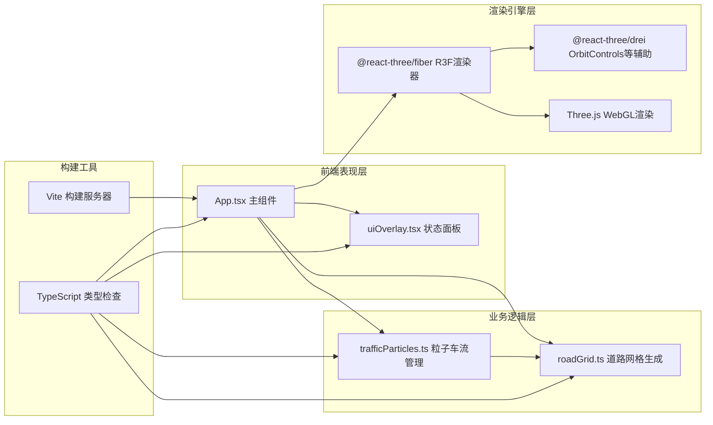

## 1. 架构设计



## 2. 技术描述

- **前端框架**：React@18 + TypeScript@5（严格模式）
- **3D渲染**：Three.js@0.160 + @react-three/fiber@8 + @react-three/drei@9
- **构建工具**：Vite@5 + @vitejs/plugin-react@4
- **样式方案**：内联样式（CSS-in-JS）+ TailwindCSS（可选辅助）
- **无后端**：纯前端应用，所有数据本地模拟生成

## 3. 路由定义

| 路由 | 用途 |
|-------|---------|
| / | 主场景页面，包含完整3D可视化 |

## 4. 文件结构

```
auto153/
├── package.json              # 项目依赖与脚本
├── vite.config.js            # Vite配置（React插件、端口）
├── tsconfig.json             # TS严格模式配置
├── index.html                # 入口页面（挂载点、深色背景）
├── src/
│   ├── App.tsx               # 主组件：场景初始化、相机控制、模块集成
│   ├── main.tsx              # React入口文件
│   ├── roadGrid.ts           # 道路网格生成：6x6网格、路口节点数据
│   ├── trafficParticles.ts   # 粒子管理：初始化/运动/拥堵/热点逻辑
│   └── uiOverlay.tsx         # UI组件：状态面板（粒子数/车速/拥堵数）
└── .trae/
    └── documents/
        ├── PRD-*.md
        └── 技术架构-*.md
```

## 5. 核心数据模型

### 5.1 道路网格数据结构

```typescript
// 道路方向枚举
enum RoadDirection { HORIZONTAL = 'H', VERTICAL = 'V' }

// 单个道路段
interface RoadSegment {
  id: string;                 // 唯一ID
  direction: RoadDirection;   // 水平/垂直
  start: THREE.Vector3;       // 起点坐标
  end: THREE.Vector3;         // 终点坐标
  length: number;             // 长度(200)
  width: number;              // 宽度(8)
  gridIndex: { row: number; col: number }; // 网格索引
  adjacentSegments: string[]; // 相邻路段ID（用于热点扩散）
}

// 路口节点
interface Intersection {
  id: string;
  position: THREE.Vector3;    // 中心坐标
  size: number;               // 边长15
  connectedRoads: string[];   // 连接的道路ID
}

// 输出数据
interface RoadGridData {
  segments: RoadSegment[];    // 72条路段 (6横6纵 × 6段)
  intersections: Intersection[]; // 36个路口 (6×6)
  bounds: { min: THREE.Vector3; max: THREE.Vector3 };
}
```

### 5.2 粒子车流数据结构

```typescript
// 单个粒子状态
interface TrafficParticle {
  id: number;
  position: THREE.Vector3;        // 当前位置
  velocity: THREE.Vector3;        // 速度向量
  baseSpeed: number;              // 基础速度(5-15)
  currentSpeed: number;           // 当前速度（拥堵时变化）
  color: THREE.Color;             // 当前颜色
  segmentId: string;              // 当前所在路段ID
  progress: number;               // 路段上的进度 0-1
  direction: 1 | -1;              // 沿路段方向
  isInHotspot: boolean;           // 是否处于热点中
  hotspotTimer: number;           // 热点剩余时间
  hotspotTarget?: THREE.Vector3;  // 热点聚集目标点
}

// 拥堵路段状态
interface CongestedSegment {
  segmentId: string;
  particleCount: number;
  startTime: number;
  pulsePhase: number;             // 光晕脉动相位
}

// 热点事件
interface HotspotEvent {
  id: number;
  center: THREE.Vector3;
  radius: number;                 // 30
  affectedSegments: string[];     // 目标段+相邻2段
  startTime: number;
  gatherDuration: number;         // 1s聚集
  glowDuration: number;           // 2s发光
}

// 粒子管理器状态
interface ParticleSystemState {
  particles: TrafficParticle[];
  congestedSegments: Map<string, CongestedSegment>;
  hotspots: HotspotEvent[];
  stats: {
    totalCount: number;
    avgSpeed: number;
    congestedCount: number;
  };
}
```

## 6. 模块接口定义

### 6.1 roadGrid.ts 导出接口

```typescript
// 生成完整的6x6道路网格数据
export function generateRoadGrid(
  gridSize: number = 6,
  segmentLength: number = 200,
  roadWidth: number = 8,
  intersectionSize: number = 15
): RoadGridData;

// 获取指定ID的路段
export function getSegmentById(
  data: RoadGridData,
  id: string
): RoadSegment | undefined;

// 获取路段上某进度的世界坐标
export function getPointOnSegment(
  segment: RoadSegment,
  progress: number
): THREE.Vector3;

// 判断点是否属于某路段（用于点击检测）
export function isPointOnSegment(
  point: THREE.Vector3,
  segment: RoadSegment,
  tolerance: number
): boolean;
```

### 6.2 trafficParticles.ts 导出接口

```typescript
// 创建粒子系统管理器
export function createParticleSystem(
  gridData: RoadGridData,
  minParticles: number = 2500,
  maxParticles: number = 3500
): ParticleSystemState;

// 每帧更新（返回更新后的状态）
export function updateParticles(
  state: ParticleSystemState,
  gridData: RoadGridData,
  deltaTime: number
): ParticleSystemState;

// 触发指定路段的拥堵热点（点击事件）
export function triggerHotspot(
  state: ParticleSystemState,
  gridData: RoadGridData,
  targetSegmentId: string,
  clickWorldPos: THREE.Vector3
): ParticleSystemState;

// 动态调整粒子数量至目标范围
export function adjustParticleCount(
  state: ParticleSystemState,
  gridData: RoadGridData,
  targetCount: number
): ParticleSystemState;

// 拥堵颜色映射函数
export function congestionToColor(densityRatio: number): THREE.Color;
```

## 7. 性能优化策略

| 优化点 | 方案 |
|--------|------|
| 粒子渲染 | 使用THREE.Points + BufferGeometry批量绘制，而非独立Mesh |
| 颜色更新 | 直接操作BufferAttribute数组，避免逐对象setAttribute |
| 点击检测 | 预计算路段AABB包围盒，先粗筛再精确距离判定 |
| 拥堵检测 | 分路段用空间哈希计数，每帧复杂度O(N) |
| 后处理Bloom | 限制Bloom采样半径，仅对高亮度像素生效 |
| GC优化 | 对象池复用Vector3/Color，减少每帧临时对象创建 |
| 动态粒子数 | 根据FPS自适应2500-3500范围，维持55FPS以上 |
| 矩阵更新 | 关闭Object3D自动矩阵更新，手动统一更新 |
