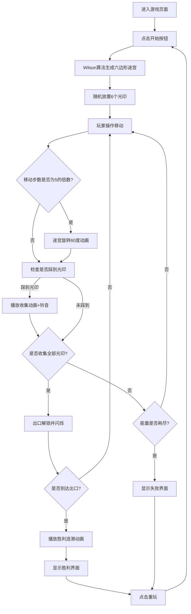

## 1. 产品概述

「幻境迷宫·光印逃脱」是一款2D浏览器策略解谜游戏，玩家操控光点小人在随机生成的六边形迷宫中收集六色光印，在有限步数内完成挑战。目标用户为独立游戏爱好者和休闲解谜玩家。

产品价值：融合随机迷宫生成 + 时间压力机制 + 动态环境变化，提供紧张刺激的策略解谜体验。

## 2. 核心功能

### 2.1 用户角色

| 角色 | 注册方式 | 核心权限 |
|------|----------|----------|
| 玩家 | 无需注册，直接游玩 | 开始游戏、控制角色、重置游戏 |

### 2.2 功能模块

1. **主游戏界面**：六边形迷宫Canvas渲染、玩家光点、光印动画
2. **游戏控制系统**：WASD键盘控制、鼠标点击相邻格移动
3. **迷宫生成系统**：Wilson算法随机生成六边形连通迷宫
4. **光印收集系统**：六色光印、收集动画、音效反馈
5. **迷宫旋转系统**：每5步迷宫旋转60度、旋转动画、光印闪烁
6. **能量步数系统**：30步能量限制、步数显示、能量耗尽判定
7. **胜负判定系统**：全部光印收集、出口解锁、胜利/失败界面

### 2.3 页面详情

| 页面名称 | 模块名称 | 功能描述 |
|----------|----------|----------|
| 游戏主界面 | 迷宫渲染模块 | Canvas绘制六边形网格、地板、光印、玩家光点 |
| 游戏主界面 | HUD信息模块 | 左上角显示能量步数、右上角显示光印收集进度 |
| 游戏主界面 | 输入控制模块 | WASD键盘监听、Canvas鼠标点击检测 |
| 游戏主界面 | 动画系统模块 | 移动插值动画、收集爆裂粒子、旋转动画、胜利涟漪 |
| 游戏主界面 | 音频反馈模块 | Web Audio API音效播放、收集铃音 |
| 结束界面 | 结果展示模块 | 显示收集光印数量、步数消耗、用时、重玩按钮 |
| 胜利界面 | 胜利动画模块 | 彩色涟漪扩散、画面淡出、统计信息展示 |

## 3. 核心流程

用户进入页面 → 点击开始按钮 → 生成120格六边形迷宫并随机放置6个光印 → 玩家控制光点移动（每步消耗1能量） → 每5步迷宫顺时针旋转60度 → 收集6个光印后出口解锁并闪烁 → 移动到出口触发胜利动画 → 显示胜利界面（统计步数和用时）/ 能量耗尽显示失败界面

## 4. 用户界面设计

### 4.1 设计风格

- **主色调**：深空蓝(#0a0a2e)到深紫色(#1a0a2e)径向渐变背景
- **辅助色**：六色光印系列（红#FF4444、橙#FF8844、黄#FFCC44、绿#44FF44、蓝#4444FF、紫#CC44FF）
- **高亮色**：半透明青色(#20ffff, α=0.2)网格线、亮金色(#ffdd44)旋转高亮、金色出口
- **字体**：现代无衬线字体，白色文字带半透明黑色阴影
- **视觉风格**：深邃神秘的幻境风格，柔光粒子效果

### 4.2 页面设计概述

| 页面名称 | 模块名称 | UI元素 |
|----------|----------|---------|
| 游戏主界面 | 开始按钮 | 居中金色发光按钮，悬停放大动画 |
| 游戏主界面 | Canvas区域 | 1:1正方形，最大600px，等比缩放居中 |
| 游戏主界面 | 能量HUD | 左上角白色18px文字，半透明黑底 |
| 游戏主界面 | 光印进度 | 右上角六个彩色圆点图标 |
| 游戏主界面 | 玩家光点 | 白色#ffffff半径8px，外圈柔光径向渐变16px |
| 游戏主界面 | 六边形网格 | 半透明青色边线，半透明地板填充 |
| 结束界面 | 统计面板 | 半透明深色背景，白色标题，统计文字，重玩按钮 |
| 胜利界面 | 涟漪动画 | 彩色涟漪从中心向外扩散，持续2秒 |

### 4.3 响应式设计

- 桌面端优先，Canvas按最大600px，屏幕小于600px时按比例缩放
- 使用CSS transform等比缩放，保持Canvas始终居中显示
- 移动端优化点击区域，六边形点击检测半径适当增大

### 4.4 性能优化

- 使用 requestAnimationFrame 驱动主循环
- 单帧渲染控制在30ms以内
- 粒子动画使用对象池或数组复用
- 减少不必要的重绘计算，使用脏矩形优化（可选）
