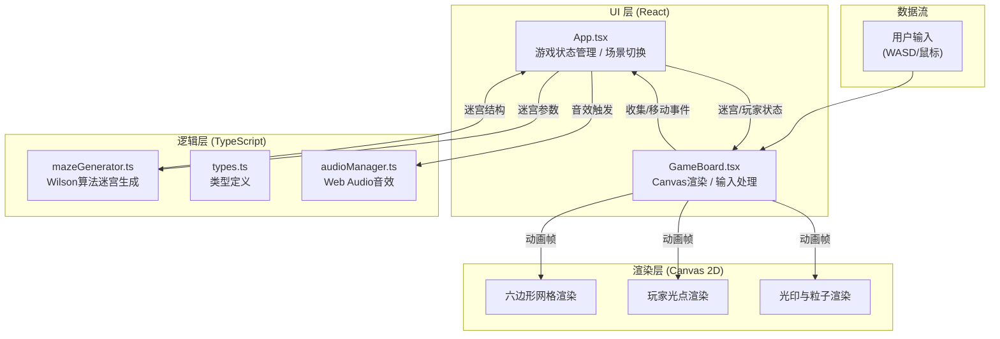

## 1. 架构设计



## 2. 技术选型

| 层级 | 技术方案 | 版本 | 说明 |
|------|---------|------|------|
| 前端框架 | React | ^18.2.0 | UI组件化管理游戏状态与HUD |
| 渲染引擎 | Canvas 2D API | - | 原生浏览器API，绘制六边形网格、光印、粒子 |
| 构建工具 | Vite | ^5.0.0 | 快速开发服务器与构建 |
| 类型系统 | TypeScript | ^5.3.0 | 严格模式，提供类型安全 |
| React插件 | @vitejs/plugin-react | ^4.2.0 | Vite React支持 |
| 音效 | Web Audio API | - | 原生浏览器音效播放（收集铃音880Hz） |
| 算法 | Wilson算法 | - | 随机生成连通六边形迷宫 |

## 3. 项目文件结构

```
auto155/
├── index.html                         # 入口HTML（响应式视口）
├── package.json                       # 项目依赖与脚本
├── vite.config.js                     # Vite配置（React + 路径别名）
├── tsconfig.json                      # TypeScript严格模式配置
└── src/
    ├── App.tsx                        # 主组件（游戏状态机、场景切换）
    ├── types.ts                       # 类型定义（共享数据结构）
    ├── mazeGenerator.ts               # Wilson算法六边形迷宫生成器
    ├── audioManager.ts                # Web Audio音效管理器
    ├── GameBoard.tsx                  # 游戏Canvas面板（渲染+输入）
    └── utils/
        └── hexMath.ts                 # 六边形坐标数学工具
```

## 4. 模块调用关系与数据流向

### 4.1 数据流图

```
用户操作(WASD/点击)
    ↓
GameBoard.tsx (输入监听)
    ↓ (移动请求事件)
App.tsx (游戏状态管理)
    ├── 更新能量步数
    ├── 更新玩家坐标
    ├── 判定光印收集 → 调用 audioManager 播放音效
    ├── 判定5步旋转 → 触发旋转状态
    ├── 判定胜负 → 切换场景
    ↓ (props更新: maze, player, animations)
GameBoard.tsx (Canvas渲染)
    ├── 逐帧 requestAnimationFrame
    ├── 计算插值位置 / 动画进度
    └── Canvas 2D 绘制（六边形、光印、玩家、粒子）
```

### 4.2 模块职责说明

| 文件 | 职责 | 输入 | 输出/回调 |
|------|------|------|-----------|
| mazeGenerator.ts | Wilson算法生成六边形迷宫 + 光印放置 | radius(迷宫半径) | MazeData(二维网格+光印列表) |
| types.ts | 共享类型定义 | - | HexCell, HexCoord, MazeData, PlayerState, GameState |
| audioManager.ts | Web Audio音效管理 | playCollect(), playWin(), playFail() | 无 |
| GameBoard.tsx | Canvas渲染 + 键盘/鼠标输入 | props: maze, player, onMove, animations | onMove(targetHex), 渲染到Canvas |
| App.tsx | 游戏状态机 + 场景切换 + 数据分发 | 用户输入回调 | 更新状态 → 重新渲染GameBoard |

## 5. 核心数据模型

### 5.1 类型定义

```typescript
// 六边形轴向坐标 (q, r)
export interface HexCoord {
  q: number;
  r: number;
}

// 单个六边形单元格
export interface HexCell {
  coord: HexCoord;
  // 6个方向的墙：true表示有墙
  walls: [boolean, boolean, boolean, boolean, boolean, boolean];
  // 光印颜色 (收集后为null)
  sealColor: string | null;
  // 是否已激活（光印被收集）
  activated: boolean;
  // 激活后地板颜色（半透明）
  activatedColor: string | null;
  // 是否为出口
  isExit: boolean;
}

// 迷宫数据
export interface MazeData {
  cells: HexCell[];
  radius: number;       // 六边形迷宫半径
  center: HexCoord;     // 中心格坐标
  sealPositions: HexCoord[];  // 光印坐标（含颜色信息）
}

// 玩家状态
export interface PlayerState {
  coord: HexCoord;
  prevCoord: HexCoord;
  moveProgress: number;  // 0~1，插值动画进度
  energy: number;
  stepsUsed: number;
}

// 游戏场景状态
export type GameScene = 'menu' | 'playing' | 'winning' | 'losing';

// 动画状态
export interface AnimationState {
  rotating: boolean;
  rotationProgress: number;   // 0~1
  rotationAngle: number;      // 当前累计角度
  particles: Particle[];      // 收集爆裂粒子
  ripples: Ripple[];          // 胜利涟漪
  collectAnimations: CollectAnim[];
}
```

### 5.2 六边形坐标系统说明

使用 **轴向坐标系 (Axial Coordinates)**：
- 6个方向的邻居偏移：
  ```
  0: (+1, 0)  右
  1: (+1,-1)  右上
  2: ( 0,-1)  左上
  3: (-1, 0)  左
  4: (-1,+1)  左下
  5: ( 0,+1)  右下
  ```
- 像素转换公式 (边长 size=30px)：
  ```
  x = size * (3/2 * q)
  y = size * (sqrt(3)/2 * q + sqrt(3) * r)
  ```

## 6. 关键算法说明

### 6.1 Wilson算法生成六边形迷宫
1. 初始化所有格子为未访问状态，所有墙为true
2. 随机选一格加入「已访问集合」
3. 对每个未访问格子执行随机游走：
   - 从该格出发，随机走邻居，记录路径
   - 如果走到「已访问集合」中的格子，则将路径打通（移除中间墙）
   - 将路径上所有格子加入「已访问集合」
4. 循环直到所有格子都被访问

### 6.2 光印放置约束
- 从迷宫格子中随机选择，满足两两之间的六边形距离 ≥ 4
- 六边形距离公式：`distance = (|q1-q2| + |q1+r1-q2-r2| + |r1-r2|) / 2`

### 6.3 碰撞检测
- WASD键 → 映射到6个方向（W=左上, D=右, S=右下, A=左, E=右上, Z=左下）
- 鼠标点击 → 计算点击像素点对应的最近六边形坐标
- 移动合法性：目标格存在 && 中间无墙 && 目标格是迷宫格子

### 6.4 迷宫旋转变换
- Canvas 上下文变换：`translate(centerX, centerY) → rotate(angle) → translate(-centerX, -centerY)`
- 旋转动画：线性插值从 0° → 60°，持续 1000ms
- 玩家坐标保持不变，但需要反向旋转计算实际移动方向
