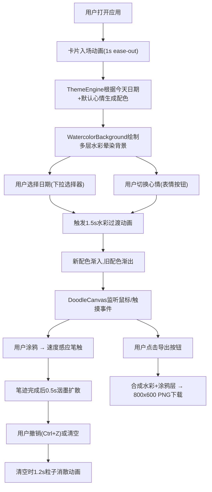

# 「水彩一日」产品需求文档 (PRD)

## 1. 产品概述
「水彩一日」是一款面向手账爱好者的电子手账Web应用，让用户在浏览器中创建随日期、天气、心情动态变化的水彩风格电子手账页面，支持自由涂鸦与墨迹效果模拟。
- **目标用户**：手账爱好者、创意记录者、喜欢数字艺术的普通用户
- **核心价值**：自动化水彩美学 + 自由手写涂鸦 = 每日独一无二的电子手账体验

## 2. 核心功能

### 2.1 用户角色
| 角色 | 注册方式 | 核心权限 |
|------|----------|----------|
| 普通用户 | 无需注册，直接使用 | 选择日期/心情、自由涂鸦、撤销清空、导出PNG |

### 2.2 功能模块
1. **主界面**：A4竖版卡片、顶部工具栏、手账画布区域
2. **主题系统**：日期/心情驱动的配色方案与装饰生成
3. **水彩背景**：多层半透明渐变色块晕染、呼吸动画、切换过渡
4. **涂鸦画布**：鼠标/触摸绘画、速度感应笔触、墨迹扩散干涸、撤销清空
5. **导出功能**：合成水彩背景与涂鸦层导出800x600 PNG

### 2.3 页面详情
| 页面名称 | 模块名称 | 功能描述 |
|----------|----------|----------|
| 主页面 | 工具栏 | 日期下拉选择器（今天+过去7天）、心情选择器（5个表情按钮）、撤销按钮、清空按钮、导出按钮 |
| 主页面 | 手账卡片 | A4竖版比例(3:4)、阴影圆角、入场动画、水彩过渡动画 |
| 主页面 | 水彩背景层 | 多层圆形色块随机重叠、中心向外米白渐变、呼吸动画（4-7秒周期） |
| 主页面 | 涂鸦画布层 | 速度感应笔触(2-6px)、深靛蓝墨迹、0.5秒内洇墨扩散1-3px、透明度降至0.85 |
| 主页面 | 撤销清空 | 撤销最近5笔(Ctrl+Z/按钮)、清空时1.2秒粒子消散动画 |
| 主页面 | 导出功能 | 合成800x600 PNG图片并下载 |

## 3. 核心流程
用户打开应用 → 页面入场动画（卡片从底部滑入）→ 自动以今天+默认心情生成水彩背景 → 用户选择日期或切换心情 → 1.5秒过渡动画重新生成水彩 → 用户在画布上涂鸦 → 笔迹实时渲染+墨迹扩散效果 → 可撤销/清空 → 点击导出下载PNG

## 4. 用户界面设计

### 4.1 设计风格
- **主色调**：米白色(#FFF8E7)为基底，搭配低饱和度柔和水彩色（#C8A2C8、#A2D2DF、#F7D9C4等）
- **按钮风格**：毛玻璃效果、圆角、悬停时从透明渐变至半透明白色(0.3s)
- **字体**：装饰性手写字体用于标题，优雅衬线字体用于正文
- **布局风格**：笔记本风格、A4竖版卡片居中、桌面淡灰色(#F0F0F0)模拟书桌
- **装饰元素**：水彩花卉、手绘线条、日期印章等装饰点缀

### 4.2 页面设计概览
| 页面名称 | 模块名称 | UI元素 |
|----------|----------|----------|
| 主页面 | 整体背景 | 淡灰色(#F0F0F0)书桌背景 |
| 主页面 | 手账卡片 | 宽高比3:4居中、圆角16px、柔和阴影、入场动画 |
| 主页面 | 工具栏 | 透明玻璃效果、顶部悬浮、日期下拉+心情表情+功能按钮 |
| 主页面 | 水彩背景 | 多层半透明圆形色块、中心米白渐变、呼吸动画 |
| 主页面 | 涂鸦层 | 透明叠加层、深靛蓝墨迹、光标为画笔样式 |
| 主页面 | 响应式 | <600px时卡片100%宽度、工具栏垂直堆叠 |

### 4.3 响应式设计
- **桌面优先(Desktop-first)**：默认适配桌面端，卡片宽度600px左右，工具栏水平排列
- **移动端适配**：屏幕<600px时，卡片宽度100%，工具栏改为垂直堆叠，增大触摸目标尺寸
- **触摸优化**：支持触摸事件，取消悬停提示，确保书写流畅不卡顿

## 5. 性能约束
| 模块 | 约束指标 |
|------|----------|
| 涂鸦渲染 | 单帧渲染≤16ms，保证60FPS流畅书写 |
| 水彩重绘 | 3-5个色块总耗时≤50ms |
| 过渡动画 | 1.5秒平滑过渡，帧率≥30FPS |
