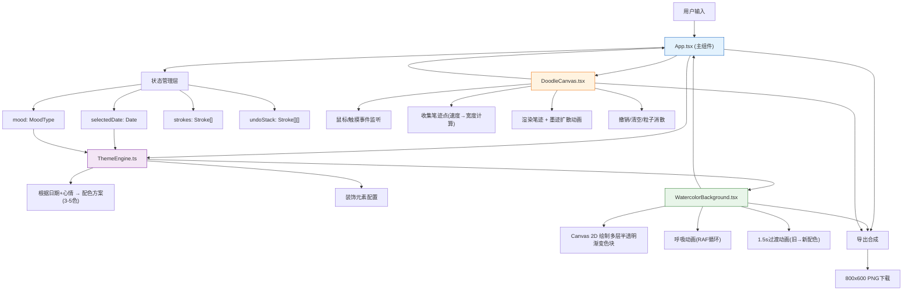

# 「水彩一日」技术架构文档

## 1. 架构设计



### 文件间调用关系与数据流向
| 模块 | 输入数据 | 输出数据 | 调用方 | 被调用方 |
|------|----------|----------|--------|----------|
| App.tsx | 用户交互事件 | 分发props、管理全局状态 | 用户 | WatercolorBackground、DoodleCanvas、ThemeEngine |
| ThemeEngine.ts | selectedDate、mood | ColorScheme、DecorationConfig | App.tsx | - |
| WatercolorBackground.tsx | ColorScheme、width、height | Canvas渲染、ImageData回调 | App.tsx | Canvas API |
| DoodleCanvas.tsx | 鼠标/触摸事件、撤销/清空指令 | Stroke数据、onChange回调 | App.tsx | Canvas API |

## 2. 技术描述
- **前端框架**：React 18 + TypeScript (严格模式)
- **构建工具**：Vite 5 + @vitejs/plugin-react
- **渲染引擎**：Canvas 2D API (水彩背景 + 涂鸦笔迹)
- **状态管理**：React Hooks (useState、useRef、useEffect、useCallback)
- **动画方案**：requestAnimationFrame (RAF) 驱动高性能渲染
- **无后端**：纯前端应用，所有逻辑在浏览器端执行

### 依赖版本
```json
{
  "react": "^18.2.0",
  "react-dom": "^18.2.0",
  "typescript": "^5.3.0",
  "vite": "^5.0.0",
  "@vitejs/plugin-react": "^4.2.0"
}
```

## 3. 路由定义
| 路由 | 用途 |
|------|------|
| / | 主页面：手账编辑器（唯一页面，单页应用） |

## 4. 核心数据结构与类型定义

### 4.1 心情类型
```typescript
type MoodType = 'happy' | 'calm' | 'melancholy' | 'excited' | 'tired';

const MOOD_EMOJIS: Record<MoodType, string> = {
  happy: '😊',
  calm: '😌',
  melancholy: '😢',
  excited: '🤩',
  tired: '😴'
};
```

### 4.2 水彩色块配置
```typescript
interface WatercolorBlob {
  id: string;
  x: number;           // 中心X (0-1相对坐标)
  y: number;           // 中心Y (0-1相对坐标)
  radius: number;      // 半径 (60-200px)
  color: string;       // 基础颜色HEX
  baseOpacity: number; // 基础透明度 (0.15-0.35)
  angle: number;       // 旋转角度 (用于椭圆变形)
  breathPeriod: number;// 呼吸周期 (4-7秒)
  breathPhase: number; // 呼吸相位偏移
}
```

### 4.3 配色方案
```typescript
interface ColorScheme {
  blobs: WatercolorBlob[];
  baseColor: string;      // 背景米白 #FFF8E7
  accentColors: string[]; // 装饰色
  inkColor: string;       // 墨迹颜色 #1A237E
  mood: MoodType;
  dateStr: string;
}
```

### 4.4 笔迹数据结构
```typescript
interface Point {
  x: number;
  y: number;
  pressure: number;  // 0-1, 根据速度模拟
  timestamp: number; // ms
}

interface Stroke {
  id: string;
  points: Point[];
  color: string;
  isDry: boolean;           // 是否已完成干涸效果
  dryProgress: number;      // 0-1, 干涸动画进度
  spreadRadius: number;     // 扩散半径 1-3px
}
```

### 4.5 清空粒子
```typescript
interface ClearParticle {
  x: number;
  y: number;
  vx: number;
  vy: number;
  color: string;
  size: number;
  life: number;    // 0-1 剩余生命
  rotation: number;
}
```

## 5. 核心算法说明

### 5.1 速度感应笔触宽度
```
速度 v = 距离 / 时间差
宽度 w = maxWidth - (maxWidth - minWidth) * clamp(v / threshold, 0, 1)
minWidth = 2px, maxWidth = 6px
快速书写 → 细笔触, 慢速书写 → 粗笔触
```

### 5.2 墨迹扩散算法
```
笔迹完成后 0.5s 内:
  沿笔迹法线方向随机偏移 1-3px
  采样原始笔迹点颜色, 降低透明度至 0.7-0.8
  用 source-over 模式叠加绘制扩散边缘
  同时主笔迹透明度从 1.0 → 0.85
```

### 5.3 水彩呼吸动画
```
t = 当前时间 / breathPeriod + breathPhase
opacityOffset = 0.1 * sin(2π * t)
实际透明度 = baseOpacity + opacityOffset
```

### 5.4 粒子消散动画 (清空时)
```
从所有笔迹点中采样 200-500 个粒子:
  初始位置 = 笔迹点位置
  速度方向 = 随机单位向量 * (2-6)
  重力加速度 = 0.1 px/frame²
  life = 1.0, 每帧衰减 1/(60*1.2)
  size = 2-5px 随机
  color = 采样该点墨迹颜色 + 随机彩色
```

## 6. 文件结构
```
auto157/
├── package.json
├── vite.config.js
├── tsconfig.json
├── index.html
└── src/
    ├── main.tsx               # React入口
    ├── App.tsx                # 主组件 (状态管理、布局)
    ├── ThemeEngine.ts         # 主题引擎 (配色生成)
    ├── WatercolorBackground.tsx # 水彩背景组件
    ├── DoodleCanvas.tsx       # 涂鸦画布组件
    ├── types.ts               # 类型定义
    └── styles.css             # 全局样式
```

## 7. 性能优化策略
1. **Canvas分层**：水彩背景单独Canvas，涂鸦单独Canvas，避免重复绘制
2. **离屏缓存**：水彩呼吸动画使用离屏Canvas缓存，仅更新透明度
3. **RAF批处理**：所有动画统一通过一个requestAnimationFrame循环驱动
4. **笔划增量渲染**：涂鸦时只重绘新增线段，不清除整个画布
5. **对象池**：粒子对象使用对象池复用，避免频繁GC
6. **触摸事件节流**：使用passive事件监听器，preventDefault优化滚动
