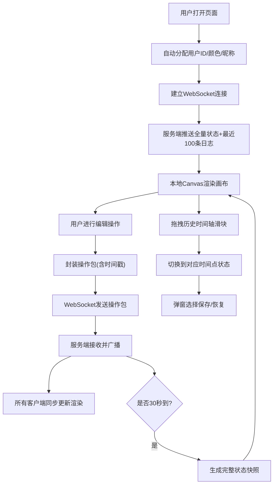

## 1. 产品概述

协作式思维导图是一款支持多用户实时在线协同编辑的Web应用，解决团队在头脑风暴、知识梳理、项目规划中遇到的多人协作难、同步慢、冲突多等痛点。目标用户为产品经理、开发团队、学生小组等需要高效协作的场景。

- 核心价值：多人实时同步、冲突智能解决、历史可追溯回溯
- 市场定位：轻量级、开箱即用的在线协作思维导图工具

## 2. 核心功能

### 2.1 用户角色
| 角色 | 注册方式 | 核心权限 |
|------|----------|----------|
| 普通用户 | 自动分配（无需注册，进入即分配随机用户） | 查看、编辑、添加/删除节点、回溯历史版本 |

### 2.2 功能模块
1. **主画布页面**：导航栏、画布编辑区、右侧工具栏、底部历史时间轴
2. **实时协作层**：WebSocket通信、用户光标、操作广播、心跳检测
3. **历史回溯系统**：快照生成、时间轴滑块、状态还原弹窗

### 2.3 页面详情
| 页面名称 | 模块名称 | 功能描述 |
|----------|----------|----------|
| 主画布页面 | 顶部导航栏 | Logo显示、导图名称编辑、在线用户列表（最多8个彩色头像） |
| 主画布页面 | 画布编辑区 | Canvas渲染节点（椭圆）+ 连接线（贝塞尔曲线+箭头）、拖拽、双击编辑、右键菜单 |
| 主画布页面 | 右侧工具栏 | 10种预设颜色（节点背景色+边框色） |
| 主画布页面 | 底部历史时间轴 | 快照时间刻度、滑块拖拽切换、1.5倍平滑缩放预览 |
| 主画布页面 | 用户光标层 | 半透明圆形光标（20px）、用户名标签、10秒休眠降透明度 |
| 主画布页面 | 冲突提示层 | 节点边框红闪3次、侧边栏冲突记录、手动选择版本 |

## 3. 核心流程

用户进入应用后自动分配身份，服务端推送当前全量状态与最近100条操作日志，本地开始渲染。用户所有编辑操作封装为操作包，经WebSocket发送至服务端，服务端广播给所有客户端并更新内存状态，每隔30秒生成一次快照。

## 4. 用户界面设计

### 4.1 设计风格
- **主色调**：深色主题，背景 #1A1A2E，画布 #16213E
- **强调色渐变**：#00DBDE → #FC00FF（发光边框、滑块）
- **节点颜色预设**：#FF6B35、#4ECDC4、#A3E4D7、#F7DC6F 等共10种
- **连接线**：蓝色贝塞尔曲线，线宽 2px，末端箭头
- **节点样式**：椭圆（80px×50px）、磨砂玻璃（backdrop-filter）、柔和阴影 0 4px 20px rgba(0,0,0,0.3)
- **字体**：节点内容 16px，用户标签 12px 白色，Logo 22px 粗体
- **交互反馈**：
  - 添加节点：从父节点中心弹出 scale 0→1，0.3s ease-out
  - 删除节点：缩小到中心 scale 1→0，0.2s
  - 连接线：从起点画到终点 0.4s 路径动画
  - 编辑状态：渐变发光边框（#00DBDE 到 #FC00FF）
  - 右键菜单：背景 #1E293B，悬浮高亮 #4ECDC4
- **布局**：顶部固定导航栏 56px，底部时间轴 48px，右侧工具栏（<768px 移到底部固定条 120px）

### 4.2 页面设计概述
| 页面名称 | 模块名称 | UI元素 |
|----------|----------|--------|
| 主画布页 | 导航栏 | 左Logo（22px粗白）、中导图名（可编辑输入框）、右用户头像组（彩色圆形+名称，最多8个） |
| 主画布页 | 画布 | 深色背景 #16213E，Canvas节点渲染（椭圆磨砂玻璃），贝塞尔连接线+箭头，用户光标（透明圆+标签） |
| 主画布页 | 工具栏 | 10个颜色方块按钮（网格排列），点击切换节点背景+边框 |
| 主画布页 | 时间轴 | 48px高深色条，渐变滑块（#00DBDE→#FC00FF），刻度显示时间 |
| 主画布页 | 右键菜单 | 浮层，4个选项（编辑/删除/改色/添加子节点），背景 #1E293B，hover高亮 #4ECDC4 |
| 主画布页 | 冲突弹窗 | 节点边框红闪动画（3次×500ms），侧边栏显示冲突记录（双方用户+内容对比+选择按钮） |

### 4.3 响应式
- **桌面优先**：默认布局（导航栏+右侧工具栏+画布+底部时间轴）
- **移动端 <768px**：工具栏移到底部固定条（120px高），节点可操作区域按视口自动缩放，触摸事件支持拖拽与长按右键菜单。

### 4.4 性能指标
- **帧率**：100节点 + 200连接线 ≥ 45fps
- **同步延迟**：WebSocket消息 50ms内广播，网络<200ms时操作响应 ≤ 100ms
- **快照加载**：100节点完整状态渲染 ≤ 1秒
