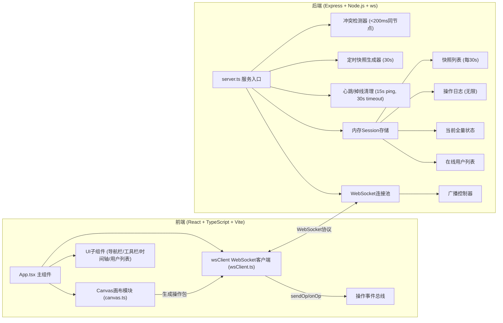
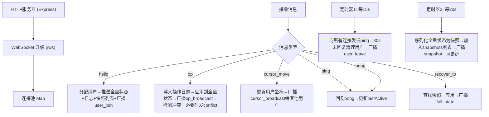
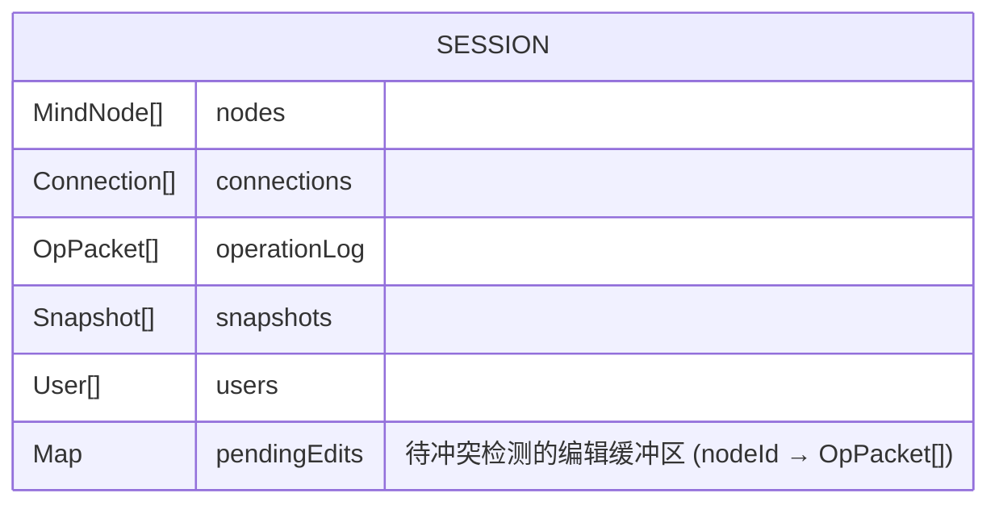

## 1. 架构设计



## 2. 技术描述

- **前端**：React 18 + TypeScript + Vite 5 + Canvas 2D API
- **构建工具**：Vite 5（代理 `/api` 和 `/ws` → 后端 3001 端口）
- **后端**：Express 4 + ws（原生WebSocket，非Socket.io）+ ts-node
- **数据存储**：服务端内存（无需数据库，session级存储）
- **路径别名**：`@/*` → `src/*`

## 3. 路由定义
| 路由 | 目的 |
|------|------|
| `/` | 主应用入口（Vite 前端） |
| `/ws` | WebSocket 升级端点（代理到 Express:3001） |
| `/api/*` | 预留 REST 端点（代理到 Express:3001） |

## 4. API 与协议定义（WebSocket）

### 4.1 数据类型

```typescript
// 用户对象
interface User {
  id: string;           // 唯一ID (uuid)
  name: string;         // 科幻角色昵称 (Astro/Nova/...)
  color: string;        // 用户标识色 (12种高饱和色之一)
  cursorX: number;      // 光标X坐标
  cursorY: number;      // 光标Y坐标
  lastActive: number;   // 最后操作时间戳 (ms)
  isOnline: boolean;
}

// 思维导图节点
interface MindNode {
  id: string;
  text: string;         // 节点文本
  x: number;            // 画布坐标X (中心)
  y: number;            // 画布坐标Y (中心)
  bgColor: string;      // 背景色
  borderColor: string;  // 边框色
  width: number;        // 默认 80
  height: number;       // 默认 50
  lastEditorId: string; // 最近编辑者用户ID
  lastEditTime: number; // 最近编辑时间戳
  createdAt: number;
}

// 连接线
interface Connection {
  id: string;
  fromId: string;       // 起始节点ID
  toId: string;         // 终止节点ID
  color: string;        // 默认蓝色
  lineWidth: number;    // 默认 2
  createdAt: number;
}

// 操作包
interface OpPacket {
  opId: string;
  userId: string;
  timestamp: number;
  type: 'node_add' | 'node_update' | 'node_move' | 'node_delete' | 'connection_add' | 'connection_delete' | 'cursor_move';
  targetId: string;
  oldValue?: any;
  newValue?: any;
}

// 冲突通知
interface ConflictNotice {
  conflictId: string;
  nodeId: string;
  users: { id: string; name: string; content: string; timestamp: number }[];
  winnerId: string;
}

// 快照
interface Snapshot {
  id: string;
  timestamp: number;
  nodes: MindNode[];
  connections: Connection[];
}

// WebSocket 消息封装
interface WSMessage {
  type: 'hello' | 'full_state' | 'op' | 'op_broadcast' | 'conflict' | 'cursor_broadcast' | 'user_join' | 'user_leave' | 'ping' | 'pong' | 'snapshot_list' | 'recover_to';
  payload: any;
}
```

### 4.2 WebSocket 消息流程
1. **客户端→服务端 `hello`**：新连接握手，服务端回复 `full_state` + 最近100条 `op_broadcast` + `snapshot_list` + `user_join`
2. **客户端→服务端 `op`**：发送编辑操作包，服务端广播 `op_broadcast` 给所有连接
3. **客户端→服务端 `cursor_move`**：光标位置更新，服务端广播给其他用户
4. **客户端→服务端 `ping` / `pong`**：心跳，15s 一次，30s 无响应标记掉线
5. **服务端→客户端 `conflict`**：冲突发生时推送通知
6. **客户端→服务端 `recover_to`**：请求恢复到某快照时间点
7. **服务端→客户端 `snapshot_list`**：推送快照列表更新

## 5. 服务端架构



## 6. 数据模型

### 6.1 内存 Session 状态



### 6.2 服务端内存状态结构

```typescript
interface ServerState {
  nodes: MindNode[];
  connections: Connection[];
  operationLog: OpPacket[];       // 无限增长 (内存中)
  snapshots: Snapshot[];          // 每30s追加
  users: Map<string, { user: User; ws: WebSocket }>;
  pendingEdits: Map<string, OpPacket[]>;  // 冲突检测缓冲
}
```

## 7. 启动脚本

- **安装依赖**：`npm install`
- **开发模式**：`npm run dev`（Vite + 后端 ts-node 同端口并发，Vite 代理 API/WebSocket）
- **脚本实现**：使用 `concurrently` 或自定义脚本启动 Vite (:5173) + Express (:3001)
