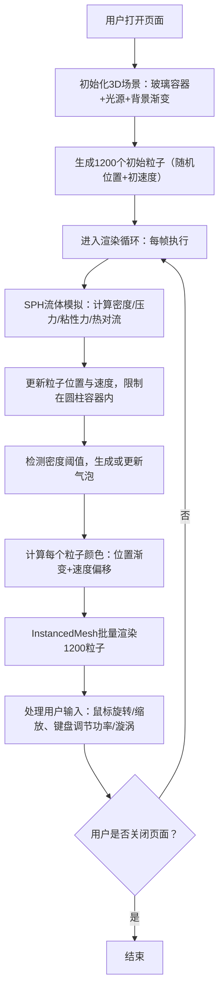

## 1. 产品概述

三维交互式流体熔岩灯可视化应用——在浏览器中模拟动态有机流动的熔岩灯效果，解决单调桌面装饰缺乏沉浸式视觉体验的问题。用户可在三维空间中观察半透明彩色流体的气泡、漩涡和分形纹理，通过鼠标/键盘与系统深度交互，控制加热功率影响流体活跃度。

- 核心目的：提供深邃神秘、有机流动的沉浸式桌面装饰视觉体验
- 目标用户：追求个性化桌面体验、喜爱艺术化视觉效果的用户群体
- 产品价值：将传统熔岩灯的美感通过三维流体动力学在浏览器中复现，带来超越物理限制的交互式体验

## 2. 核心功能

### 2.1 功能模块

1. **三维场景主视图**：半透明玻璃圆柱熔岩灯容器、SPH 粒子流体系统、动态气泡漩涡特效、冷暖双光源系统
2. **流体动力学模拟**：1200粒子 SPH 算法、粘性流动/表面张力/热对流、上升-扩散-下沉循环（15-25秒周期）
3. **动态颜色系统**：温度-位置渐变映射（底部橙红→顶部蓝紫）、速度-亮度/色相联动、气泡闪烁过渡
4. **特效系统**：密度触发气泡生成、气泡脉动纹理、顶部破裂碎屑、S键生成漩涡吸入粒子
5. **用户交互系统**：鼠标拖拽旋转视角、滚轮缩放、W/K键调节加热功率、实时HUD显示

### 2.2 页面详情

| 页面名称 | 模块名称 | 功能描述 |
|-----------|-------------|---------------------|
| 主场景页 | 三维场景渲染 | 占满100vw×100vh视口的Three.js 3D场景，包含玻璃容器、粒子系统、光源 |
| 主场景页 | 流体模拟引擎 | 1200粒子SPH算法，每帧更新位置/速度/密度/颜色，0.1-3.0单位/帧速度范围 |
| 主场景页 | 气泡与漩涡特效 | 密度阈值触发气泡（0.3-1.2半径）、脉动法线扰动、顶部破裂释放20碎屑、S键漩涡 |
| 主场景页 | 交互控制器 | OrbitControls旋转(-90°~90°)、缩放(0.5-5.0)、W/K键调节加热功率(10%-100%) |
| 主场景页 | HUD显示层 | 左上角显示加热功率百分比和实时FPS，无其他UI遮挡 |

## 3. 核心流程

## 4. 用户界面设计

### 4.1 设计风格
- **主色调**：暖橙 #FF4500 → #FFA500（底部高温区）与冷紫 #8A2BE2 → #00CED1（顶部低温区）的强烈冷暖对比渐变
- **背景色**：深灰径向渐变 #1A1A2E → #0F0F23，深邃神秘氛围
- **视觉风格**：有机、半透明、流动感，所有元素遵循「熔岩灯」主题统一
- **玻璃容器**：半透明圆柱，折射率1.5，透明度0.6，带淡淡反射高光
- **HUD字体**：等宽字体，白色半透明，科技感与可读性平衡

### 4.2 页面设计概述

| 页面名称 | 模块名称 | UI元素 |
|-----------|-------------|-------------|
| 主场景页 | 3D场景 | 布局：全屏视口；色彩：深灰径向渐变背景+暖橙冷紫粒子；动画：流体有机流动、气泡脉动上升、碎屑消散 |
| 主场景页 | HUD信息层 | 布局：左上角绝对定位；元素：加热功率进度条+百分比文字、FPS计数器；样式：半透明白色背景圆角卡片，字体Monaco等宽 |
| 主场景页 | 交互反馈 | 鼠标拖拽：视角平滑旋转；滚轮：缩放平滑过渡；W/K按键：功率值1-2秒内平滑插值；S键：漩涡位置视觉高亮 |

### 4.3 响应式设计
- **桌面优先**：主要针对桌面端Chromium浏览器优化
- **自适应**：场景自动适配窗口大小，resize事件触发相机aspect与renderer尺寸更新
- **触控设备**：支持触控拖拽旋转与双指缩放（OrbitControls内置）

### 4.4 3D场景指南
- **环境与氛围**：径向渐变深色背景，无HDRI，突出熔岩灯主体发光感
- **光照设置**：底部暖光点光源（#FF8C00，强度0.5）+顶部冷光点光源（#00BFFF，强度0.2）+环境光（强度0.3）提供基础照明
- **相机设置**：PerspectiveCamera，fov 60°，初始距离3.0单位，OrbitControls限制旋转角度X轴-90°~90°，缩放距离0.5-5.0
- **构图与焦点**：熔岩灯位于场景中心(0,0,0)，圆柱高度4单位半径1单位，视觉重心在容器中部流体区
- **交互与动画**：粒子运动平滑插值（目标速度→当前速度的lerp），功率变化带1.5秒过渡，气泡脉动正弦波动画，碎屑透明度线性衰减
- **后期效果**：可选Bloom泛光效果增强发光粒子的辉光感（@react-three/postprocessing）
- **性能预算**：粒子1200个使用InstancedMesh（1个draw call），气泡最多10个独立Mesh，目标帧率≥30FPS，内存≤200MB
