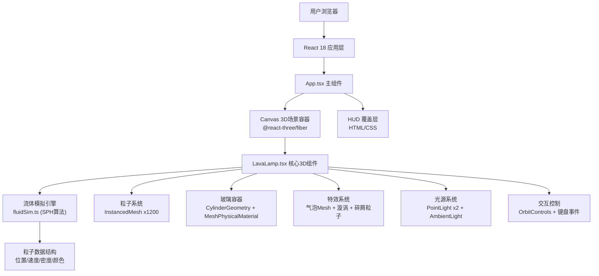

## 1. 架构设计



## 2. 技术描述

- **前端框架**：React 18 + TypeScript
- **构建工具**：Vite 5.x（@vitejs/plugin-react）
- **3D渲染引擎**：Three.js r160+
- **React-Three 桥接**：@react-three/fiber 8.x + @react-three/drei 9.x
- **后期处理**：@react-three/postprocessing（Bloom泛光效果）
- **状态管理**：React useState/useRef + zustand（可选，用于跨组件状态）
- **类型系统**：TypeScript strict模式，ES2020目标
- **样式方案**：内联CSS + CSS Modules（HUD层），Tailwind CSS可选

## 3. 目录结构与文件职责

| 文件路径 | 职责说明 |
|-------|---------|
| `/package.json` | 项目依赖与npm脚本（dev/build/preview） |
| `/index.html` | Vite入口HTML，设置viewport与背景色 |
| `/vite.config.js` | Vite配置，React插件、路径别名、端口配置 |
| `/tsconfig.json` | TypeScript配置，strict模式、ES2020目标、路径别名 |
| `/src/App.tsx` | 主组件：Canvas渲染容器、HUD层布局、全局键盘事件监听、加热功率状态管理 |
| `/src/components/LavaLamp.tsx` | 核心3D组件：粒子系统（InstancedMesh）、气泡管理、玻璃容器网格、双光源设置、OrbitControls、useFrame渲染循环调用流体更新 |
| `/src/utils/fluidSim.ts` | 流体模拟工具模块：Particle数据接口定义、SPH粒子类、初始化函数、每帧更新函数（密度计算/压力/粘性力/热对流/边界碰撞）、颜色映射函数 |
| `/src/main.tsx` | React入口文件，渲染App组件 |
| `/src/index.css` | 全局样式：reset、overflow、全屏布局 |

## 4. 核心数据结构与API

### 4.1 粒子数据接口
```typescript
interface Particle {
  position: THREE.Vector3;    // 粒子当前位置
  velocity: THREE.Vector3;    // 粒子当前速度
  targetVelocity: THREE.Vector3; // 目标速度（用于平滑过渡）
  density: number;            // 局部密度（SPH计算）
  pressure: number;           // 压力值
  temperature: number;        // 温度值 0.0(冷) - 1.0(热)
  baseRadius: number;         // 基础半径 0.05-0.15
  color: THREE.Color;         // 当前颜色
}

interface Bubble {
  id: number;
  position: THREE.Vector3;
  radius: number;             // 0.3-1.2
  pulsePhase: number;         // 脉动相位
  lifetime: number;           // 剩余寿命（秒）
}

interface Debris {
  id: number;
  position: THREE.Vector3;
  velocity: THREE.Vector3;
  lifetime: number;           // 剩余寿命 0-1.5秒
  maxLifetime: number;
}

interface Vortex {
  id: number;
  position: THREE.Vector3;
  lifetime: number;           // 剩余寿命 0-3秒
  strength: number;
}

interface FluidState {
  particles: Particle[];
  bubbles: Bubble[];
  debris: Debris[];
  vortexes: Vortex[];
  heatPower: number;          // 0.1 - 1.0
  targetHeatPower: number;    // 目标功率（平滑过渡用）
}
```

### 4.2 流体模拟核心函数
```typescript
// 初始化N个粒子在圆柱体内
export function initParticles(count: number, cylinderRadius: number, cylinderHeight: number): Particle[];

// 每帧更新所有粒子状态（核心SPH）
export function updateFluid(
  state: FluidState,
  dt: number,
  cylinderRadius: number,
  cylinderHeight: number
): void;

// 根据粒子位置和速度计算颜色
export function computeParticleColor(
  particle: Particle,
  cylinderHeight: number
): THREE.Color;

// 检测密度并生成新气泡
export function checkBubbleFormation(state: FluidState, threshold: number): void;

// 在指定位置创建漩涡
export function createVortex(state: FluidState, position: THREE.Vector3): void;

// 气泡到达顶部破裂，生成碎屑
export function popBubble(state: FluidState, bubble: Bubble): void;
```

### 4.3 性能优化策略
- **InstancedMesh**：1200粒子使用单个InstancedMesh，减少draw call从1200到1
- **空间哈希网格**：SPH邻域搜索使用空间网格加速（O(n)复杂度）
- **对象池**：气泡、碎屑、漩涡对象复用，避免GC抖动
- **批量矩阵更新**：每帧一次instanceMatrix更新，而非逐个粒子setMatrixAt
- **颜色预计算**：使用颜色查找表LUT，避免每帧重复Color对象创建

## 5. 交互事件映射

| 输入事件 | 响应行为 | 实现位置 |
|-------|---------|---------|
| 鼠标左键拖拽 | OrbitControls旋转视角，X/Y轴限制-90°~90° | LavaLamp.tsx OrbitControls props |
| 鼠标滚轮 | 缩放相机距离0.5-5.0单位 | LavaLamp.tsx OrbitControls props |
| W键按下 | targetHeatPower += 0.1，上限1.0 | App.tsx keydown监听 |
| K键按下 | targetHeatPower -= 0.1，下限0.1 | App.tsx keydown监听 |
| S键按下 | 射线拾取鼠标指向的3D位置，创建漩涡 | App.tsx + LavaLamp.tsx 射线拾取 |
| window resize | 更新camera.aspect和renderer尺寸 | @react-three/fiber 内置自动处理 |
