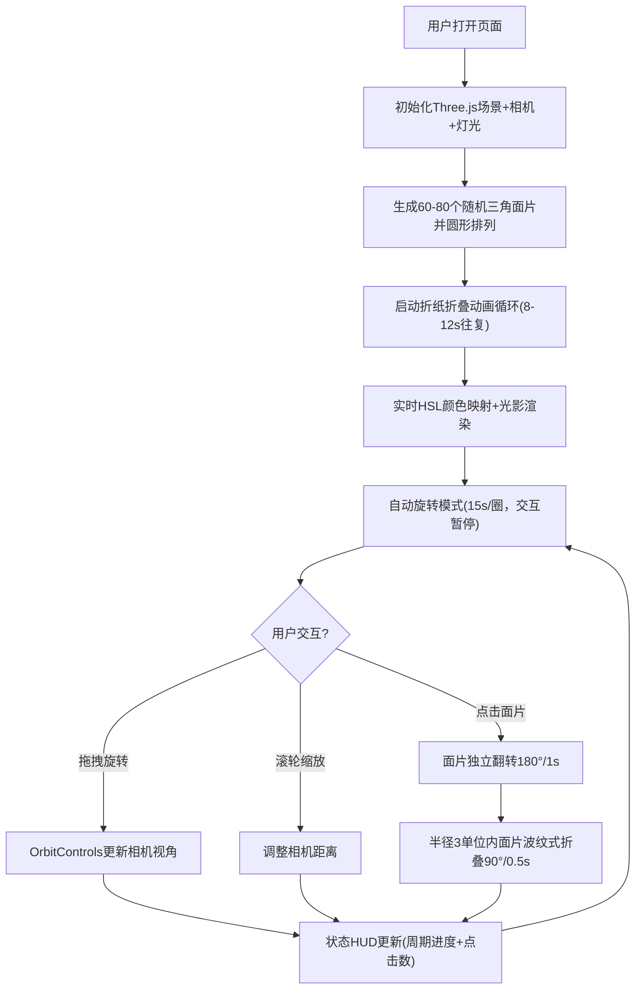

## 1. 产品概述

「光影折纸·动态几何雕塑」是一款基于WebGL的三维交互可视化应用，通过半透明彩色三角面片的折叠变形创造抽象几何雕塑。解决了传统静态折纸模型缺乏动态光影、实时变形和丰富交互反馈的问题。面向艺术爱好者、设计师和创意编程爱好者，提供沉浸式的折纸艺术欣赏与交互体验。

## 2. 核心特性

### 2.1 用户角色
| 角色 | 注册方式 | 核心权限 |
|------|----------|----------|
| 访客用户 | 无需注册，直接访问 | 完整的三维场景浏览、视角控制、面片交互、状态信息查看 |

### 2.2 功能模块
1. **折纸几何雕塑模块**：60-80个半透明三角面片构成的圆形排列雕塑，带折痕线折叠动画系统
2. **动态光影渲染模块**：基于HSL色环的颜色映射、法线漫反射高光、随视角旋转的光源
3. **交互连锁折叠模块**：面片点击独立翻转、波纹式连锁折叠动画传播
4. **视图控制模块**：鼠标拖拽旋转、滚轮缩放、自动旋转模式切换
5. **状态信息模块**：折叠周期进度、点击面片数统计的悬浮显示

### 2.3 页面详情
| 页面名称 | 模块名称 | 功能描述 |
|----------|----------|----------|
| 主场景页面 | 3D Canvas画布 | Three.js WebGL渲染器，全屏自适应，背景渐变深空+300颗星点 |
| 主场景页面 | 折纸几何雕塑 | 60-80个三角面片，半径0.3-1.0随机，折痕折叠动画0°-120°，波状延迟扩散 |
| 主场景页面 | 动态光影系统 | 暖橙#FF8C00→冷紫#8A2BE2的HSL插值，透明度0.9→0.4，漫反射高光计算 |
| 主场景页面 | 连锁折叠交互 | 点击面片翻转180°/1秒，半径3单位内波纹扩散90°/0.5秒，最多波及10面片 |
| 主场景页面 | 视图控制 | OrbitControls拖拽旋转+缩放，15秒自动环绕，交互暂停 |
| 主场景页面 | 状态HUD | 左上角半透明文字，折叠周期进度+点击统计，每2秒更新，淡入淡出动画 |

## 3. 核心流程

用户打开页面后，自动旋转的折纸雕塑进入视野，面片以波状模式从中心向外依次折叠展开，颜色在暖橙与冷紫之间渐变流动。用户可鼠标拖拽改变视角观察不同角度的光影效果，滚轮缩放细节。点击任意面片触发独立翻转并向周围扩散连锁折叠波纹，形成视觉冲击。所有交互均有平滑过渡动画，营造科幻折纸美学氛围。

## 4. 用户界面设计

### 4.1 设计风格
- **主色调**：暖橙#FF8C00 → 冷紫#8A2BE2的HSL渐变，深空背景#0a0a2e → #1a1a3e
- **辅助色**：白色边缘发光(透明度0.2)，面片高光白色(强度动态)
- **字体**：系统默认无衬线字体(sans-serif)，14px小号文字
- **视觉风格**：科幻折纸美学——半透明渐变、边缘线条发光、法线扰动模拟金属拉丝纹理
- **动画**：所有过渡使用requestAnimationFrame，CSS缓动ease-in-out，淡入淡出opacity动画

### 4.2 页面设计概览
| 页面名称 | 模块名称 | UI元素 |
|----------|----------|--------|
| 主场景页面 | 3D场景 | 全屏Canvas、深空渐变背景、300颗星点、动态光源 |
| 主场景页面 | 几何雕塑 | 60-80半透明三角面片、白色边缘发光线、动态折叠变形 |
| 主场景页面 | 状态HUD | 左上角14px白色半透明文字(透明度0.6)、淡入淡出动画、2秒更新周期 |
| 主场景页面 | 交互反馈 | 面片翻转平滑过渡、连锁波纹动画、视角拖拽惯性 |

### 4.3 响应式设计
- **桌面优先**：100vw×100vh全屏Canvas，窗口resize自适应
- **触摸优化**：支持触屏拖拽旋转、双指缩放（OrbitControls内置支持）
- **性能保障**：60FPS目标，80面片时≥50FPS，每帧仅更新必要的变换矩阵和着色器uniform

### 4.4 3D场景指引
- **环境**：深空渐变背景(#0a0a2e→#1a1a3e)+300随机星点，营造宇宙空间感
- **光照**：右上方固定方向光(随视角旋转)+环境光辅助，漫反射高光由法线点积计算
- **相机**：PerspectiveCamera，fov 60°，初始距离8单位，OrbitControls拖拽+缩放
- **构图**：雕塑居中占据视野70%，视角可环绕观察，缩放范围4-15单位
- **交互**：鼠标拖拽旋转(带惯性阻尼)、滚轮缩放、点击面片拾取(raycaster)
- **后期处理**：面片边缘线框叠加、透明度混合、深度测试正确排序
- **性能预算**：单场景 draw call ≤ 80，每帧矩阵更新 ≤ 80个，HSL颜色计算每面片1次
