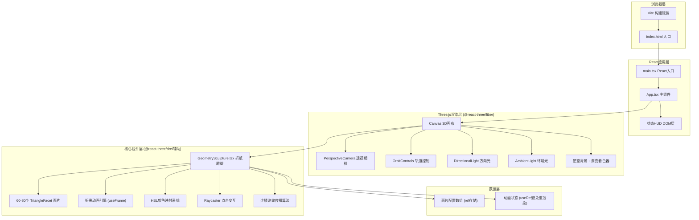

## 1. 架构设计



## 2. 技术栈说明

| 类别 | 技术选型 | 版本 | 用途 |
|------|----------|------|------|
| 前端框架 | React | ^18.x | 组件化UI，Hooks状态管理 |
| 渲染引擎 | Three.js | ^0.160.x | WebGL 3D底层渲染 |
| React绑定 | @react-three/fiber | ^8.x | Three.js的React声明式封装 |
| 辅助组件 | @react-three/drei | ^9.x | OrbitControls等常用3D组件 |
| 类型定义 | TypeScript | ^5.x | 严格类型检查，esModuleInterop |
| 构建工具 | Vite | ^5.x | 快速冷启动+HMR开发服务器 |
| React插件 | @vitejs/plugin-react | ^4.x | Vite的React+TSX支持 |
| 类型声明 | @types/three | ^0.160.x | Three.js完整TypeScript类型 |

## 3. 项目文件结构

```
auto160/
├── package.json          # 依赖声明+启动脚本
├── index.html            # HTML入口(挂载#root)
├── tsconfig.json         # TS严格配置
├── vite.config.js        # Vite构建配置
└── src/
    ├── main.tsx          # ReactDOM.createRoot入口
    ├── App.tsx           # 主组件(Canvas+HUD+布局)
    └── components/
        └── GeometrySculpture.tsx  # 核心折纸雕塑组件
```

## 4. 核心模块数据流定义

### 4.1 面片数据结构 TypeScript 类型

```typescript
interface FacetData {
  id: number;
  // 几何参数
  baseVertices: [THREE.Vector3, THREE.Vector3, THREE.Vector3]; // 三角形三顶点(局部)
  center: THREE.Vector3;       // 面片世界中心点(用于连锁半径计算)
  size: number;                // 面片大小 0.3-1.0
  angle: number;               // 当前折叠角度(弧度)
  // 动画参数
  foldSpeed: number;           // 折叠速度 rad/s (10°-30°/s)
  delayPhase: number;          // 延迟相位 0-1 (波状扩散)
  cyclePeriod: number;         // 总周期 s (8-12s)
  hingeAxis: THREE.Vector3;    // 折痕旋转轴(共享边)
  hingePivot: THREE.Vector3;   // 折痕旋转基点
  // 独立翻转/连锁状态
  flipAngle: number;           // 独立翻转附加角度
  flipVelocity: number;        // 翻转动画速度
  flipTarget: number;          // 翻转目标角度
  rippleActivated: boolean;    // 是否已被波纹激活
  rippleStartTime: number;     // 波纹触发时间戳
}
```

### 4.2 颜色映射算法 (HSL线性插值)
```
输入: foldAngle [0°, 120°]
   t = clamp(foldAngle / 120°, 0, 1)
   H = 30°*(1-t) + 270°*t     // 暖橙H≈30 → 冷紫H≈270
   S = 80%                     // 固定高饱和度
   L = 55% + 5%*sin(t*π)      // 亮度微浮动
   α = 0.9 - 0.5*t             // 透明度 0.9→0.4
输出: RGBA + 法线高光系数
```

### 4.3 连锁波纹传播算法
```
触发: 点击面片 P0
   1. P0.flipTarget += π (180°), 动画1秒
   2. 收集所有 distance(P.center, P0.center) ≤ 3.0 的面片 → candidates[]
   3. candidates 按距离升序排序, 最多取前10个
   4. 对第i个面片 Pi:
         delay = distance(Pi, P0) / 2.0    // 传播速度2单位/秒
         setTimeout(delay, () => {
           Pi.flipTarget += π/2            // 90°
           动画持续0.5秒
         })
```

## 5. 性能优化策略

### 5.1 渲染层面
- **共享几何体**: 所有面片复用单个 BufferGeometry，通过 matrixWorld 实例化变换（或使用 InstancedMesh）
- **材质复用**: 统一使用 ShaderMaterial，颜色/透明度通过 uniform 数组或顶点色传递
- **深度排序**: 半透明面片启用 alphaTest+transparent，按 cameraDistance 排序渲染

### 5.2 动画层面
- **useRef 存储动画状态**: 避免 React 重渲染触发 80 个子组件 reconcile
- **useFrame 单循环**: 所有面片的角度更新、矩阵计算、颜色计算在一个 useFrame 内完成
- **矩阵自动更新关闭**: `mesh.matrixAutoUpdate = false`，手动调用 `matrix.compose(position, quaternion, scale)`

### 5.3 交互层面
- **Raycaster 复用**: 全局一个 Raycaster 实例，点击时复用而非重建
- **事件委托**: 不在每个面片上挂 onClick，使用 Canvas 根级 onClick + 批量 intersectObjects
- **防抖节流**: 状态 HUD 每 2 秒更新一次，使用 setInterval 而非每帧 setState
