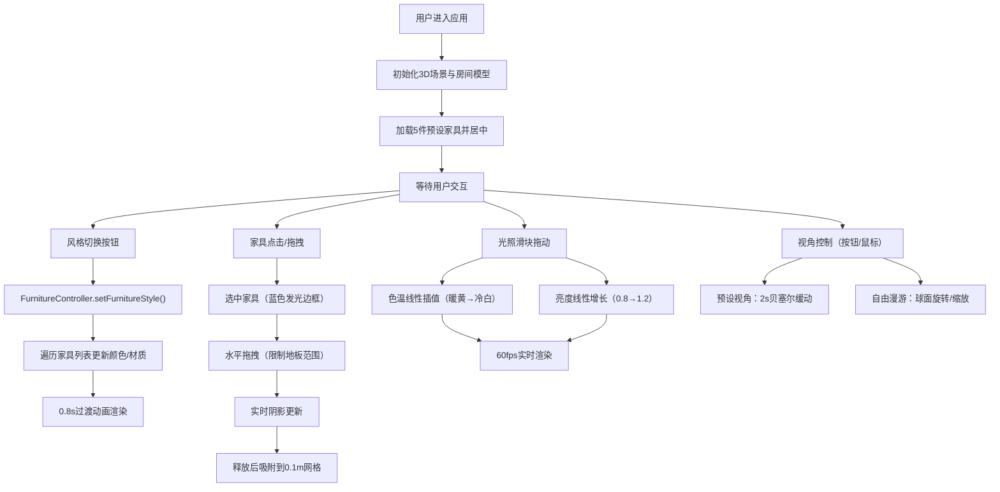

## 1. 产品概述

「光影家居·3D配置器」是一款面向空间设计师和家居爱好者的3D交互可视化工具，帮助用户在浏览器中实时预览不同风格的室内布局，通过拖拽家具模型快速切换搭配，并即时查看光影和材质效果。

- 核心价值：将传统2D平面设计升级为沉浸式3D体验，降低室内设计决策门槛，提升方案沟通效率
- 目标用户：空间设计师、家装从业者、普通用户装修前的方案预览

## 2. 核心功能

### 2.1 用户角色

| 角色 | 注册方式 | 核心权限 |
|------|----------|----------|
| 设计师用户 | 无需注册，浏览器直接使用 | 3D场景浏览、家具拖拽、风格切换、光照调节、视角切换 |

### 2.2 功能模块

1. **3D场景渲染模块**：房间模型（墙壁/地板/窗户）渲染、5件预设家具（沙发/茶几/落地灯/置物架/地毯）的几何组合建模
2. **风格切换模块**：4种预设风格（现代灰白/暖木日式/复古墨绿/轻奢金棕）一键切换，材质颜色带0.8s过渡动画
3. **家具拖拽模块**：点击选中家具（蓝色发光边框），水平拖拽在地板上自由移动，实时阴影跟随，释放后吸附到0.1m网格
4. **光照调节模块**：0-100滑块控制全局光照，色温暖黄→冷白渐变，亮度0.8→1.2线性增长，60fps实时渲染
5. **视角控制模块**：3个预设视角（俯视图/客厅视角/角落视角）带贝塞尔曲线2s缓动；自由拖拽旋转（球面运动围绕房间中心）、滚轮缩放

### 2.3 页面详情

| 页面名称 | 模块名称 | 功能描述 |
|----------|----------|----------|
| 主界面 | 3D渲染画布（左3/4） | Three.js场景渲染，支持家具选中、拖拽、视角控制 |
| 主界面 | 控制面板（右1/4） | 风格切换按钮组、家具属性区、光照滑块、视角预设按钮 |
| 控制面板 | 风格切换区 | 4个直径48px圆形按钮，对应四色，点击时边框发光+弹性动画 |
| 控制面板 | 家具属性区 | 显示选中家具名称+拖拽提示，选中家具显示外发光 |
| 控制面板 | 光照控制区 | 0-100滑块（默认50），实时控制色温和亮度 |
| 控制面板 | 视角预设区 | 三个视角快捷按钮，2s贝塞尔曲线过渡 |

## 3. 核心流程

用户打开应用 → 加载简约现代风格房间与5件家具 → 3D场景自动居中显示
→ 路径A（风格切换）：点击风格按钮 → FurnitureController遍历家具 → 0.8s颜色/材质过渡动画 → 场景实时更新
→ 路径B（家具拖拽）：点击家具选中（蓝色发光边框）→ 拖拽移动（限制在地板内，阴影跟随）→ 释放吸附到0.1m网格
→ 路径C（光照调节）：拖动光照滑块 → 色温&亮度实时插值 → 60fps渲染
→ 路径D（视角切换）：点击视角按钮 → 2s贝塞尔曲线缓动；或鼠标拖拽/滚轮自由漫游

## 4. 用户界面设计

### 4.1 设计风格

- **主色调**：深灰色背景 #2C2C2C，控制面板半透明玻璃效果（backdrop-filter: blur(8px)，圆角12px）
- **风格按钮**：4个直径48px圆形，颜色分别为现代灰白#EAEAEA、暖木日式#D4B895、复古墨绿#2D5A27、轻奢金棕#B87333
- **选中状态**：边框发光 + transform弹性动画 scale(0.95→1.05→1)
- **字体**：现代无衬线字体，标题16px粗体，正文14px常规
- **交互反馈**：所有操作响应≤0.1s，拖拽时cursor: crosshair，选中家具外发光 rgba(64,128,255,0.3)
- **布局**：桌面端1920x1080全屏，左侧3/4画布（1440px），右侧1/4控制面板（最小320px）

### 4.2 页面设计概览

| 页面名称 | 模块名称 | UI元素 |
|----------|----------|--------|
| 主界面 | 整体布局 | 深色背景#2C2C2C，左右分栏（3:1） |
| 主界面 | 3D画布区 | 全屏Three.js Canvas，支持OrbitControls，选中家具蓝色半透明外发光 |
| 控制面板 | 风格切换卡片 | 半透明玻璃卡片（圆角12px），4个圆形按钮网格2x2，标签文字 |
| 控制面板 | 家具属性卡片 | 选中家具名称（大号字体）+ 拖拽提示（小号灰色） |
| 控制面板 | 光照控制卡片 | 滑块控件（左侧最小值，右侧最大值），当前值显示，色温和亮度状态标签 |
| 控制面板 | 视角预设卡片 | 三个等宽按钮，图标+文字（俯视图/客厅视角/角落视角） |

### 4.3 响应式

- 桌面优先设计，适配1920x1080为主
- 控制面板最小宽度320px，确保在较小屏幕上仍可操作
- 3D画布区自适应剩余空间

### 4.4 3D场景指引

- **环境**：简约现代房间，墙壁#EAEAEA浅灰，地板#D4B895浅木色纹理
- **光照设置**：AmbientLight + DirectionalLight（投射阴影），PointLight辅助，默认色温5000K、亮度1.0
- **相机设置**：PerspectiveCamera，fov 50，初始客厅视角；球面运动围绕原点(0,0,0)；预设视角为俯视图(0,8,0)、客厅视角(0,2,6)、角落视角(-4,3,-4)
- **组合与焦点**：房间为5m×5m的开放空间，家具集中在中心区域，沙发为视觉焦点
- **交互与动画**：风格切换0.8s颜色插值；视角切换2s贝塞尔曲线；拖拽实时阴影更新（≤8ms延迟）；光照60fps实时更新（≤16ms延迟）
- **性能预算**：帧率≥55FPS，几何体用基础BoxGeometry/CylinderGeometry等组合，避免复杂模型
