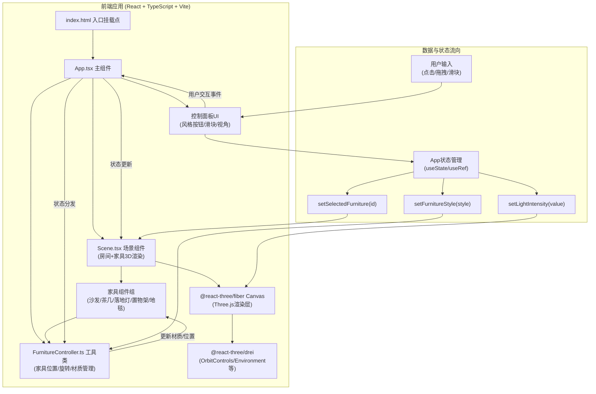

## 1. 架构设计



## 2. 技术选型说明

| 分类 | 技术 | 版本要求 | 用途 |
|------|------|----------|------|
| 构建工具 | Vite | ^5.0 | 极速HMR、TypeScript支持、生产构建 |
| 前端框架 | React | ^18.2 | 组件化开发、Hooks状态管理 |
| 类型系统 | TypeScript | ^5.3 | 严格模式类型检查、代码质量保障 |
| 3D渲染引擎 | three | ^0.160 | WebGL底层3D渲染API |
| React-3D桥接 | @react-three/fiber | ^8.15 | React声明式Three.js，Canvas/useFrame等 |
| 3D辅助库 | @react-three/drei | ^9.92 | OrbitControls、贝塞尔曲线相机动画、阴影辅助 |
| 3D类型定义 | @types/three | ^0.160 | Three.js TypeScript类型支持 |
| Vite React插件 | @vitejs/plugin-react | ^4.2 | JSX编译、React Fast Refresh |

## 3. 目录结构与文件职责

```
项目根目录/
├── index.html                          # 入口页面（root挂载点，引入main.tsx）
├── package.json                        # 依赖声明、npm run dev启动脚本
├── vite.config.js                      # Vite构建配置（React+TS支持）
├── tsconfig.json                       # TS严格模式（esnext+dom类型）
└── src/
    ├── main.tsx                        # React入口（createRoot渲染<App/>）
    ├── App.tsx                         # 主组件
    │                                 # ├── 初始化3D场景Canvas和相机
    │                                 # ├── 挂载Scene组件与控制面板
    │                                 # ├── 数据流向：用户点击→分发到FurnitureController
    │                                 # └── 状态：currentStyle, selectedId, lightValue, cameraTarget
    ├── Scene.tsx                       # 场景组件
    │                                 # ├── 渲染固定房间（墙壁/地板/窗户）
    │                                 # ├── 管理动态家具列表（读取配置数组）
    │                                 # ├── 为家具添加交互标签（onPointerDown选中，拖拽事件）
    │                                 # └── 数据流向：家具配置→3D网格+交互
    ├── FurnitureController.ts          # 工具类
    │                                 # ├── 管理所有家具的位置/旋转/材质
    │                                 # ├── setFurnitureStyle(style)：遍历家具→updateMaterial
    │                                 # ├── getFurnitureConfig(id)：获取家具当前状态
    │                                 # ├── updateFurniturePosition(id, x, z)：更新位置+网格吸附
    │                                 # └── 数据流向：外部调用setFurnitureStyle→遍历→updateMaterial
    ├── types/
    │   └── index.ts                    # 类型定义：FurnitureItem, StylePreset, LightConfig等
    └── components/
        ├── ControlPanel.tsx            # 右侧控制面板（风格按钮+属性区+滑块+视角）
        ├── StyleButtons.tsx            # 风格切换按钮组（4个圆形+弹性动画）
        ├── LightSlider.tsx             # 光照滑块控件
        ├── ViewPresets.tsx             # 视角预设按钮组
        ├── Room.tsx                    # 房间子组件（墙壁/地板/窗户）
        └── Furniture/
            ├── Sofa.tsx                # 沙发（立方体+圆柱组合）
            ├── CoffeeTable.tsx         # 茶几
            ├── FloorLamp.tsx           # 落地灯
            ├── Shelf.tsx               # 置物架
            └── Carpet.tsx              # 地毯
```

## 4. 核心数据模型定义

```typescript
// Furniture ID 枚举
export type FurnitureId = 'sofa' | 'coffeeTable' | 'floorLamp' | 'shelf' | 'carpet';

// 家具材质配置
export interface MaterialConfig {
  color: string;          // 十六进制颜色
  metalness: number;      // 金属度 0-1
  roughness: number;      // 粗糙度 0-1
  emissive?: string;      // 自发光（用于灯具）
}

// 家具位置与状态
export interface FurnitureState {
  id: FurnitureId;
  name: string;           // 显示名：沙发/茶几/落地灯/置物架/地毯
  position: [number, number, number];   // [x, y, z]
  rotation: [number, number, number];   // [rx, ry, rz]
  material: MaterialConfig;
  scale?: [number, number, number];
}

// 风格预设 ID
export type StyleId = 'modern' | 'japanese' | 'vintage' | 'luxury';

// 风格预设配置：每个风格定义5件家具的材质
export interface StylePreset {
  id: StyleId;
  name: string;               // 现代灰白/暖木日式/复古墨绿/轻奢金棕
  buttonColor: string;        // 按钮显示色
  furniture: Record<FurnitureId, MaterialConfig>;
}

// 光照配置
export interface LightConfig {
  intensity: number;          // 0.8 - 1.2
  colorTemperature: number;   // 3500K - 6500K
  colorHex: string;           // 颜色十六进制
}
```

## 5. 文件间调用关系与数据流向详解

### 5.1 组件层级调用

```
App.tsx
├── <Canvas />              (来自@react-three/fiber，初始化Three.js场景)
│   ├── <Scene />           (自定义场景组件)
│   │   ├── <Room />        (墙壁/地板/窗户)
│   │   ├── <Sofa />        (接收 position, material, selected, onSelect, onDrag)
│   │   ├── <CoffeeTable />
│   │   ├── <FloorLamp />
│   │   ├── <Shelf />
│   │   └── <Carpet />
│   └── <OrbitControls />   (来自drei，鼠标旋转/缩放)
└── <ControlPanel />
    ├── <StyleButtons />    (4个风格按钮，onClick→App.setCurrentStyle)
    ├── <FurnitureInfo />   (显示选中家具名称+拖拽提示)
    ├── <LightSlider />     (0-100滑块，onChange→App.setLightValue)
    └── <ViewPresets />     (3个视角按钮，onClick→设置相机动画目标)
```

### 5.2 数据流向详细

1. **风格切换数据流**：
   - 用户点击StyleButtons → App.setCurrentStyle(styleId)
   - App.useEffect 检测 currentStyle 变化
   - 调用 FurnitureController.setFurnitureStyle(styleId)
   - Controller 遍历 5 件家具 → 调用每个家具组件暴露的 updateMaterial(newConfig) 方法
   - Three.js MeshStandardMaterial.color 进行 0.8s lerp 插值（useFrame 逐帧更新）

2. **家具拖拽数据流**：
   - 用户点击家具 mesh → onPointerDown → App.setSelectedId(furnitureId)
   - 选中家具渲染蓝色发光边框 + 外发光
   - 按住鼠标移动 → onPointerMove → 射线投射计算地板平面交点
   - 限制 x/z 在房间范围内 → 调用 FurnitureController.updatePosition(id, x, z)
   - useFrame 内更新 Mesh.position，实时同步阴影（shadowMap.needsUpdate = true）
   - 释放鼠标 → 网格吸附到 0.1m：Math.round(x*10)/10

3. **光照调节数据流**：
   - 用户拖动 LightSlider → onChange → App.setLightValue(0-100)
   - App.useEffect 计算：
     - 亮度 intensity = 0.8 + (value/100) * 0.4
     - 色温 color = lerpColor(#FFF8E3, #E3F0FF, value/100) （每10为一档）
   - 传入 <Scene /> → 更新 ambientLight 和 directionalLight 的 intensity 和 color
   - 逐帧 useFrame 内插值平滑过渡（≤16ms 响应）

4. **视角切换数据流**：
   - 用户点击 ViewPresets 按钮 → App设置 cameraTarget 配置
   - drei 的 <CameraRig /> 或自定义 useFrame 贝塞尔插值：
     - startPos → targetPos，2s 缓动 easeInOutCubic
   - 自由漫游：OrbitControls.target 固定 (0,0,0)，enableDamping=true

## 6. 性能优化策略

| 性能目标 | 优化方案 |
|----------|----------|
| 帧率 ≥ 55FPS | 使用基础几何体（Box/Cylinder），避免复杂Mesh；阴影贴图尺寸合理(1024)；仅拖拽时shadowMap.needsUpdate=true |
| 风格切换流畅 | Material.color 用 lerp 逐帧插值而非一次性赋值；避免切换时重建材质，复用同一 MeshStandardMaterial |
| 光照滑块响应 ≤16ms | 颜色插值使用 Three.js Color.lerp，计算复杂度 O(1)；useFrame 内每帧更新，无额外GC |
| 拖拽阴影延迟 ≤8ms | 仅在拖拽期间开启 dynamic shadows；静态时使用 baked shadow；DirectionalLight.shadow.autoUpdate=false 拖拽时手动needsUpdate |
| 内存优化 | 5件家具共享几何体实例（InstancedMesh可选）；避免频繁创建/销毁材质，使用 uniform 变量改色 |
