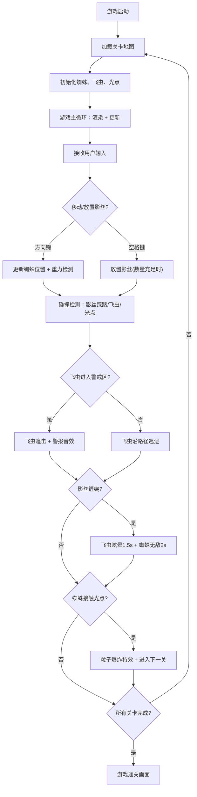

## 1. 产品概述

「影子织网者」是一款在浏览器中运行的2D潜行解谜游戏，玩家操控一只由动态阴影构成的蜘蛛，在网格化的墙面和天花板上自由攀爬，通过放置和回收可消耗的「影丝」来构建临时通路、触发机关或困住巡逻的发光飞虫敌人，最终抵达每一关的出口光点。

- **核心目标**：为独立游戏开发者打造一款轻量化、高性能、视觉风格统一的浏览器端游戏
- **目标用户**：休闲解谜游戏爱好者、独立游戏玩家
- **市场价值**：通过创新的「影丝」机制和阴影攀爬玩法，在潜行解谜品类中形成差异化体验

## 2. 核心功能

### 2.1 用户角色

本游戏为单人单机游戏，无多角色区分。

### 2.2 功能模块

1. **游戏主场景**：全屏Canvas渲染、深灰色网格背景、实时游戏画面
2. **蜘蛛控制模块**：网格攀爬、重力模拟、方向键移动、腿部动画
3. **影丝系统**：放置/回收影丝、物理变形、自动消散、波纹特效
4. **飞虫AI模块**：折线路径巡逻、警报追击、眩晕状态、警告音效
5. **出口与关卡模块**：光点检测、粒子爆炸、关卡切换、进度显示
6. **UI界面模块**：影丝数量显示、关卡进度、像素风格字体

### 2.3 页面详情

| 页面名称 | 模块名称 | 功能描述 |
|-----------|-------------|---------------------|
| 游戏主场景 | 背景渲染 | 全屏深灰色(#2A2A2A)网格，线宽1px，透明度0.3，16:9自适应缩放 |
| 游戏主场景 | 蜘蛛实体 | 8条腿半透明多边形蜘蛛，深蓝(#1E3A5F)到紫色(#6A4C93)渐变，腿部交替摆动 |
| 游戏主场景 | 影丝系统 | 空格键放置，3格单位蓝色半透明丝线，踩踏变形(±20%)，3秒自动消散，最多10条 |
| 游戏主场景 | 飞虫实体 | 明黄色(#FFB347)椭圆发光体，光晕半径8px，翅膀10Hz扇动，折线路径巡逻 |
| 游戏主场景 | 出口光点 | 右上角闪烁光点，同心圆波纹脉动，半径5px，周期1秒，接触触发粒子爆炸 |
| UI界面 | 状态栏 | 左上角显示影丝数量和关卡进度，monospace字体，白色16px |
| UI界面 | 反馈特效 | 落地阴影扩散、影丝放置光环、踩踏波纹、飞虫眩晕闪光、无敌护盾、粒子爆炸 |

## 3. 核心流程

### 主游戏流程

玩家启动游戏 → 加载第1关地图 → 蜘蛛出现在起始位置 → 使用方向键控制蜘蛛在网格上攀爬 → 空格键放置影丝构建通路/陷阱 → 躲避或缠绕巡逻飞虫 → 抵达出口光点 → 粒子爆炸特效 → 进入下一关

## 4. 用户界面设计

### 4.1 设计风格

- **主色调**：深灰背景 #2A2A2A、蜘蛛渐变 #1E3A5F → #6A4C93、影丝蓝色、飞虫明黄 #FFB347、出口金色 #FFD700
- **辅助色**：白色 #FFFFFF（UI文字）、红色 #FF4444（飞虫受创）
- **整体风格**：暗色调科幻/哥特式美学，强调阴影与光的对比
- **字体**：像素风格 monospace，字号16px
- **视觉重点**：发光特效、粒子动画、半透明渐变、波纹扩散

### 4.2 页面设计概览

| 页面名称 | 模块名称 | UI元素 |
|-----------|-------------|-------------|
| 游戏主场景 | 网格背景 | #2A2A2A，1px线宽，0.3透明度，全屏16:9自适应 |
| 游戏主场景 | 蜘蛛角色 | 渐变多边形主体 + 8条2px腿，0.2s周期腿部交替摆动 |
| 游戏主场景 | 影丝 | 半透明蓝色线段，3格单位，踩踏变形，放置时0-15px蓝色光环0.4s |
| 游戏主场景 | 飞虫 | 椭圆发光体 + 8px光晕，翅膀0.8-1.2缩放10Hz，追击时脉冲闪光2Hz |
| 游戏主场景 | 出口光点 | 金色圆点 + 同心圆波纹1s周期，接触时300粒子爆炸1.5s |
| UI界面 | 左上角状态栏 | 影丝数量 🕸️ X / 关卡 Level N，白色monospace 16px |
| UI界面 | 特效层 | 落地阴影扩散、踩踏蓝色波纹、飞虫红色5Hz闪烁、无敌护盾白光闪烁 |

### 4.3 响应式适配

- **设计策略**：Desktop-first，移动端触控适配
- **画布缩放**：按窗口大小缩放，aspectRatio强制保持16:9，letterbox模式
- **UI定位**：绝对定位，左上角固定偏移(20px, 20px)，随画布缩放比例调整
- **触控支持**：移动端提供虚拟方向键 + 空格按钮覆盖层

### 4.4 性能指标

- **帧率目标**：1080p分辨率下稳定60FPS，单帧渲染≤12ms
- **粒子约束**：峰值≤500个，单粒子寿命≤2s
- **影丝约束**：同时存在≤10条
- **AI更新**：飞虫AI计算频率≤100ms/次（与渲染帧解耦）
