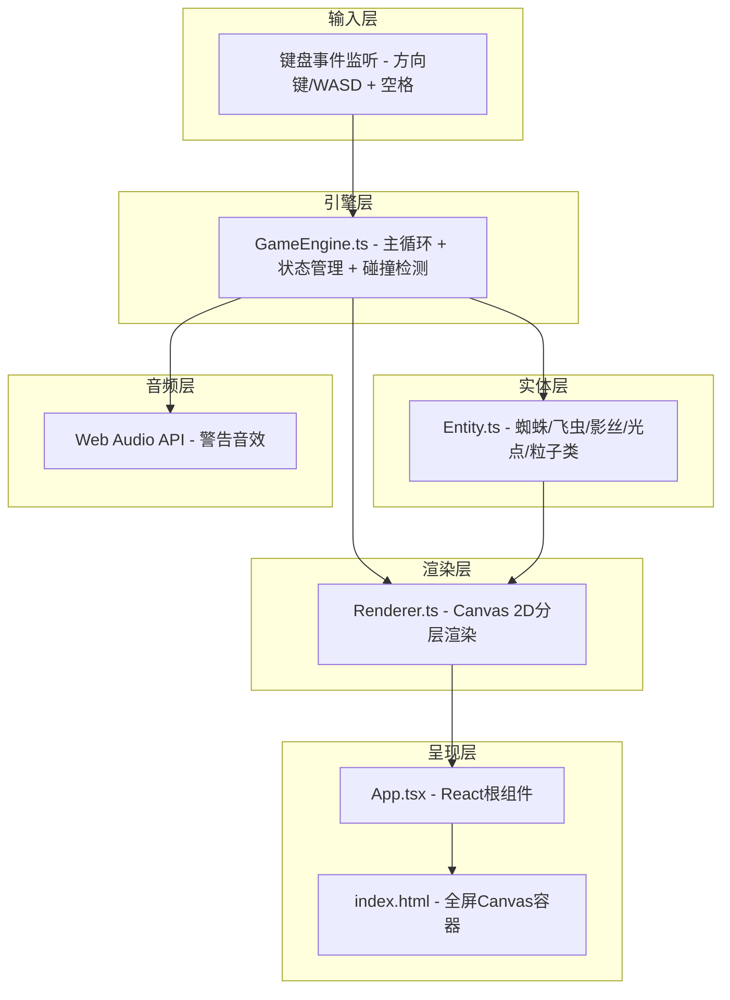

## 1. 架构设计

本项目为纯前端浏览器游戏，采用分层架构设计。数据单向流动：输入层 → 引擎层 → 实体层 → 渲染层 → 呈现层。



**数据流向说明**：

1. **输入层 → 引擎层**：键盘事件被监听后，以 InputState 形式传入 GameEngine
2. **引擎层 → 实体层**：GameEngine 每帧调用所有实体的 update() 方法，传入 dt 和游戏状态
3. **引擎层 → 渲染层**：GameEngine 将活跃实体数组、特效数组传给 Renderer
4. **实体层 → 渲染层**：每个实体通过 render(ctx) 方法自行绘制，或由 Renderer 统一绘制
5. **引擎层 → 音频层**：警报触发时调用 Web Audio 播放音效

## 2. 技术描述

- **前端框架**：React@18 + TypeScript@5（严格模式）
- **构建工具**：Vite@5 + @vitejs/plugin-react
- **渲染引擎**：Canvas 2D API（原生，无第三方游戏引擎）
- **音频方案**：Web Audio API（原生合成，无需资源文件）
- **CSS方案**：内联样式 + CSS变量（轻量，避免依赖CSS框架）
- **初始化方式**：手动配置文件结构（非模板脚手架生成）

### 依赖清单

| 包名 | 版本范围 | 用途 |
|------|---------|------|
| react | ^18.2.0 | UI组件框架 |
| react-dom | ^18.2.0 | React DOM渲染 |
| typescript | ^5.3.0 | 类型系统 |
| vite | ^5.0.0 | 构建开发服务器 |
| @vitejs/plugin-react | ^4.2.0 | Vite React支持 |

## 3. 文件结构与职责

```
auto165/
├── index.html                    # 入口HTML，全屏Canvas容器，加载main.tsx
├── package.json                  # 依赖与脚本配置(npm run dev)
├── vite.config.js                # Vite配置(启用React插件)
├── tsconfig.json                 # TypeScript配置(strict, es2020)
└── src/
    ├── main.tsx                  # React入口，挂载App到#root
    ├── App.tsx                   # 游戏容器组件，集成Canvas + UI覆盖层
    ├── types.ts                  # 全局类型定义(InputState, Vec2, EntityType等)
    ├── GameEngine.ts             # 游戏主循环、状态更新、碰撞检测、关卡管理
    ├── Entity.ts                 # 蜘蛛/飞虫/影丝/光点/粒子等实体类
    ├── Renderer.ts               # Canvas 2D渲染模块，分层绘制所有元素
    ├── AudioManager.ts           # Web Audio封装，管理警告音效
    ├── levels.ts                 # 关卡数据(地图网格、飞虫路径、出生点)
    └── constants.ts              # 游戏常量(网格尺寸、颜色、速度、时限)
```

### 文件调用关系

```
main.tsx ──> App.tsx
                │
                ├──> GameEngine.ts (实例化)
                │       │
                │       ├──> Entity.ts (new Spider/Firefly/Silk/Point/Particle)
                │       ├──> levels.ts (加载关卡数据)
                │       ├──> constants.ts (读取配置)
                │       ├──> AudioManager.ts (播放音效)
                │       └──> Renderer.ts (传入实体，每帧渲染)
                │               │
                │               └──> Entity.ts (调用render方法或绘制实体)
                │
                └──> UI覆盖层 (影丝数量、关卡显示)
```

## 4. 核心数据结构

### 4.1 基础类型 (types.ts)

```typescript
// 二维向量
interface Vec2 { x: number; y: number }

// 网格坐标
interface GridPos { gx: number; gy: number }

// 输入状态
interface InputState {
  up: boolean; down: boolean; left: boolean; right: boolean;
  action: boolean;  // 空格键
  actionPressed: boolean;  // 本帧按下
}

// 实体基类接口
interface IEntity {
  id: number;
  pos: Vec2;
  alive: boolean;
  update(dt: number, ctx: GameContext): void;
  render(ctx: CanvasRenderingContext2D): void;
}

// 游戏上下文(传递给实体update)
interface GameContext {
  grid: number[][];        // 0空 1墙 2天花板
  gridSize: number;        // 像素
  entities: IEntity[];
  spawnParticle: (p: Particle) => void;
  playAlert: () => void;
  onLevelComplete: () => void;
  spider: Spider;
}
```

### 4.2 实体类结构 (Entity.ts)

```typescript
class Spider implements IEntity {
  pos: Vec2
  gridPos: GridPos
  attached: boolean           // 是否附着在网格上
  velocity: Vec2
  silkCount: number
  legPhase: number            // 腿部动画相位
  invincibleTime: number      // 无敌剩余时间
  landingEffect: LandingEffect | null
}

class Firefly implements IEntity {
  pos: Vec2
  patrolPath: Vec2[]
  patrolIndex: number
  state: 'patrol' | 'alert' | 'stunned'
  alertTime: number
  stunnedTime: number
  wingPhase: number
  glowPulse: number
}

class SilkThread implements IEntity {
  start: Vec2
  end: Vec2
  control: Vec2               // 贝塞尔控制点(用于变形)
  deformAmount: number        // -20% ~ +20%
  lifeTime: number            // 3秒倒计时
  steppedThisFrame: boolean
}

class ExitPoint implements IEntity {
  pos: Vec2
  pulsePhase: number
  activated: boolean
}

class Particle {
  pos: Vec2
  vel: Vec2
  life: number
  maxLife: number
  color: string
  size: number
}
```

## 5. 性能优化策略

| 优化点 | 方案 |
|--------|------|
| 主循环 | requestAnimationFrame，dt时间步长补偿，固定逻辑步长60FPS |
| AI更新 | 飞虫AI 100ms节流，与渲染解耦，用accumulator累计 |
| 碰撞检测 | 空间划分：将飞虫/影丝按网格坐标预存，只检查蜘蛛所在±2格 |
| 粒子系统 | 对象池复用Particle，链表管理活跃粒子，O(1)增删 |
| Canvas渲染 | 分层绘制(背景层→实体层→特效层→UI层)，背景网格每resize重绘一次到离屏Canvas缓存 |
| GC控制 | 避免每帧创建对象，复用Vec2/数组，TypedArray存储粒子数据 |
| 渲染限制 | 峰值粒子≤500，超限后丢弃最早粒子；影丝≤10条，超出自动回收最早的 |

## 6. 关卡数据格式 (levels.ts)

```typescript
interface LevelData {
  id: number
  name: string
  gridWidth: number    // 网格列数(如24)
  gridHeight: number   // 网格行数(如14)
  walls: string[]      // 每行字符串: '.'空 '#'墙 '^'天花板
  spiderSpawn: GridPos
  exitPoint: GridPos
  fireflies: {
    path: GridPos[]    // 折线巡逻点
    speed: number      // 默认1格/秒
  }[]
  pickupPoints?: GridPos[]  // 可选：额外光点(恢复影丝)
}
```

示例：3个预设关卡，难度递增（飞虫数量增加、路径更复杂、墙壁更密集）。
