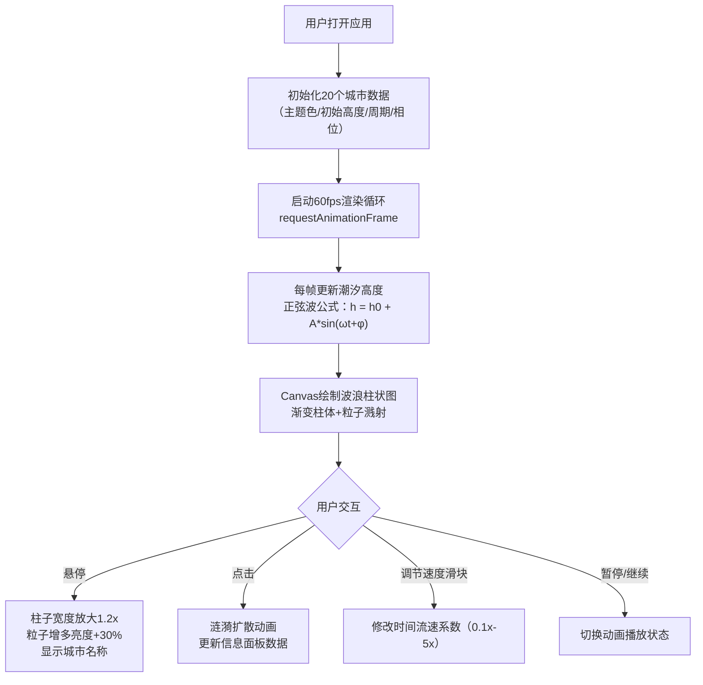

## 1. 产品概述

「潮汐都市」是一款面向数据可视化爱好者的浏览器端全球城市潮汐动态交互看板。以Canvas 2D渲染的彩色波浪柱状图实时呈现20个全球主要城市的潮汐涨落，模拟真实时间的呼吸般涨落动画，提供沉浸式的深海风格视觉体验。

- 目标用户：数据可视化爱好者、教育工作者、海洋气象研究人员
- 产品价值：以美观、直观、交互性强的方式展示潮汐数据变化规律

## 2. 核心功能

### 2.1 功能模块

1. **主看板页面**：顶部工具栏、波浪柱状图区域、城市信息面板

### 2.2 页面详情

| 页面名称 | 模块名称 | 功能描述 |
|-----------|-------------|---------------------|
| 主看板页面 | 顶部工具栏 | 速度控制滑块（0.1x-5x）、暂停/继续按钮 |
| 主看板页面 | 波浪柱状图区域 | 20根彩色波浪柱、粒子溅射效果、悬停高亮、点击涟漪动画 |
| 主看板页面 | 城市信息面板 | 城市名称、潮汐高度、涨落状态、6小时预测曲线、磨砂玻璃背景 |

## 3. 核心流程

用户打开应用 → 系统初始化20个城市潮汐数据（正弦波模拟）→ 每帧（60fps）更新潮汐高度 → Canvas渲染波浪柱状图与粒子特效 → 用户悬停柱子触发高亮与粒子增多 → 用户点击柱子触发涟漪动画并更新信息面板 → 用户可调节速度或暂停动画

## 4. 用户界面设计

### 4.1 设计风格

- **设计方向**：深海科幻风格，深色沉浸式主题
- **主色调**：背景深蓝 `#0B0E17`，渐变至 `#162240`（径向渐变中心偏下）
- **强调色**：亮蓝色 `#3A86FF`，悬停浅蓝 `#60A5FF`
- **涨落指示**：上升绿色 `#00FF88`，下降红色 `#FF4466`
- **城市主题色**：20个城市色相均匀分布于0-360度色环
- **按钮风格**：圆角8px，阴影 `0 4px 12px rgba(0,0,0,0.5)`，悬停上升2px，阴影加深50%
- **字体**：标题粗体，数字使用Mono等宽字体，尺寸按层级4-5种规格
- **布局**：桌面端左右分栏（左波浪图flex:1，右面板280px），移动端上下布局
- **视觉层次**：面板半透明磨砂玻璃（backdrop-filter: blur(10px), rgba(20,20,40,0.7)），圆角16px

### 4.2 页面设计概述

| 页面名称 | 模块名称 | UI元素 |
|-----------|-------------|-------------|
| 主看板页面 | 顶部工具栏 | 深蓝灰底(#1A2332)、速度滑块、暂停按钮、品牌标题「潮汐都市」 |
| 主看板页面 | 波浪图区域 | 径向渐变背景、20根垂直彩柱（每根30px宽，间距10px）、白色水平基线、柱子顶部粒子云、鼠标悬停高亮缩放、点击涟漪圈、柱子底部城市名淡入 |
| 主看板页面 | 信息面板 | 磨砂玻璃卡片(280px)、城市名(24px粗体+主题色)、潮汐高度(Mono字体+滚动动画)、涨落箭头(▲/▼+颜色)、预测曲线Canvas(240x80px贝塞尔曲线+半透明填充) |

### 4.3 响应式设计

- **桌面优先**（≥1200px）：显示全部20根柱子（30px宽+10px间距），左右分栏布局
- **中等屏（768-1200px）**：柱子缩至24px宽+5px间距，保持左右分栏
- **移动端（<768px）**：面板移至底部全宽，柱子缩至20px宽+5px间距，波浪图占满剩余高度，触摸优化

### 4.4 性能优化策略

- **FPS锁定60**：requestAnimationFrame + 时间戳节流
- **粒子池**：总计不超过200个粒子复用
- **涟漪限制**：最多同时活跃3个涟漪动画
- **超时降级**：performance.now检测单帧JS执行>8ms时，跳过粒子渲染仅更新柱高
