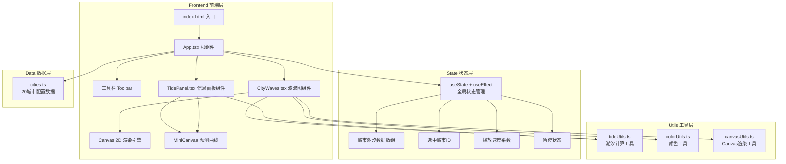

## 1. 架构设计

## 2. 技术描述

- **前端框架**：React@18 + TypeScript
- **构建工具**：Vite@5 + @vitejs/plugin-react
- **渲染引擎**：Canvas 2D API（原生，无额外图形库）
- **状态管理**：React useState/useEffect（轻量场景无需zustand）
- **样式方案**：原生CSS + CSS变量（深色主题统一token）
- **初始化方式**：npm create vite-init@latest（react-ts模板）

