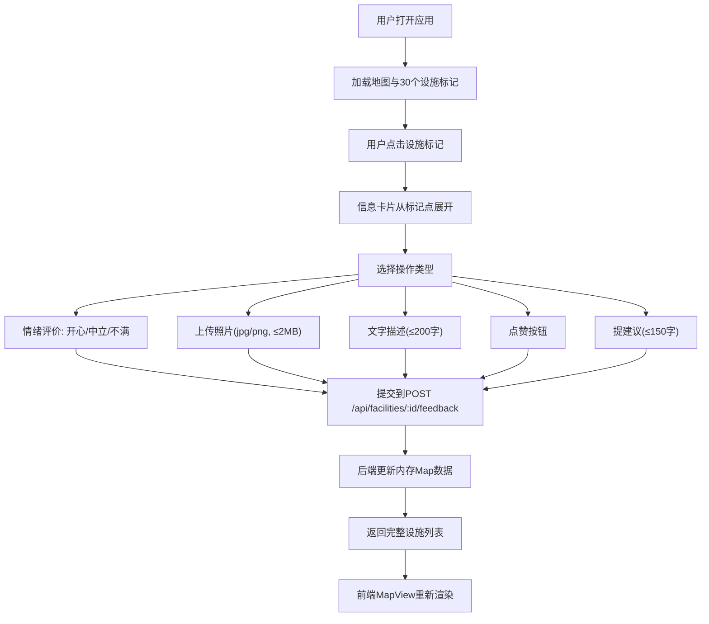

## 1. 产品概述
「社区微景·设施心声」是一款面向社区居民的公共设施标记与反馈平台，通过交互式社区地图让居民对长椅、路灯、花坛等公共设施进行实时反馈、点赞与建议提交，促进社区环境共建共享。

- 目标用户：社区居民、社区管理者
- 核心价值：可视化设施状态、畅通居民反馈渠道、提升社区治理效率

## 2. 核心功能

### 2.1 用户角色
| 角色 | 注册方式 | 核心权限 |
|------|----------|----------|
| 社区居民 | 无需注册（匿名使用） | 浏览设施地图、提交反馈、点赞、提建议 |
| 社区管理者 | 无需注册 | 查看所有反馈数据、统计分析 |

### 2.2 功能模块
1. **地图浏览模块**：Canvas 2D渲染社区网格地图，30个预置设施标记点
2. **设施信息卡片模块**：展示设施详情、照片、描述、情绪状态
3. **反馈提交模块**：照片上传、文字描述、三档情绪评价
4. **互动模块**：点赞功能、建议提交与展示
5. **统计面板模块**：反馈统计、情绪比例柱状图、建议滚动列表

### 2.3 页面详情
| 页面名称 | 模块名称 | 功能描述 |
|----------|----------|----------|
| 主页面 | 地图区域 | 800x600px Canvas地图，渐变色背景，网格线，30个设施标记点，hover放大光晕效果 |
| 主页面 | 信息卡片 | 点击标记弹出，从点击位置scale展开动画，展示照片、描述、情绪按钮、点赞、建议 |
| 主页面 | 右侧统计面板 | 固定300px宽度，总反馈数、情绪比例柱状图、近10条建议滚动列表 |
| 主页面 | 响应式布局 | <900px时面板折叠到底部，地图占满宽度 |

## 3. 核心流程
用户打开应用 → 浏览社区地图 → 点击设施标记点 → 信息卡片从该点展开 → 
- 选择情绪评价 → 发送到后端 → 地图标记状态更新
- 上传照片 → 预览成功 → 提交反馈 → 后端更新
- 点击点赞 → 爱心变实心+1 → 不可再点
- 点击提建议 → 展开文本框 → 输入建议 → 提交后显示建议条目

## 4. 用户界面设计
### 4.1 设计风格
- **主题模式**：深色模式
- **主背景色**：#1A1A2E（深蓝黑）
- **文字颜色**：#EAEAEA（浅灰白）
- **地图背景**：线性渐变 #2C3E50 → #3498DB（夜晚到黄昏）
- **设施颜色**：长椅#4CAF50绿、路灯#FFC107黄、花坛#E91E63粉、垃圾桶#9E9E9E灰、健身器材#2196F3蓝
- **卡片/面板**：圆角12px，box-shadow: 0 8px 32px rgba(0,0,0,0.3)
- **按钮hover**：transform: translateY(-2px)，filter: brightness(1.2)，过渡0.2s
- **情绪按钮动画**：scale 0.8→1.1→1.0，0.3s弹性缩放
- **卡片展开动画**：transform-origin: center center，scale 0→1，0.4s

### 4.2 页面设计概览
| 页面名称 | 模块名称 | UI元素 |
|----------|----------|--------|
| 主页面 | 地图区域 | Canvas渐变背景、半透明网格线、彩色圆点标记、浮动设施名称、hover光晕放大、信息卡片展开动画 |
| 主页面 | 信息卡片 | 照片预览区、文字描述区、三档情绪按钮、点赞爱心按钮、建议输入框、建议条目列表 |
| 主页面 | 统计面板 | 总反馈数大字显示、水平柱状情绪比例图、滚动建议列表（用户名+内容+时间） |

### 4.3 响应式
- **桌面优先**：≥900px时左2/3地图 + 右侧300px面板
- **移动适配**：<900px时面板折叠到底部，地图占满宽度
- **触摸优化**：按钮最小触摸区域44px，标记点可点击半径增大
