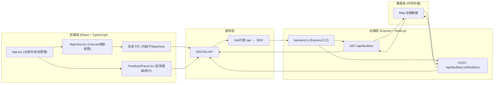
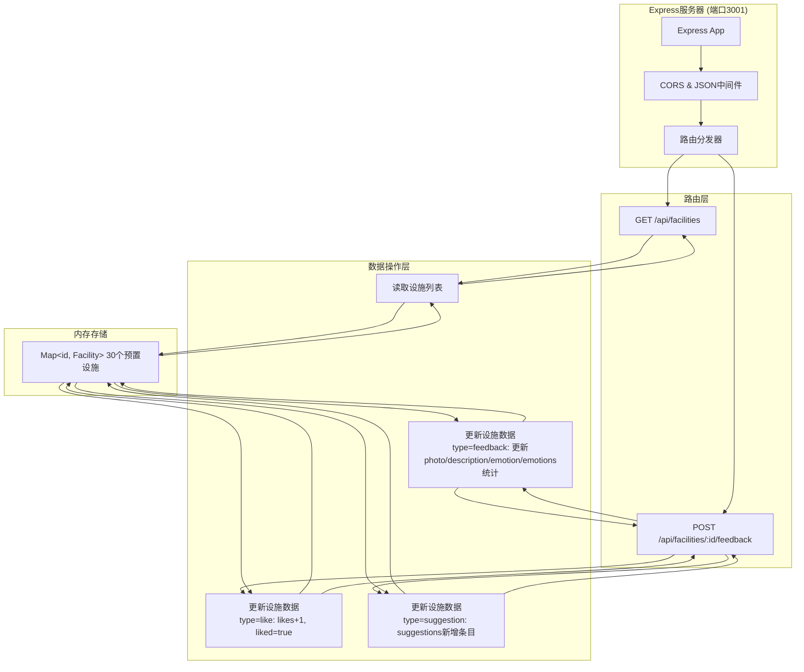
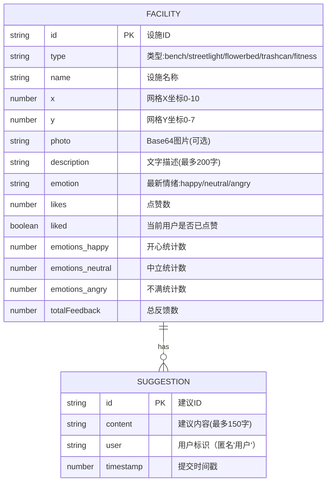

## 1. 架构设计



## 2. 技术说明

- **前端框架**: React 18 + TypeScript（严格模式）
- **构建工具**: Vite 5 + @vitejs/plugin-react
- **状态管理**: React useState/useEffect（无需额外状态库，规模较小）
- **地图渲染**: Canvas 2D API（800x600px画布）
- **后端框架**: Express 4 + ts-node
- **数据存储**: JavaScript Map（内存存储）
- **ID生成**: uuid
- **启动方式**: `npm run dev`（前后端concurrently并行启动）
- **API代理**: Vite devServer proxy `/api` → `http://localhost:3001`

## 3. 路由定义

| 路由 | 用途 |
|------|------|
| `/` | 主页面（地图+反馈面板+统计） |

## 4. API定义

### 类型定义
```typescript
// 设施类型
type FacilityType = 'bench' | 'streetlight' | 'flowerbed' | 'trashcan' | 'fitness';

// 情绪类型
type EmotionType = 'happy' | 'neutral' | 'angry';

// 反馈类型
type FeedbackType = 'feedback' | 'like' | 'suggestion';

// 建议条目
interface Suggestion {
  id: string;
  content: string;
  user: string;
  timestamp: number;
}

// 情绪统计
interface EmotionStats {
  happy: number;
  neutral: number;
  angry: number;
}

// 设施数据
interface Facility {
  id: string;
  type: FacilityType;
  name: string;
  x: number;           // 网格坐标X (0-10)
  y: number;           // 网格坐标Y (0-7)
  photo?: string;      // Base64图片
  description: string;
  emotion?: EmotionType;
  likes: number;
  liked: boolean;
  emotions: EmotionStats;
  totalFeedback: number;
  suggestions: Suggestion[];
}

// POST请求Body
interface FeedbackRequestBody {
  type: FeedbackType;
  content?: string;
  emotion?: EmotionType;
}
```

### GET /api/facilities
- **描述**: 获取所有设施列表
- **响应**: `Facility[]` - 设施数组，共30个

### POST /api/facilities/:id/feedback
- **描述**: 提交设施反馈（情绪/点赞/建议/文字描述/照片）
- **URL参数**: `id` - 设施ID
- **请求体**:
  ```json
  {
    "type": "feedback",
    "content": "设施描述文字或建议内容",
    "emotion": "happy"
  }
  ```
- **响应**: `Facility[]` - 更新后的完整设施列表

## 5. 服务器架构图



## 6. 数据模型

### 6.1 数据模型定义



### 6.2 初始数据规则
- 共30个设施，5x6网格分布（x: 0-5, y: 0-5 各6个，实际按合理分布）
- 每种设施类型各6个（长椅/路灯/花坛/垃圾桶/健身器材 × 6 = 30）
- 坐标映射到Canvas 800x600px：x方向80px间隔，y方向100px间隔，留50px边距
- 设施颜色映射：
  - bench(长椅): #4CAF50 (绿)
  - streetlight(路灯): #FFC107 (黄)
  - flowerbed(花坛): #E91E63 (粉)
  - trashcan(垃圾桶): #9E9E9E (灰)
  - fitness(健身器材): #2196F3 (蓝)

### 6.3 文件结构与调用关系

```
项目根目录/
├── package.json                    # 依赖配置 + 启动脚本
├── vite.config.js                  # Vite配置 + /api代理到3001端口
├── tsconfig.json                   # TS严格模式配置
├── index.html                      # Vite入口HTML
├── src/
│   ├── App.tsx                     # [顶层组件] 全局状态(facilities/selectedId)
│   │                                 → GET /api/facilities初始化加载
│   │                                 → POST提交后setFacilities刷新
│   │                                 → 渲染MapView(selectedId→props, onSelect→回调)
│   │                                 → 渲染FeedbackPanel(facilities→props, selectedId→props)
│   ├── MapView.tsx                 # [地图组件] Canvas 2D渲染
│   │                                 → 接收facilities数组渲染30个圆点
│   │                                 → hover放大+光晕效果
│   │                                 → onClick触发onSelect回调
│   │                                 → 选中时在标记点位置弹出信息卡片
│   │                                 → 信息卡片内按钮调用POST /api/facilities/:id/feedback
│   ├── FeedbackPanel.tsx           # [统计面板组件]
│   │                                 → 接收选中设施数据
│   │                                 → 渲染总反馈数、情绪柱状图、建议列表
│   └── backend.ts                  # [Express后端] 端口3001
│                                     → 初始化30个设施存入Map
│                                     → GET /api/facilities 返回Array.from(map.values())
│                                     → POST /api/facilities/:id/feedback 根据type更新
│                                     → 返回完整设施列表
```

**数据流向**:
1. 启动 → backend.ts初始化30个设施到内存Map
2. App.tsx挂载 → useEffect → GET /api/facilities → setFacilities
3. MapView接收facilities → Canvas渲染30个圆点
4. 用户点击圆点 → App.onSelect(id) → setSelectedId → 传入选中状态
5. 用户操作（情绪/点赞/建议/照片）→ 组件内构造body → POST /api/facilities/:id/feedback
6. backend接收 → 根据type字段更新对应设施数据 → 返回完整facilities[]
7. App.setFacilities → MapView和FeedbackPanel响应props更新 → 重新渲染
